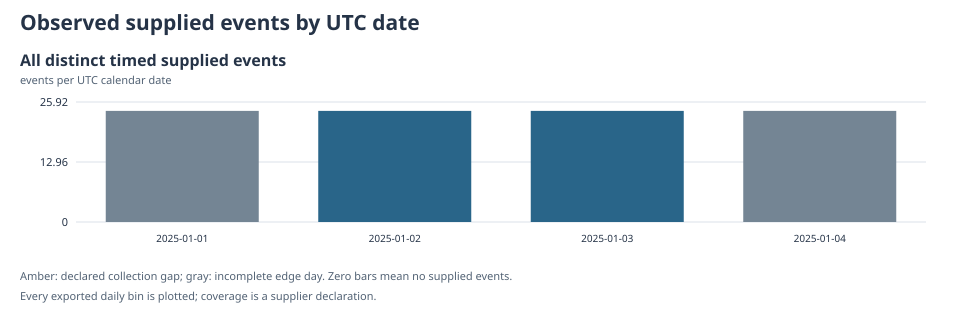
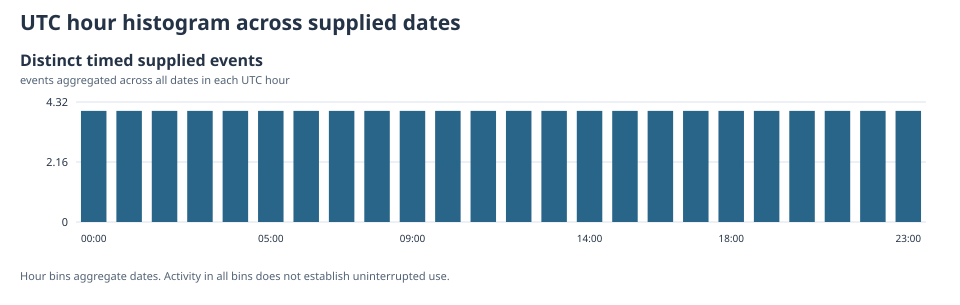
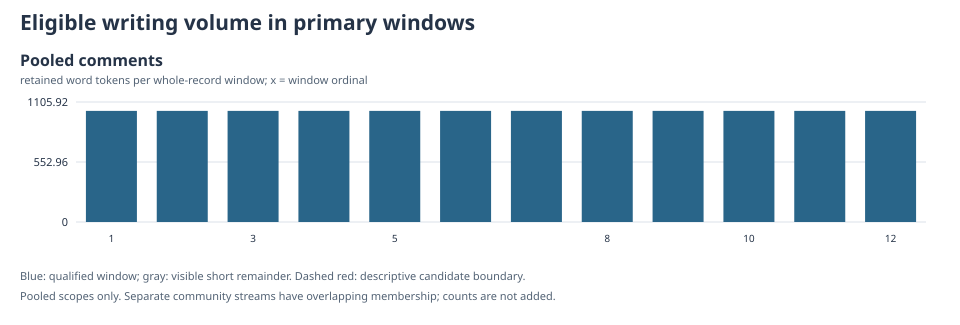
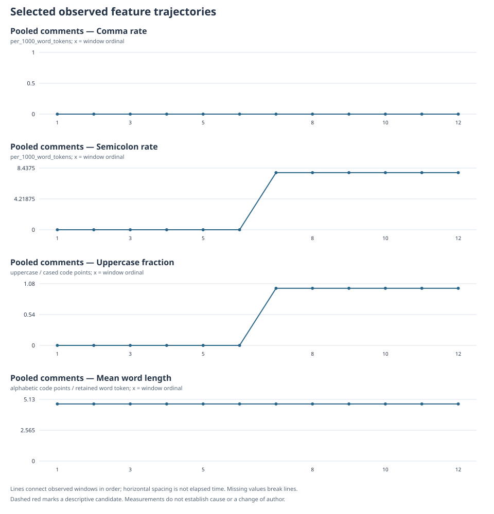
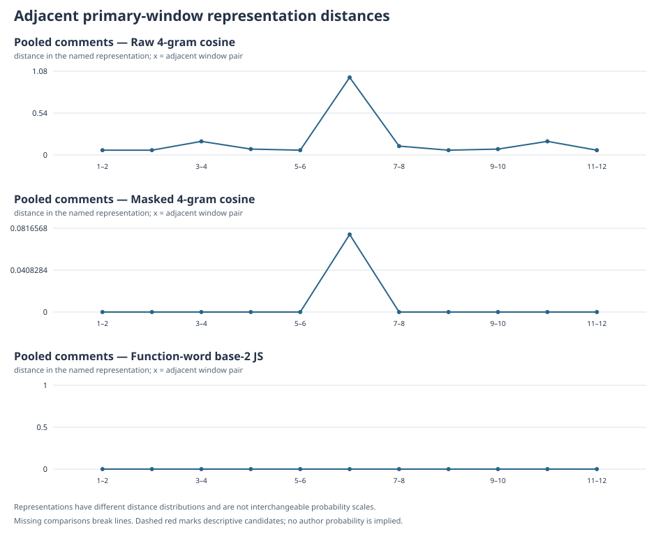

# Supplied account-history measurements

**Privacy:** Source excerpts omitted. Remaining identifiers and measurements may still identify an account.

Snapshot: RW-001 PUBLIC PRESENTATION FIXTURE: sensitivity outcomes were manually constructed after processing artificial source records. These are renderer regression cases, not optimizer output, numerical validation, or authorship truth. Case: alternative&#95;only. Source category: synthetic. All temporal labels use UTC.

[Coverage](#coverage) · [Text](#text) · [Activity](#activity) · [Reuse](#reuse) · [Comparisons](#style) · [Candidates](#changes) · [Links](#links) · [Evidence](#evidence) · [Methods](#methods)

## Coverage and limitations

Module status: **ok**. Reasons: none.

- These are measurements of supplied records. Coverage and language are supplier declarations.
- A measured pattern does not establish its cause. Style distance is not an authorship probability.
- A content match does not establish deceptive intent. A timestamp gap does not establish sleep or inactivity.
- Observed text is ordered by record creation time; edited wording may differ from wording at creation.
- AI text detection: not_implemented_in_v1. Real-world validation: not_established.

Unique supplied records: **96**. Usable body texts: 96. Missing creation times: 0.
Coverage declaration: **complete&#95;for&#95;declared&#95;scope**; not independently verified. Declared range: 2025-01-01 00:00:00 UTC to 2025-01-04 23:00:00 UTC.

| Supplied text status | Distinct records |
| --- | --- |
| present | 96 |
| deleted | 0 |
| removed | 0 |
| unavailable | 0 |

| Declared language | Records |
| --- | --- |
| en | 96 |

## Direct text measurements

Module status: **ok**. Reasons: none.

### Retained body prose

Included records: 96; usable text observations: 96. Rates pool counts before dividing.

| Measurement | Count |
| --- | --- |
| Retained word tokens | 12288 |
| Number tokens | 0 |
| Retained Unicode code points | 70656 |
| Cased code points | 58368 |
| Uppercase code points | 29184 |
| Retained boundary-separated segments | 96 |
| Retained prose blocks | 96 |
| Alphabetic code points inside word tokens | 58368 |
| Removed explicit quote spans | 0 |
| Removed code spans | 0 |
| Removed visible URL spans | 0 |
| Source headings | 0 |
| Source list items | 0 |
| Detected source link occurrences | 0 |
| Excluded mentions | 0 |

Uppercase fraction = uppercase / cased code points: **0.5**. Average word length = alphabetic code points / retained word tokens: **4.75**.
Undefined rates: none.

Retained words per usable record (n=96): min 128, Q1 128, median 128, Q3 128, max 128. Quantiles use linear interpolation at (n−1)q.

Literal punctuation and lexical descriptors

| Literal punctuation | Count | Per 1,000 word tokens | Per 1,000 retained code points |
| --- | --- | --- | --- |
| ascii apostrophe | 0 | 0 | 0 |
| ascii double quote | 0 | 0 | 0 |
| ascii hyphen | 0 | 0 | 0 |
| ascii period runs | 0 | 0 | 0 |
| colon | 0 | 0 | 0 |
| comma | 0 | 0 | 0 |
| curly apostrophe | 0 | 0 | 0 |
| ellipsis | 0 | 0 | 0 |
| em dash | 0 | 0 | 0 |
| en dash | 0 | 0 | 0 |
| exclamation mark | 0 | 0 | 0 |
| left curly double quote | 0 | 0 | 0 |
| period | 48 | 3.90625 | 0.679348 |
| question mark | 0 | 0 | 0 |
| right curly double quote | 0 | 0 | 0 |
| semicolon | 48 | 3.90625 | 0.679348 |

ASCII period runs overlap literal period counts; these are not disjoint quantities.
Standalone literal i/I token counts: 0/0. These are not verified pronoun labels.
English-specific denominator: 12288 retained words in 96 declared-English usable records.

| Literal alternative | Contracted | Expanded | Opportunities | Qualified fraction | Status |
| --- | --- | --- | --- | --- | --- |
| arent&#95;are&#95;not | 0 | 0 | 0 | not computable | insufficient&#95;opportunities |
| couldnt&#95;could&#95;not | 0 | 0 | 0 | not computable | insufficient&#95;opportunities |
| didnt&#95;did&#95;not | 0 | 0 | 0 | not computable | insufficient&#95;opportunities |
| doesnt&#95;does&#95;not | 0 | 0 | 0 | not computable | insufficient&#95;opportunities |
| dont&#95;do&#95;not | 0 | 0 | 0 | not computable | insufficient&#95;opportunities |
| im&#95;i&#95;am | 0 | 0 | 0 | not computable | insufficient&#95;opportunities |
| isnt&#95;is&#95;not | 0 | 0 | 0 | not computable | insufficient&#95;opportunities |
| ive&#95;i&#95;have | 0 | 0 | 0 | not computable | insufficient&#95;opportunities |
| shouldnt&#95;should&#95;not | 0 | 0 | 0 | not computable | insufficient&#95;opportunities |
| theyre&#95;they&#95;are | 0 | 0 | 0 | not computable | insufficient&#95;opportunities |
| wasnt&#95;was&#95;not | 0 | 0 | 0 | not computable | insufficient&#95;opportunities |
| were&#95;we&#95;are | 0 | 0 | 0 | not computable | insufficient&#95;opportunities |
| werent&#95;were&#95;not | 0 | 0 | 0 | not computable | insufficient&#95;opportunities |
| wont&#95;will&#95;not | 0 | 0 | 0 | not computable | insufficient&#95;opportunities |
| wouldnt&#95;would&#95;not | 0 | 0 | 0 | not computable | insufficient&#95;opportunities |
| youre&#95;you&#95;are | 0 | 0 | 0 | not computable | insufficient&#95;opportunities |

Raw fractions below the opportunity guard remain in the numerical export; they are not displayed as qualified preferences.

### Submission titles (separate scope)

Included records: 0; usable text observations: 0. Rates pool counts before dividing.

| Measurement | Count |
| --- | --- |
| Retained word tokens | 0 |
| Number tokens | 0 |
| Retained Unicode code points | 0 |
| Cased code points | 0 |
| Uppercase code points | 0 |
| Retained boundary-separated segments | 0 |
| Retained prose blocks | 0 |
| Alphabetic code points inside word tokens | 0 |
| Removed explicit quote spans | 0 |
| Removed code spans | 0 |
| Removed visible URL spans | 0 |
| Source headings | 0 |
| Source list items | 0 |
| Detected source link occurrences | 0 |
| Excluded mentions | 0 |

Uppercase fraction = uppercase / cased code points: **not computable**. Average word length = alphabetic code points / retained word tokens: **not computable**.
Undefined rates: zero&#95;cased&#95;letters&#95;denominator, zero&#95;retained&#95;codepoints&#95;denominator, zero&#95;retained&#95;words&#95;denominator.

Retained words per usable record (n=0): min not computable, Q1 not computable, median not computable, Q3 not computable, max not computable. Quantiles use linear interpolation at (n−1)q.

## Observed supplied activity

Module status: **ok**. Reasons: none.

Distinct timed supplied events: **96**, including records whose text is deleted, removed or unusable. Range: 2025-01-01 00:00:00 UTC to 2025-01-04 23:00:00 UTC.
Observed span: 342000 seconds. Event-bearing UTC dates: 4 of 4 calendar dates; dates with no supplied events: 0.
Zero-event dates and long gaps do not establish inactivity or sleep. Hour bins aggregate across dates.

<!-- AHAS_CHART:activity_daily.svg -->

<!-- AHAS_CHART:activity_hourly.svg -->

| Adjacent-event gap summary | Value |
| --- | --- |
| Interval count | 95 |
| Mean / median (seconds) | 3600 / 3600 |
| Q1 / Q3 (seconds) | 3600 / 3600 |
| Population variance (seconds squared) | 0 |
| Population SD / mean (dimensionless) | 0 |
| Variability missingness reason | none |

| Inclusive sliding duration (seconds) | Maximum supplied events | Witness source records |
| --- | --- | --- |
| 30 | 1 | [r000](#source-b2722d9b17bd87ad879baff8) |
| 120 | 1 | [r000](#source-b2722d9b17bd87ad879baff8) |
| 3600 | 2 | [r000](#source-b2722d9b17bd87ad879baff8), [r001](#source-3c704c2bf14bdd448dc6f246) |

Greedy nonoverlapping fixed-window bursts: 0; duration 30 seconds, minimum 3 events. This differs from gap-connected sessions or overlapping sliding counts.

Weekday exposure and simultaneous supplied timestamps

| UTC weekday | Calendar dates in supplied range | Supplied events |
| --- | --- | --- |
| Monday | 0 | 0 |
| Tuesday | 0 | 0 |
| Wednesday | 1 | 24 |
| Thursday | 1 | 24 |
| Friday | 1 | 24 |
| Saturday | 1 | 24 |
| Sunday | 0 | 0 |

## Content reuse and source evidence

Module status: **ok**. Reasons: none.

Exact equivalence groups: 0. Qualifying shingle pairs: 0. Distinct candidate pairs generated: 0; budget 2000000; complete near-reuse search: true.
Raw strings, normalized prose and lexical token sequences are different match types. Empty/sentinel text is excluded. Short common text is excluded from substantial-reuse findings.
Shingles are sets of consecutive tokens within segments. Jaccard divides shared shingles by their union; directed containment divides by the source side’s shingle count. Exact rational thresholds are recorded in resolved_config.json.

Deterministic near-reuse resource accounting: reuse&#95;work&#95;units&#95;v1. Exhaustion reason: none.

| Resource counter | Consumed | Configured limit |
| --- | --- | --- |
| evidence&#95;codepoints | 0 | 8000000 |
| evidence&#95;tokens | 0 | 2000000 |
| index&#95;postings | 768 | 2000000 |
| work&#95;units | 118848 | 250000000 |

| Exact match type | Source records | Scope qualification |
| --- | --- | --- |

Showing 0 of 0 exact groups; 0 omitted from this preview. All groups are in results.json.

| Source pair | Words left/right | Shared / union shingles | Jaccard | Left in right | Right in left |
| --- | --- | --- | --- | --- | --- |

Showing 0 of 0 pairs; 0 omitted from this preview. Complete computed pairs and passages are in results.json.
Connected reuse groups: 0. Connected edges do not assert pairwise equivalence among every group member.
A shared shingle set is not necessarily one contiguous passage. Lexically matched source passages may retain different case and punctuation.

## Writing windows and descriptive comparisons

Module status: **ok**. Reasons: none.

Windows contain whole records, with separate comment and submission-body streams. A visible final remainder is excluded from segmentation. Community streams share records with pooled streams and are not independent samples.

| Stream scope | Target words / min records | Eligible words | Qualified windows | Remainder words |
| --- | --- | --- | --- | --- |
| pooled comment | 1000 / 8 | 12288 | 12 | 0 |
| community comment: synthetic&#95;context | 1000 / 8 | 12288 | 12 | 0 |

<!-- AHAS_CHART:eligible_word_volume.svg -->

Showing 20 of 23 comparisons; 3 omitted from this preview. Complete comparisons/contributions are in results.json and all memberships in windows.jsonl.
Raw measurements may be computable below the qualified sample guard. A distance is not a percentage of different authorship, and raw/masked distance scales are not interchangeable.

The preview prioritizes manual selections, then candidate-adjacent comparisons, then other comparisons in export order.

Comparison cmp-71b8f8bacdeebebac10a1031 — ok

Left: 8 records / 1024 words; right: 8 records / 1024 words. Eligible sizes: 8 records / 1024 words versus 8 records / 1024 words.
Kinds: comment versus comment; languages: en versus en. Missing times: 0 / 0.
Largest single-record word shares: 0.125 / 0.125. Median retained words per usable record: 128 / 128.
Reasons: none.
Limitations: context&#95;controls&#95;incomplete, correlated&#95;representations, distance&#95;is&#95;not&#95;authorship&#95;probability, parameter&#95;defaults&#95;uncalibrated, unknown&#95;edit&#95;history.

Left community composition: synthetic&#95;context: 8 records, 1024 words.
Right community composition: synthetic&#95;context: 8 records, 1024 words.

| Method / representation | Distance | Unit | Left/right denominators | Status / reason |
| --- | --- | --- | --- | --- |
| cosine&#95;distance&#95;v1 / retained&#95;prose / n=3 | 0.0434208 | cosine&#95;distance | 5872 / 5872 character&#95;ngrams | ok / none |
| cosine&#95;distance&#95;v1 / retained&#95;prose / n=4 | 0.0616632 | cosine&#95;distance | 5864 / 5864 character&#95;ngrams | ok / none |
| cosine&#95;distance&#95;v1 / retained&#95;prose / n=5 | 0.0833617 | cosine&#95;distance | 5856 / 5856 character&#95;ngrams | ok / none |
| cosine&#95;distance&#95;v1 / function&#95;mask&#95;v1 / n=3 | 0 | cosine&#95;distance | 5872 / 5872 character&#95;ngrams | ok / none |
| cosine&#95;distance&#95;v1 / function&#95;mask&#95;v1 / n=4 | 0 | cosine&#95;distance | 5864 / 5864 character&#95;ngrams | ok / none |
| cosine&#95;distance&#95;v1 / function&#95;mask&#95;v1 / n=5 | 0 | cosine&#95;distance | 5856 / 5856 character&#95;ngrams | ok / none |
| function&#95;word&#95;js&#95;v1 / lexical&#95;tokens | 0 | base&#95;2&#95;js&#95;distance | 1024 / 1024 retained&#95;word&#95;tokens | ok / none |
| classic&#95;delta&#95;v1 / lexical&#95;tokens | not computable | mean&#95;absolute&#95;standardized&#95;frequency&#95;difference | 1024 / 1024 retained&#95;word&#95;tokens | not&#95;run / not&#95;run&#95;missing&#95;reference |

Largest representation differences and contributions

function&#95;word&#95;js&#95;v1, lexical&#95;tokens: 127 exported feature coordinates. Preview: 10.
Character n-gram rate differences are not an exact decomposition of cosine distance. JS contributions are divergence terms before square root; Delta contributions are absolute standardized-frequency differences.

| Feature | Left rate | Right rate | Absolute rate change | Contribution | Rate unit |
| --- | --- | --- | --- | --- | --- |
| function&#95;word.OTHER&#95;WORD | 500 | 500 | 0 | 0 | per&#95;1000&#95;word&#95;tokens |
| function&#95;word.a | 0 | 0 | 0 | 0 | per&#95;1000&#95;word&#95;tokens |
| function&#95;word.about | 0 | 0 | 0 | 0 | per&#95;1000&#95;word&#95;tokens |
| function&#95;word.above | 0 | 0 | 0 | 0 | per&#95;1000&#95;word&#95;tokens |
| function&#95;word.after | 0 | 0 | 0 | 0 | per&#95;1000&#95;word&#95;tokens |
| function&#95;word.again | 0 | 0 | 0 | 0 | per&#95;1000&#95;word&#95;tokens |
| function&#95;word.against | 0 | 0 | 0 | 0 | per&#95;1000&#95;word&#95;tokens |
| function&#95;word.all | 0 | 0 | 0 | 0 | per&#95;1000&#95;word&#95;tokens |
| function&#95;word.am | 0 | 0 | 0 | 0 | per&#95;1000&#95;word&#95;tokens |
| function&#95;word.an | 0 | 0 | 0 | 0 | per&#95;1000&#95;word&#95;tokens |

Comparison cmp-422c16c6b891c790e160c5ce — ok

Left: 8 records / 1024 words; right: 8 records / 1024 words. Eligible sizes: 8 records / 1024 words versus 8 records / 1024 words.
Kinds: comment versus comment; languages: en versus en. Missing times: 0 / 0.
Largest single-record word shares: 0.125 / 0.125. Median retained words per usable record: 128 / 128.
Reasons: none.
Limitations: context&#95;controls&#95;incomplete, correlated&#95;representations, distance&#95;is&#95;not&#95;authorship&#95;probability, parameter&#95;defaults&#95;uncalibrated, unknown&#95;edit&#95;history.

Left community composition: synthetic&#95;context: 8 records, 1024 words.
Right community composition: synthetic&#95;context: 8 records, 1024 words.

| Method / representation | Distance | Unit | Left/right denominators | Status / reason |
| --- | --- | --- | --- | --- |
| cosine&#95;distance&#95;v1 / retained&#95;prose / n=3 | 0.0435215 | cosine&#95;distance | 5872 / 5872 character&#95;ngrams | ok / none |
| cosine&#95;distance&#95;v1 / retained&#95;prose / n=4 | 0.0617568 | cosine&#95;distance | 5864 / 5864 character&#95;ngrams | ok / none |
| cosine&#95;distance&#95;v1 / retained&#95;prose / n=5 | 0.0833617 | cosine&#95;distance | 5856 / 5856 character&#95;ngrams | ok / none |
| cosine&#95;distance&#95;v1 / function&#95;mask&#95;v1 / n=3 | 0 | cosine&#95;distance | 5872 / 5872 character&#95;ngrams | ok / none |
| cosine&#95;distance&#95;v1 / function&#95;mask&#95;v1 / n=4 | 0 | cosine&#95;distance | 5864 / 5864 character&#95;ngrams | ok / none |
| cosine&#95;distance&#95;v1 / function&#95;mask&#95;v1 / n=5 | 0 | cosine&#95;distance | 5856 / 5856 character&#95;ngrams | ok / none |
| function&#95;word&#95;js&#95;v1 / lexical&#95;tokens | 0 | base&#95;2&#95;js&#95;distance | 1024 / 1024 retained&#95;word&#95;tokens | ok / none |
| classic&#95;delta&#95;v1 / lexical&#95;tokens | not computable | mean&#95;absolute&#95;standardized&#95;frequency&#95;difference | 1024 / 1024 retained&#95;word&#95;tokens | not&#95;run / not&#95;run&#95;missing&#95;reference |

Largest representation differences and contributions

function&#95;word&#95;js&#95;v1, lexical&#95;tokens: 127 exported feature coordinates. Preview: 10.
Character n-gram rate differences are not an exact decomposition of cosine distance. JS contributions are divergence terms before square root; Delta contributions are absolute standardized-frequency differences.

| Feature | Left rate | Right rate | Absolute rate change | Contribution | Rate unit |
| --- | --- | --- | --- | --- | --- |
| function&#95;word.OTHER&#95;WORD | 500 | 500 | 0 | 0 | per&#95;1000&#95;word&#95;tokens |
| function&#95;word.a | 0 | 0 | 0 | 0 | per&#95;1000&#95;word&#95;tokens |
| function&#95;word.about | 0 | 0 | 0 | 0 | per&#95;1000&#95;word&#95;tokens |
| function&#95;word.above | 0 | 0 | 0 | 0 | per&#95;1000&#95;word&#95;tokens |
| function&#95;word.after | 0 | 0 | 0 | 0 | per&#95;1000&#95;word&#95;tokens |
| function&#95;word.again | 0 | 0 | 0 | 0 | per&#95;1000&#95;word&#95;tokens |
| function&#95;word.against | 0 | 0 | 0 | 0 | per&#95;1000&#95;word&#95;tokens |
| function&#95;word.all | 0 | 0 | 0 | 0 | per&#95;1000&#95;word&#95;tokens |
| function&#95;word.am | 0 | 0 | 0 | 0 | per&#95;1000&#95;word&#95;tokens |
| function&#95;word.an | 0 | 0 | 0 | 0 | per&#95;1000&#95;word&#95;tokens |

Comparison cmp-4a90d818bb4390e410d5e6cf — ok

Left: 8 records / 1024 words; right: 8 records / 1024 words. Eligible sizes: 8 records / 1024 words versus 8 records / 1024 words.
Kinds: comment versus comment; languages: en versus en. Missing times: 0 / 0.
Largest single-record word shares: 0.125 / 0.125. Median retained words per usable record: 128 / 128.
Reasons: none.
Limitations: context&#95;controls&#95;incomplete, correlated&#95;representations, distance&#95;is&#95;not&#95;authorship&#95;probability, parameter&#95;defaults&#95;uncalibrated, unknown&#95;edit&#95;history.

Left community composition: synthetic&#95;context: 8 records, 1024 words.
Right community composition: synthetic&#95;context: 8 records, 1024 words.

| Method / representation | Distance | Unit | Left/right denominators | Status / reason |
| --- | --- | --- | --- | --- |
| cosine&#95;distance&#95;v1 / retained&#95;prose / n=3 | 0.130689 | cosine&#95;distance | 5872 / 5872 character&#95;ngrams | ok / none |
| cosine&#95;distance&#95;v1 / retained&#95;prose / n=4 | 0.175383 | cosine&#95;distance | 5864 / 5864 character&#95;ngrams | ok / none |
| cosine&#95;distance&#95;v1 / retained&#95;prose / n=5 | 0.225922 | cosine&#95;distance | 5856 / 5856 character&#95;ngrams | ok / none |
| cosine&#95;distance&#95;v1 / function&#95;mask&#95;v1 / n=3 | 0 | cosine&#95;distance | 5872 / 5872 character&#95;ngrams | ok / none |
| cosine&#95;distance&#95;v1 / function&#95;mask&#95;v1 / n=4 | 0 | cosine&#95;distance | 5864 / 5864 character&#95;ngrams | ok / none |
| cosine&#95;distance&#95;v1 / function&#95;mask&#95;v1 / n=5 | 0 | cosine&#95;distance | 5856 / 5856 character&#95;ngrams | ok / none |
| function&#95;word&#95;js&#95;v1 / lexical&#95;tokens | 0 | base&#95;2&#95;js&#95;distance | 1024 / 1024 retained&#95;word&#95;tokens | ok / none |
| classic&#95;delta&#95;v1 / lexical&#95;tokens | not computable | mean&#95;absolute&#95;standardized&#95;frequency&#95;difference | 1024 / 1024 retained&#95;word&#95;tokens | not&#95;run / not&#95;run&#95;missing&#95;reference |

Largest representation differences and contributions

function&#95;word&#95;js&#95;v1, lexical&#95;tokens: 127 exported feature coordinates. Preview: 10.
Character n-gram rate differences are not an exact decomposition of cosine distance. JS contributions are divergence terms before square root; Delta contributions are absolute standardized-frequency differences.

| Feature | Left rate | Right rate | Absolute rate change | Contribution | Rate unit |
| --- | --- | --- | --- | --- | --- |
| function&#95;word.OTHER&#95;WORD | 500 | 500 | 0 | 0 | per&#95;1000&#95;word&#95;tokens |
| function&#95;word.a | 0 | 0 | 0 | 0 | per&#95;1000&#95;word&#95;tokens |
| function&#95;word.about | 0 | 0 | 0 | 0 | per&#95;1000&#95;word&#95;tokens |
| function&#95;word.above | 0 | 0 | 0 | 0 | per&#95;1000&#95;word&#95;tokens |
| function&#95;word.after | 0 | 0 | 0 | 0 | per&#95;1000&#95;word&#95;tokens |
| function&#95;word.again | 0 | 0 | 0 | 0 | per&#95;1000&#95;word&#95;tokens |
| function&#95;word.against | 0 | 0 | 0 | 0 | per&#95;1000&#95;word&#95;tokens |
| function&#95;word.all | 0 | 0 | 0 | 0 | per&#95;1000&#95;word&#95;tokens |
| function&#95;word.am | 0 | 0 | 0 | 0 | per&#95;1000&#95;word&#95;tokens |
| function&#95;word.an | 0 | 0 | 0 | 0 | per&#95;1000&#95;word&#95;tokens |

Comparison cmp-bc0d9cc5ba69e8a7d2a6fbc2 — ok

Left: 8 records / 1024 words; right: 8 records / 1024 words. Eligible sizes: 8 records / 1024 words versus 8 records / 1024 words.
Kinds: comment versus comment; languages: en versus en. Missing times: 0 / 0.
Largest single-record word shares: 0.125 / 0.125. Median retained words per usable record: 128 / 128.
Reasons: none.
Limitations: context&#95;controls&#95;incomplete, correlated&#95;representations, distance&#95;is&#95;not&#95;authorship&#95;probability, parameter&#95;defaults&#95;uncalibrated, unknown&#95;edit&#95;history.

Left community composition: synthetic&#95;context: 8 records, 1024 words.
Right community composition: synthetic&#95;context: 8 records, 1024 words.

| Method / representation | Distance | Unit | Left/right denominators | Status / reason |
| --- | --- | --- | --- | --- |
| cosine&#95;distance&#95;v1 / retained&#95;prose / n=3 | 0.0541135 | cosine&#95;distance | 5872 / 5872 character&#95;ngrams | ok / none |
| cosine&#95;distance&#95;v1 / retained&#95;prose / n=4 | 0.0759801 | cosine&#95;distance | 5864 / 5864 character&#95;ngrams | ok / none |
| cosine&#95;distance&#95;v1 / retained&#95;prose / n=5 | 0.101769 | cosine&#95;distance | 5856 / 5856 character&#95;ngrams | ok / none |
| cosine&#95;distance&#95;v1 / function&#95;mask&#95;v1 / n=3 | 0 | cosine&#95;distance | 5872 / 5872 character&#95;ngrams | ok / none |
| cosine&#95;distance&#95;v1 / function&#95;mask&#95;v1 / n=4 | 0 | cosine&#95;distance | 5864 / 5864 character&#95;ngrams | ok / none |
| cosine&#95;distance&#95;v1 / function&#95;mask&#95;v1 / n=5 | 0 | cosine&#95;distance | 5856 / 5856 character&#95;ngrams | ok / none |
| function&#95;word&#95;js&#95;v1 / lexical&#95;tokens | 0 | base&#95;2&#95;js&#95;distance | 1024 / 1024 retained&#95;word&#95;tokens | ok / none |
| classic&#95;delta&#95;v1 / lexical&#95;tokens | not computable | mean&#95;absolute&#95;standardized&#95;frequency&#95;difference | 1024 / 1024 retained&#95;word&#95;tokens | not&#95;run / not&#95;run&#95;missing&#95;reference |

Largest representation differences and contributions

function&#95;word&#95;js&#95;v1, lexical&#95;tokens: 127 exported feature coordinates. Preview: 10.
Character n-gram rate differences are not an exact decomposition of cosine distance. JS contributions are divergence terms before square root; Delta contributions are absolute standardized-frequency differences.

| Feature | Left rate | Right rate | Absolute rate change | Contribution | Rate unit |
| --- | --- | --- | --- | --- | --- |
| function&#95;word.OTHER&#95;WORD | 500 | 500 | 0 | 0 | per&#95;1000&#95;word&#95;tokens |
| function&#95;word.a | 0 | 0 | 0 | 0 | per&#95;1000&#95;word&#95;tokens |
| function&#95;word.about | 0 | 0 | 0 | 0 | per&#95;1000&#95;word&#95;tokens |
| function&#95;word.above | 0 | 0 | 0 | 0 | per&#95;1000&#95;word&#95;tokens |
| function&#95;word.after | 0 | 0 | 0 | 0 | per&#95;1000&#95;word&#95;tokens |
| function&#95;word.again | 0 | 0 | 0 | 0 | per&#95;1000&#95;word&#95;tokens |
| function&#95;word.against | 0 | 0 | 0 | 0 | per&#95;1000&#95;word&#95;tokens |
| function&#95;word.all | 0 | 0 | 0 | 0 | per&#95;1000&#95;word&#95;tokens |
| function&#95;word.am | 0 | 0 | 0 | 0 | per&#95;1000&#95;word&#95;tokens |
| function&#95;word.an | 0 | 0 | 0 | 0 | per&#95;1000&#95;word&#95;tokens |

Comparison cmp-2ad3d8a402e55d822c039a65 — ok

Left: 8 records / 1024 words; right: 8 records / 1024 words. Eligible sizes: 8 records / 1024 words versus 8 records / 1024 words.
Kinds: comment versus comment; languages: en versus en. Missing times: 0 / 0.
Largest single-record word shares: 0.125 / 0.125. Median retained words per usable record: 128 / 128.
Reasons: none.
Limitations: context&#95;controls&#95;incomplete, correlated&#95;representations, distance&#95;is&#95;not&#95;authorship&#95;probability, parameter&#95;defaults&#95;uncalibrated, unknown&#95;edit&#95;history.

Left community composition: synthetic&#95;context: 8 records, 1024 words.
Right community composition: synthetic&#95;context: 8 records, 1024 words.

| Method / representation | Distance | Unit | Left/right denominators | Status / reason |
| --- | --- | --- | --- | --- |
| cosine&#95;distance&#95;v1 / retained&#95;prose / n=3 | 0.0435117 | cosine&#95;distance | 5872 / 5872 character&#95;ngrams | ok / none |
| cosine&#95;distance&#95;v1 / retained&#95;prose / n=4 | 0.0617525 | cosine&#95;distance | 5864 / 5864 character&#95;ngrams | ok / none |
| cosine&#95;distance&#95;v1 / retained&#95;prose / n=5 | 0.0833617 | cosine&#95;distance | 5856 / 5856 character&#95;ngrams | ok / none |
| cosine&#95;distance&#95;v1 / function&#95;mask&#95;v1 / n=3 | 0 | cosine&#95;distance | 5872 / 5872 character&#95;ngrams | ok / none |
| cosine&#95;distance&#95;v1 / function&#95;mask&#95;v1 / n=4 | 0 | cosine&#95;distance | 5864 / 5864 character&#95;ngrams | ok / none |
| cosine&#95;distance&#95;v1 / function&#95;mask&#95;v1 / n=5 | 0 | cosine&#95;distance | 5856 / 5856 character&#95;ngrams | ok / none |
| function&#95;word&#95;js&#95;v1 / lexical&#95;tokens | 0 | base&#95;2&#95;js&#95;distance | 1024 / 1024 retained&#95;word&#95;tokens | ok / none |
| classic&#95;delta&#95;v1 / lexical&#95;tokens | not computable | mean&#95;absolute&#95;standardized&#95;frequency&#95;difference | 1024 / 1024 retained&#95;word&#95;tokens | not&#95;run / not&#95;run&#95;missing&#95;reference |

Largest representation differences and contributions

function&#95;word&#95;js&#95;v1, lexical&#95;tokens: 127 exported feature coordinates. Preview: 10.
Character n-gram rate differences are not an exact decomposition of cosine distance. JS contributions are divergence terms before square root; Delta contributions are absolute standardized-frequency differences.

| Feature | Left rate | Right rate | Absolute rate change | Contribution | Rate unit |
| --- | --- | --- | --- | --- | --- |
| function&#95;word.OTHER&#95;WORD | 500 | 500 | 0 | 0 | per&#95;1000&#95;word&#95;tokens |
| function&#95;word.a | 0 | 0 | 0 | 0 | per&#95;1000&#95;word&#95;tokens |
| function&#95;word.about | 0 | 0 | 0 | 0 | per&#95;1000&#95;word&#95;tokens |
| function&#95;word.above | 0 | 0 | 0 | 0 | per&#95;1000&#95;word&#95;tokens |
| function&#95;word.after | 0 | 0 | 0 | 0 | per&#95;1000&#95;word&#95;tokens |
| function&#95;word.again | 0 | 0 | 0 | 0 | per&#95;1000&#95;word&#95;tokens |
| function&#95;word.against | 0 | 0 | 0 | 0 | per&#95;1000&#95;word&#95;tokens |
| function&#95;word.all | 0 | 0 | 0 | 0 | per&#95;1000&#95;word&#95;tokens |
| function&#95;word.am | 0 | 0 | 0 | 0 | per&#95;1000&#95;word&#95;tokens |
| function&#95;word.an | 0 | 0 | 0 | 0 | per&#95;1000&#95;word&#95;tokens |

Comparison cmp-e3a57c6806cb3ee527bf78bb — ok

Left: 8 records / 1024 words; right: 8 records / 1024 words. Eligible sizes: 8 records / 1024 words versus 8 records / 1024 words.
Kinds: comment versus comment; languages: en versus en. Missing times: 0 / 0.
Largest single-record word shares: 0.125 / 0.125. Median retained words per usable record: 128 / 128.
Reasons: none.
Limitations: context&#95;controls&#95;incomplete, correlated&#95;representations, distance&#95;is&#95;not&#95;authorship&#95;probability, parameter&#95;defaults&#95;uncalibrated, unknown&#95;edit&#95;history.

Left community composition: synthetic&#95;context: 8 records, 1024 words.
Right community composition: synthetic&#95;context: 8 records, 1024 words.

| Method / representation | Distance | Unit | Left/right denominators | Status / reason |
| --- | --- | --- | --- | --- |
| cosine&#95;distance&#95;v1 / retained&#95;prose / n=3 | 1 | cosine&#95;distance | 5872 / 5872 character&#95;ngrams | ok / none |
| cosine&#95;distance&#95;v1 / retained&#95;prose / n=4 | 1 | cosine&#95;distance | 5864 / 5864 character&#95;ngrams | ok / none |
| cosine&#95;distance&#95;v1 / retained&#95;prose / n=5 | 1 | cosine&#95;distance | 5856 / 5856 character&#95;ngrams | ok / none |
| cosine&#95;distance&#95;v1 / function&#95;mask&#95;v1 / n=3 | 0.0435268 | cosine&#95;distance | 5872 / 5872 character&#95;ngrams | ok / none |
| cosine&#95;distance&#95;v1 / function&#95;mask&#95;v1 / n=4 | 0.0756082 | cosine&#95;distance | 5864 / 5864 character&#95;ngrams | ok / none |
| cosine&#95;distance&#95;v1 / function&#95;mask&#95;v1 / n=5 | 0.135016 | cosine&#95;distance | 5856 / 5856 character&#95;ngrams | ok / none |
| function&#95;word&#95;js&#95;v1 / lexical&#95;tokens | 0 | base&#95;2&#95;js&#95;distance | 1024 / 1024 retained&#95;word&#95;tokens | ok / none |
| classic&#95;delta&#95;v1 / lexical&#95;tokens | not computable | mean&#95;absolute&#95;standardized&#95;frequency&#95;difference | 1024 / 1024 retained&#95;word&#95;tokens | not&#95;run / not&#95;run&#95;missing&#95;reference |

Largest representation differences and contributions

function&#95;word&#95;js&#95;v1, lexical&#95;tokens: 127 exported feature coordinates. Preview: 10.
Character n-gram rate differences are not an exact decomposition of cosine distance. JS contributions are divergence terms before square root; Delta contributions are absolute standardized-frequency differences.

| Feature | Left rate | Right rate | Absolute rate change | Contribution | Rate unit |
| --- | --- | --- | --- | --- | --- |
| function&#95;word.OTHER&#95;WORD | 500 | 500 | 0 | 0 | per&#95;1000&#95;word&#95;tokens |
| function&#95;word.a | 0 | 0 | 0 | 0 | per&#95;1000&#95;word&#95;tokens |
| function&#95;word.about | 0 | 0 | 0 | 0 | per&#95;1000&#95;word&#95;tokens |
| function&#95;word.above | 0 | 0 | 0 | 0 | per&#95;1000&#95;word&#95;tokens |
| function&#95;word.after | 0 | 0 | 0 | 0 | per&#95;1000&#95;word&#95;tokens |
| function&#95;word.again | 0 | 0 | 0 | 0 | per&#95;1000&#95;word&#95;tokens |
| function&#95;word.against | 0 | 0 | 0 | 0 | per&#95;1000&#95;word&#95;tokens |
| function&#95;word.all | 0 | 0 | 0 | 0 | per&#95;1000&#95;word&#95;tokens |
| function&#95;word.am | 0 | 0 | 0 | 0 | per&#95;1000&#95;word&#95;tokens |
| function&#95;word.an | 0 | 0 | 0 | 0 | per&#95;1000&#95;word&#95;tokens |

Comparison cmp-2d7e8c1e8c1725acf9cce303 — ok

Left: 8 records / 1024 words; right: 8 records / 1024 words. Eligible sizes: 8 records / 1024 words versus 8 records / 1024 words.
Kinds: comment versus comment; languages: en versus en. Missing times: 0 / 0.
Largest single-record word shares: 0.125 / 0.125. Median retained words per usable record: 128 / 128.
Reasons: none.
Limitations: context&#95;controls&#95;incomplete, correlated&#95;representations, distance&#95;is&#95;not&#95;authorship&#95;probability, parameter&#95;defaults&#95;uncalibrated, unknown&#95;edit&#95;history.

Left community composition: synthetic&#95;context: 8 records, 1024 words.
Right community composition: synthetic&#95;context: 8 records, 1024 words.

| Method / representation | Distance | Unit | Left/right denominators | Status / reason |
| --- | --- | --- | --- | --- |
| cosine&#95;distance&#95;v1 / retained&#95;prose / n=3 | 0.0833471 | cosine&#95;distance | 5872 / 5872 character&#95;ngrams | ok / none |
| cosine&#95;distance&#95;v1 / retained&#95;prose / n=4 | 0.114204 | cosine&#95;distance | 5864 / 5864 character&#95;ngrams | ok / none |
| cosine&#95;distance&#95;v1 / retained&#95;prose / n=5 | 0.14991 | cosine&#95;distance | 5856 / 5856 character&#95;ngrams | ok / none |
| cosine&#95;distance&#95;v1 / function&#95;mask&#95;v1 / n=3 | 0 | cosine&#95;distance | 5872 / 5872 character&#95;ngrams | ok / none |
| cosine&#95;distance&#95;v1 / function&#95;mask&#95;v1 / n=4 | 0 | cosine&#95;distance | 5864 / 5864 character&#95;ngrams | ok / none |
| cosine&#95;distance&#95;v1 / function&#95;mask&#95;v1 / n=5 | 0 | cosine&#95;distance | 5856 / 5856 character&#95;ngrams | ok / none |
| function&#95;word&#95;js&#95;v1 / lexical&#95;tokens | 0 | base&#95;2&#95;js&#95;distance | 1024 / 1024 retained&#95;word&#95;tokens | ok / none |
| classic&#95;delta&#95;v1 / lexical&#95;tokens | not computable | mean&#95;absolute&#95;standardized&#95;frequency&#95;difference | 1024 / 1024 retained&#95;word&#95;tokens | not&#95;run / not&#95;run&#95;missing&#95;reference |

Largest representation differences and contributions

function&#95;word&#95;js&#95;v1, lexical&#95;tokens: 127 exported feature coordinates. Preview: 10.
Character n-gram rate differences are not an exact decomposition of cosine distance. JS contributions are divergence terms before square root; Delta contributions are absolute standardized-frequency differences.

| Feature | Left rate | Right rate | Absolute rate change | Contribution | Rate unit |
| --- | --- | --- | --- | --- | --- |
| function&#95;word.OTHER&#95;WORD | 500 | 500 | 0 | 0 | per&#95;1000&#95;word&#95;tokens |
| function&#95;word.a | 0 | 0 | 0 | 0 | per&#95;1000&#95;word&#95;tokens |
| function&#95;word.about | 0 | 0 | 0 | 0 | per&#95;1000&#95;word&#95;tokens |
| function&#95;word.above | 0 | 0 | 0 | 0 | per&#95;1000&#95;word&#95;tokens |
| function&#95;word.after | 0 | 0 | 0 | 0 | per&#95;1000&#95;word&#95;tokens |
| function&#95;word.again | 0 | 0 | 0 | 0 | per&#95;1000&#95;word&#95;tokens |
| function&#95;word.against | 0 | 0 | 0 | 0 | per&#95;1000&#95;word&#95;tokens |
| function&#95;word.all | 0 | 0 | 0 | 0 | per&#95;1000&#95;word&#95;tokens |
| function&#95;word.am | 0 | 0 | 0 | 0 | per&#95;1000&#95;word&#95;tokens |
| function&#95;word.an | 0 | 0 | 0 | 0 | per&#95;1000&#95;word&#95;tokens |

Comparison cmp-11b818f85ec2c34639e8450f — ok

Left: 8 records / 1024 words; right: 8 records / 1024 words. Eligible sizes: 8 records / 1024 words versus 8 records / 1024 words.
Kinds: comment versus comment; languages: en versus en. Missing times: 0 / 0.
Largest single-record word shares: 0.125 / 0.125. Median retained words per usable record: 128 / 128.
Reasons: none.
Limitations: context&#95;controls&#95;incomplete, correlated&#95;representations, distance&#95;is&#95;not&#95;authorship&#95;probability, parameter&#95;defaults&#95;uncalibrated, unknown&#95;edit&#95;history.

Left community composition: synthetic&#95;context: 8 records, 1024 words.
Right community composition: synthetic&#95;context: 8 records, 1024 words.

| Method / representation | Distance | Unit | Left/right denominators | Status / reason |
| --- | --- | --- | --- | --- |
| cosine&#95;distance&#95;v1 / retained&#95;prose / n=3 | 0.0434208 | cosine&#95;distance | 5872 / 5872 character&#95;ngrams | ok / none |
| cosine&#95;distance&#95;v1 / retained&#95;prose / n=4 | 0.0616632 | cosine&#95;distance | 5864 / 5864 character&#95;ngrams | ok / none |
| cosine&#95;distance&#95;v1 / retained&#95;prose / n=5 | 0.0833617 | cosine&#95;distance | 5856 / 5856 character&#95;ngrams | ok / none |
| cosine&#95;distance&#95;v1 / function&#95;mask&#95;v1 / n=3 | 0 | cosine&#95;distance | 5872 / 5872 character&#95;ngrams | ok / none |
| cosine&#95;distance&#95;v1 / function&#95;mask&#95;v1 / n=4 | 0 | cosine&#95;distance | 5864 / 5864 character&#95;ngrams | ok / none |
| cosine&#95;distance&#95;v1 / function&#95;mask&#95;v1 / n=5 | 0 | cosine&#95;distance | 5856 / 5856 character&#95;ngrams | ok / none |
| function&#95;word&#95;js&#95;v1 / lexical&#95;tokens | 0 | base&#95;2&#95;js&#95;distance | 1024 / 1024 retained&#95;word&#95;tokens | ok / none |
| classic&#95;delta&#95;v1 / lexical&#95;tokens | not computable | mean&#95;absolute&#95;standardized&#95;frequency&#95;difference | 1024 / 1024 retained&#95;word&#95;tokens | not&#95;run / not&#95;run&#95;missing&#95;reference |

Largest representation differences and contributions

function&#95;word&#95;js&#95;v1, lexical&#95;tokens: 127 exported feature coordinates. Preview: 10.
Character n-gram rate differences are not an exact decomposition of cosine distance. JS contributions are divergence terms before square root; Delta contributions are absolute standardized-frequency differences.

| Feature | Left rate | Right rate | Absolute rate change | Contribution | Rate unit |
| --- | --- | --- | --- | --- | --- |
| function&#95;word.OTHER&#95;WORD | 500 | 500 | 0 | 0 | per&#95;1000&#95;word&#95;tokens |
| function&#95;word.a | 0 | 0 | 0 | 0 | per&#95;1000&#95;word&#95;tokens |
| function&#95;word.about | 0 | 0 | 0 | 0 | per&#95;1000&#95;word&#95;tokens |
| function&#95;word.above | 0 | 0 | 0 | 0 | per&#95;1000&#95;word&#95;tokens |
| function&#95;word.after | 0 | 0 | 0 | 0 | per&#95;1000&#95;word&#95;tokens |
| function&#95;word.again | 0 | 0 | 0 | 0 | per&#95;1000&#95;word&#95;tokens |
| function&#95;word.against | 0 | 0 | 0 | 0 | per&#95;1000&#95;word&#95;tokens |
| function&#95;word.all | 0 | 0 | 0 | 0 | per&#95;1000&#95;word&#95;tokens |
| function&#95;word.am | 0 | 0 | 0 | 0 | per&#95;1000&#95;word&#95;tokens |
| function&#95;word.an | 0 | 0 | 0 | 0 | per&#95;1000&#95;word&#95;tokens |

Comparison cmp-04f75dce9bdcf088bad91385 — ok

Left: 8 records / 1024 words; right: 8 records / 1024 words. Eligible sizes: 8 records / 1024 words versus 8 records / 1024 words.
Kinds: comment versus comment; languages: en versus en. Missing times: 0 / 0.
Largest single-record word shares: 0.125 / 0.125. Median retained words per usable record: 128 / 128.
Reasons: none.
Limitations: context&#95;controls&#95;incomplete, correlated&#95;representations, distance&#95;is&#95;not&#95;authorship&#95;probability, parameter&#95;defaults&#95;uncalibrated, unknown&#95;edit&#95;history.

Left community composition: synthetic&#95;context: 8 records, 1024 words.
Right community composition: synthetic&#95;context: 8 records, 1024 words.

| Method / representation | Distance | Unit | Left/right denominators | Status / reason |
| --- | --- | --- | --- | --- |
| cosine&#95;distance&#95;v1 / retained&#95;prose / n=3 | 0.0538592 | cosine&#95;distance | 5872 / 5872 character&#95;ngrams | ok / none |
| cosine&#95;distance&#95;v1 / retained&#95;prose / n=4 | 0.0757647 | cosine&#95;distance | 5864 / 5864 character&#95;ngrams | ok / none |
| cosine&#95;distance&#95;v1 / retained&#95;prose / n=5 | 0.101769 | cosine&#95;distance | 5856 / 5856 character&#95;ngrams | ok / none |
| cosine&#95;distance&#95;v1 / function&#95;mask&#95;v1 / n=3 | 0 | cosine&#95;distance | 5872 / 5872 character&#95;ngrams | ok / none |
| cosine&#95;distance&#95;v1 / function&#95;mask&#95;v1 / n=4 | 0 | cosine&#95;distance | 5864 / 5864 character&#95;ngrams | ok / none |
| cosine&#95;distance&#95;v1 / function&#95;mask&#95;v1 / n=5 | 0 | cosine&#95;distance | 5856 / 5856 character&#95;ngrams | ok / none |
| function&#95;word&#95;js&#95;v1 / lexical&#95;tokens | 0 | base&#95;2&#95;js&#95;distance | 1024 / 1024 retained&#95;word&#95;tokens | ok / none |
| classic&#95;delta&#95;v1 / lexical&#95;tokens | not computable | mean&#95;absolute&#95;standardized&#95;frequency&#95;difference | 1024 / 1024 retained&#95;word&#95;tokens | not&#95;run / not&#95;run&#95;missing&#95;reference |

Largest representation differences and contributions

function&#95;word&#95;js&#95;v1, lexical&#95;tokens: 127 exported feature coordinates. Preview: 10.
Character n-gram rate differences are not an exact decomposition of cosine distance. JS contributions are divergence terms before square root; Delta contributions are absolute standardized-frequency differences.

| Feature | Left rate | Right rate | Absolute rate change | Contribution | Rate unit |
| --- | --- | --- | --- | --- | --- |
| function&#95;word.OTHER&#95;WORD | 500 | 500 | 0 | 0 | per&#95;1000&#95;word&#95;tokens |
| function&#95;word.a | 0 | 0 | 0 | 0 | per&#95;1000&#95;word&#95;tokens |
| function&#95;word.about | 0 | 0 | 0 | 0 | per&#95;1000&#95;word&#95;tokens |
| function&#95;word.above | 0 | 0 | 0 | 0 | per&#95;1000&#95;word&#95;tokens |
| function&#95;word.after | 0 | 0 | 0 | 0 | per&#95;1000&#95;word&#95;tokens |
| function&#95;word.again | 0 | 0 | 0 | 0 | per&#95;1000&#95;word&#95;tokens |
| function&#95;word.against | 0 | 0 | 0 | 0 | per&#95;1000&#95;word&#95;tokens |
| function&#95;word.all | 0 | 0 | 0 | 0 | per&#95;1000&#95;word&#95;tokens |
| function&#95;word.am | 0 | 0 | 0 | 0 | per&#95;1000&#95;word&#95;tokens |
| function&#95;word.an | 0 | 0 | 0 | 0 | per&#95;1000&#95;word&#95;tokens |

Comparison cmp-5b33c2f107dd78db59a038b6 — ok

Left: 8 records / 1024 words; right: 8 records / 1024 words. Eligible sizes: 8 records / 1024 words versus 8 records / 1024 words.
Kinds: comment versus comment; languages: en versus en. Missing times: 0 / 0.
Largest single-record word shares: 0.125 / 0.125. Median retained words per usable record: 128 / 128.
Reasons: none.
Limitations: context&#95;controls&#95;incomplete, correlated&#95;representations, distance&#95;is&#95;not&#95;authorship&#95;probability, parameter&#95;defaults&#95;uncalibrated, unknown&#95;edit&#95;history.

Left community composition: synthetic&#95;context: 8 records, 1024 words.
Right community composition: synthetic&#95;context: 8 records, 1024 words.

| Method / representation | Distance | Unit | Left/right denominators | Status / reason |
| --- | --- | --- | --- | --- |
| cosine&#95;distance&#95;v1 / retained&#95;prose / n=3 | 0.13081 | cosine&#95;distance | 5872 / 5872 character&#95;ngrams | ok / none |
| cosine&#95;distance&#95;v1 / retained&#95;prose / n=4 | 0.175508 | cosine&#95;distance | 5864 / 5864 character&#95;ngrams | ok / none |
| cosine&#95;distance&#95;v1 / retained&#95;prose / n=5 | 0.225922 | cosine&#95;distance | 5856 / 5856 character&#95;ngrams | ok / none |
| cosine&#95;distance&#95;v1 / function&#95;mask&#95;v1 / n=3 | 0 | cosine&#95;distance | 5872 / 5872 character&#95;ngrams | ok / none |
| cosine&#95;distance&#95;v1 / function&#95;mask&#95;v1 / n=4 | 0 | cosine&#95;distance | 5864 / 5864 character&#95;ngrams | ok / none |
| cosine&#95;distance&#95;v1 / function&#95;mask&#95;v1 / n=5 | 0 | cosine&#95;distance | 5856 / 5856 character&#95;ngrams | ok / none |
| function&#95;word&#95;js&#95;v1 / lexical&#95;tokens | 0 | base&#95;2&#95;js&#95;distance | 1024 / 1024 retained&#95;word&#95;tokens | ok / none |
| classic&#95;delta&#95;v1 / lexical&#95;tokens | not computable | mean&#95;absolute&#95;standardized&#95;frequency&#95;difference | 1024 / 1024 retained&#95;word&#95;tokens | not&#95;run / not&#95;run&#95;missing&#95;reference |

Largest representation differences and contributions

function&#95;word&#95;js&#95;v1, lexical&#95;tokens: 127 exported feature coordinates. Preview: 10.
Character n-gram rate differences are not an exact decomposition of cosine distance. JS contributions are divergence terms before square root; Delta contributions are absolute standardized-frequency differences.

| Feature | Left rate | Right rate | Absolute rate change | Contribution | Rate unit |
| --- | --- | --- | --- | --- | --- |
| function&#95;word.OTHER&#95;WORD | 500 | 500 | 0 | 0 | per&#95;1000&#95;word&#95;tokens |
| function&#95;word.a | 0 | 0 | 0 | 0 | per&#95;1000&#95;word&#95;tokens |
| function&#95;word.about | 0 | 0 | 0 | 0 | per&#95;1000&#95;word&#95;tokens |
| function&#95;word.above | 0 | 0 | 0 | 0 | per&#95;1000&#95;word&#95;tokens |
| function&#95;word.after | 0 | 0 | 0 | 0 | per&#95;1000&#95;word&#95;tokens |
| function&#95;word.again | 0 | 0 | 0 | 0 | per&#95;1000&#95;word&#95;tokens |
| function&#95;word.against | 0 | 0 | 0 | 0 | per&#95;1000&#95;word&#95;tokens |
| function&#95;word.all | 0 | 0 | 0 | 0 | per&#95;1000&#95;word&#95;tokens |
| function&#95;word.am | 0 | 0 | 0 | 0 | per&#95;1000&#95;word&#95;tokens |
| function&#95;word.an | 0 | 0 | 0 | 0 | per&#95;1000&#95;word&#95;tokens |

Comparison cmp-437aba8eabf10c2bd2a7449d — ok

Left: 8 records / 1024 words; right: 8 records / 1024 words. Eligible sizes: 8 records / 1024 words versus 8 records / 1024 words.
Kinds: comment versus comment; languages: en versus en. Missing times: 0 / 0.
Largest single-record word shares: 0.125 / 0.125. Median retained words per usable record: 128 / 128.
Reasons: none.
Limitations: context&#95;controls&#95;incomplete, correlated&#95;representations, distance&#95;is&#95;not&#95;authorship&#95;probability, parameter&#95;defaults&#95;uncalibrated, unknown&#95;edit&#95;history.

Left community composition: synthetic&#95;context: 8 records, 1024 words.
Right community composition: synthetic&#95;context: 8 records, 1024 words.

| Method / representation | Distance | Unit | Left/right denominators | Status / reason |
| --- | --- | --- | --- | --- |
| cosine&#95;distance&#95;v1 / retained&#95;prose / n=3 | 0.0434208 | cosine&#95;distance | 5872 / 5872 character&#95;ngrams | ok / none |
| cosine&#95;distance&#95;v1 / retained&#95;prose / n=4 | 0.0616632 | cosine&#95;distance | 5864 / 5864 character&#95;ngrams | ok / none |
| cosine&#95;distance&#95;v1 / retained&#95;prose / n=5 | 0.0833617 | cosine&#95;distance | 5856 / 5856 character&#95;ngrams | ok / none |
| cosine&#95;distance&#95;v1 / function&#95;mask&#95;v1 / n=3 | 0 | cosine&#95;distance | 5872 / 5872 character&#95;ngrams | ok / none |
| cosine&#95;distance&#95;v1 / function&#95;mask&#95;v1 / n=4 | 0 | cosine&#95;distance | 5864 / 5864 character&#95;ngrams | ok / none |
| cosine&#95;distance&#95;v1 / function&#95;mask&#95;v1 / n=5 | 0 | cosine&#95;distance | 5856 / 5856 character&#95;ngrams | ok / none |
| function&#95;word&#95;js&#95;v1 / lexical&#95;tokens | 0 | base&#95;2&#95;js&#95;distance | 1024 / 1024 retained&#95;word&#95;tokens | ok / none |
| classic&#95;delta&#95;v1 / lexical&#95;tokens | not computable | mean&#95;absolute&#95;standardized&#95;frequency&#95;difference | 1024 / 1024 retained&#95;word&#95;tokens | not&#95;run / not&#95;run&#95;missing&#95;reference |

Largest representation differences and contributions

function&#95;word&#95;js&#95;v1, lexical&#95;tokens: 127 exported feature coordinates. Preview: 10.
Character n-gram rate differences are not an exact decomposition of cosine distance. JS contributions are divergence terms before square root; Delta contributions are absolute standardized-frequency differences.

| Feature | Left rate | Right rate | Absolute rate change | Contribution | Rate unit |
| --- | --- | --- | --- | --- | --- |
| function&#95;word.OTHER&#95;WORD | 500 | 500 | 0 | 0 | per&#95;1000&#95;word&#95;tokens |
| function&#95;word.a | 0 | 0 | 0 | 0 | per&#95;1000&#95;word&#95;tokens |
| function&#95;word.about | 0 | 0 | 0 | 0 | per&#95;1000&#95;word&#95;tokens |
| function&#95;word.above | 0 | 0 | 0 | 0 | per&#95;1000&#95;word&#95;tokens |
| function&#95;word.after | 0 | 0 | 0 | 0 | per&#95;1000&#95;word&#95;tokens |
| function&#95;word.again | 0 | 0 | 0 | 0 | per&#95;1000&#95;word&#95;tokens |
| function&#95;word.against | 0 | 0 | 0 | 0 | per&#95;1000&#95;word&#95;tokens |
| function&#95;word.all | 0 | 0 | 0 | 0 | per&#95;1000&#95;word&#95;tokens |
| function&#95;word.am | 0 | 0 | 0 | 0 | per&#95;1000&#95;word&#95;tokens |
| function&#95;word.an | 0 | 0 | 0 | 0 | per&#95;1000&#95;word&#95;tokens |

Comparison cmp-98a5124a9b8f1c206cc036c7 — ok

Left: 8 records / 1024 words; right: 8 records / 1024 words. Eligible sizes: 8 records / 1024 words versus 8 records / 1024 words.
Kinds: comment versus comment; languages: en versus en. Missing times: 0 / 0.
Largest single-record word shares: 0.125 / 0.125. Median retained words per usable record: 128 / 128.
Reasons: none.
Limitations: context&#95;controls&#95;incomplete, correlated&#95;representations, distance&#95;is&#95;not&#95;authorship&#95;probability, parameter&#95;defaults&#95;uncalibrated, unknown&#95;edit&#95;history.

Left community composition: synthetic&#95;context: 8 records, 1024 words.
Right community composition: synthetic&#95;context: 8 records, 1024 words.

| Method / representation | Distance | Unit | Left/right denominators | Status / reason |
| --- | --- | --- | --- | --- |
| cosine&#95;distance&#95;v1 / retained&#95;prose / n=3 | 0.0434208 | cosine&#95;distance | 5872 / 5872 character&#95;ngrams | ok / none |
| cosine&#95;distance&#95;v1 / retained&#95;prose / n=4 | 0.0616632 | cosine&#95;distance | 5864 / 5864 character&#95;ngrams | ok / none |
| cosine&#95;distance&#95;v1 / retained&#95;prose / n=5 | 0.0833617 | cosine&#95;distance | 5856 / 5856 character&#95;ngrams | ok / none |
| cosine&#95;distance&#95;v1 / function&#95;mask&#95;v1 / n=3 | 0 | cosine&#95;distance | 5872 / 5872 character&#95;ngrams | ok / none |
| cosine&#95;distance&#95;v1 / function&#95;mask&#95;v1 / n=4 | 0 | cosine&#95;distance | 5864 / 5864 character&#95;ngrams | ok / none |
| cosine&#95;distance&#95;v1 / function&#95;mask&#95;v1 / n=5 | 0 | cosine&#95;distance | 5856 / 5856 character&#95;ngrams | ok / none |
| function&#95;word&#95;js&#95;v1 / lexical&#95;tokens | 0 | base&#95;2&#95;js&#95;distance | 1024 / 1024 retained&#95;word&#95;tokens | ok / none |
| classic&#95;delta&#95;v1 / lexical&#95;tokens | not computable | mean&#95;absolute&#95;standardized&#95;frequency&#95;difference | 1024 / 1024 retained&#95;word&#95;tokens | not&#95;run / not&#95;run&#95;missing&#95;reference |

Largest representation differences and contributions

function&#95;word&#95;js&#95;v1, lexical&#95;tokens: 127 exported feature coordinates. Preview: 10.
Character n-gram rate differences are not an exact decomposition of cosine distance. JS contributions are divergence terms before square root; Delta contributions are absolute standardized-frequency differences.

| Feature | Left rate | Right rate | Absolute rate change | Contribution | Rate unit |
| --- | --- | --- | --- | --- | --- |
| function&#95;word.OTHER&#95;WORD | 500 | 500 | 0 | 0 | per&#95;1000&#95;word&#95;tokens |
| function&#95;word.a | 0 | 0 | 0 | 0 | per&#95;1000&#95;word&#95;tokens |
| function&#95;word.about | 0 | 0 | 0 | 0 | per&#95;1000&#95;word&#95;tokens |
| function&#95;word.above | 0 | 0 | 0 | 0 | per&#95;1000&#95;word&#95;tokens |
| function&#95;word.after | 0 | 0 | 0 | 0 | per&#95;1000&#95;word&#95;tokens |
| function&#95;word.again | 0 | 0 | 0 | 0 | per&#95;1000&#95;word&#95;tokens |
| function&#95;word.against | 0 | 0 | 0 | 0 | per&#95;1000&#95;word&#95;tokens |
| function&#95;word.all | 0 | 0 | 0 | 0 | per&#95;1000&#95;word&#95;tokens |
| function&#95;word.am | 0 | 0 | 0 | 0 | per&#95;1000&#95;word&#95;tokens |
| function&#95;word.an | 0 | 0 | 0 | 0 | per&#95;1000&#95;word&#95;tokens |

Comparison cmp-d0daf4838dd0827a8ade9b85 — ok

Left: 8 records / 1024 words; right: 8 records / 1024 words. Eligible sizes: 8 records / 1024 words versus 8 records / 1024 words.
Kinds: comment versus comment; languages: en versus en. Missing times: 0 / 0.
Largest single-record word shares: 0.125 / 0.125. Median retained words per usable record: 128 / 128.
Reasons: none.
Limitations: context&#95;controls&#95;incomplete, correlated&#95;representations, distance&#95;is&#95;not&#95;authorship&#95;probability, parameter&#95;defaults&#95;uncalibrated, unknown&#95;edit&#95;history.

Left community composition: synthetic&#95;context: 8 records, 1024 words.
Right community composition: synthetic&#95;context: 8 records, 1024 words.

| Method / representation | Distance | Unit | Left/right denominators | Status / reason |
| --- | --- | --- | --- | --- |
| cosine&#95;distance&#95;v1 / retained&#95;prose / n=3 | 0.0435215 | cosine&#95;distance | 5872 / 5872 character&#95;ngrams | ok / none |
| cosine&#95;distance&#95;v1 / retained&#95;prose / n=4 | 0.0617568 | cosine&#95;distance | 5864 / 5864 character&#95;ngrams | ok / none |
| cosine&#95;distance&#95;v1 / retained&#95;prose / n=5 | 0.0833617 | cosine&#95;distance | 5856 / 5856 character&#95;ngrams | ok / none |
| cosine&#95;distance&#95;v1 / function&#95;mask&#95;v1 / n=3 | 0 | cosine&#95;distance | 5872 / 5872 character&#95;ngrams | ok / none |
| cosine&#95;distance&#95;v1 / function&#95;mask&#95;v1 / n=4 | 0 | cosine&#95;distance | 5864 / 5864 character&#95;ngrams | ok / none |
| cosine&#95;distance&#95;v1 / function&#95;mask&#95;v1 / n=5 | 0 | cosine&#95;distance | 5856 / 5856 character&#95;ngrams | ok / none |
| function&#95;word&#95;js&#95;v1 / lexical&#95;tokens | 0 | base&#95;2&#95;js&#95;distance | 1024 / 1024 retained&#95;word&#95;tokens | ok / none |
| classic&#95;delta&#95;v1 / lexical&#95;tokens | not computable | mean&#95;absolute&#95;standardized&#95;frequency&#95;difference | 1024 / 1024 retained&#95;word&#95;tokens | not&#95;run / not&#95;run&#95;missing&#95;reference |

Largest representation differences and contributions

function&#95;word&#95;js&#95;v1, lexical&#95;tokens: 127 exported feature coordinates. Preview: 10.
Character n-gram rate differences are not an exact decomposition of cosine distance. JS contributions are divergence terms before square root; Delta contributions are absolute standardized-frequency differences.

| Feature | Left rate | Right rate | Absolute rate change | Contribution | Rate unit |
| --- | --- | --- | --- | --- | --- |
| function&#95;word.OTHER&#95;WORD | 500 | 500 | 0 | 0 | per&#95;1000&#95;word&#95;tokens |
| function&#95;word.a | 0 | 0 | 0 | 0 | per&#95;1000&#95;word&#95;tokens |
| function&#95;word.about | 0 | 0 | 0 | 0 | per&#95;1000&#95;word&#95;tokens |
| function&#95;word.above | 0 | 0 | 0 | 0 | per&#95;1000&#95;word&#95;tokens |
| function&#95;word.after | 0 | 0 | 0 | 0 | per&#95;1000&#95;word&#95;tokens |
| function&#95;word.again | 0 | 0 | 0 | 0 | per&#95;1000&#95;word&#95;tokens |
| function&#95;word.against | 0 | 0 | 0 | 0 | per&#95;1000&#95;word&#95;tokens |
| function&#95;word.all | 0 | 0 | 0 | 0 | per&#95;1000&#95;word&#95;tokens |
| function&#95;word.am | 0 | 0 | 0 | 0 | per&#95;1000&#95;word&#95;tokens |
| function&#95;word.an | 0 | 0 | 0 | 0 | per&#95;1000&#95;word&#95;tokens |

Comparison cmp-8891f8b1443b498fee632371 — ok

Left: 8 records / 1024 words; right: 8 records / 1024 words. Eligible sizes: 8 records / 1024 words versus 8 records / 1024 words.
Kinds: comment versus comment; languages: en versus en. Missing times: 0 / 0.
Largest single-record word shares: 0.125 / 0.125. Median retained words per usable record: 128 / 128.
Reasons: none.
Limitations: context&#95;controls&#95;incomplete, correlated&#95;representations, distance&#95;is&#95;not&#95;authorship&#95;probability, parameter&#95;defaults&#95;uncalibrated, unknown&#95;edit&#95;history.

Left community composition: synthetic&#95;context: 8 records, 1024 words.
Right community composition: synthetic&#95;context: 8 records, 1024 words.

| Method / representation | Distance | Unit | Left/right denominators | Status / reason |
| --- | --- | --- | --- | --- |
| cosine&#95;distance&#95;v1 / retained&#95;prose / n=3 | 0.130689 | cosine&#95;distance | 5872 / 5872 character&#95;ngrams | ok / none |
| cosine&#95;distance&#95;v1 / retained&#95;prose / n=4 | 0.175383 | cosine&#95;distance | 5864 / 5864 character&#95;ngrams | ok / none |
| cosine&#95;distance&#95;v1 / retained&#95;prose / n=5 | 0.225922 | cosine&#95;distance | 5856 / 5856 character&#95;ngrams | ok / none |
| cosine&#95;distance&#95;v1 / function&#95;mask&#95;v1 / n=3 | 0 | cosine&#95;distance | 5872 / 5872 character&#95;ngrams | ok / none |
| cosine&#95;distance&#95;v1 / function&#95;mask&#95;v1 / n=4 | 0 | cosine&#95;distance | 5864 / 5864 character&#95;ngrams | ok / none |
| cosine&#95;distance&#95;v1 / function&#95;mask&#95;v1 / n=5 | 0 | cosine&#95;distance | 5856 / 5856 character&#95;ngrams | ok / none |
| function&#95;word&#95;js&#95;v1 / lexical&#95;tokens | 0 | base&#95;2&#95;js&#95;distance | 1024 / 1024 retained&#95;word&#95;tokens | ok / none |
| classic&#95;delta&#95;v1 / lexical&#95;tokens | not computable | mean&#95;absolute&#95;standardized&#95;frequency&#95;difference | 1024 / 1024 retained&#95;word&#95;tokens | not&#95;run / not&#95;run&#95;missing&#95;reference |

Largest representation differences and contributions

function&#95;word&#95;js&#95;v1, lexical&#95;tokens: 127 exported feature coordinates. Preview: 10.
Character n-gram rate differences are not an exact decomposition of cosine distance. JS contributions are divergence terms before square root; Delta contributions are absolute standardized-frequency differences.

| Feature | Left rate | Right rate | Absolute rate change | Contribution | Rate unit |
| --- | --- | --- | --- | --- | --- |
| function&#95;word.OTHER&#95;WORD | 500 | 500 | 0 | 0 | per&#95;1000&#95;word&#95;tokens |
| function&#95;word.a | 0 | 0 | 0 | 0 | per&#95;1000&#95;word&#95;tokens |
| function&#95;word.about | 0 | 0 | 0 | 0 | per&#95;1000&#95;word&#95;tokens |
| function&#95;word.above | 0 | 0 | 0 | 0 | per&#95;1000&#95;word&#95;tokens |
| function&#95;word.after | 0 | 0 | 0 | 0 | per&#95;1000&#95;word&#95;tokens |
| function&#95;word.again | 0 | 0 | 0 | 0 | per&#95;1000&#95;word&#95;tokens |
| function&#95;word.against | 0 | 0 | 0 | 0 | per&#95;1000&#95;word&#95;tokens |
| function&#95;word.all | 0 | 0 | 0 | 0 | per&#95;1000&#95;word&#95;tokens |
| function&#95;word.am | 0 | 0 | 0 | 0 | per&#95;1000&#95;word&#95;tokens |
| function&#95;word.an | 0 | 0 | 0 | 0 | per&#95;1000&#95;word&#95;tokens |

Comparison cmp-b9293e4f44d74aed123df994 — ok

Left: 8 records / 1024 words; right: 8 records / 1024 words. Eligible sizes: 8 records / 1024 words versus 8 records / 1024 words.
Kinds: comment versus comment; languages: en versus en. Missing times: 0 / 0.
Largest single-record word shares: 0.125 / 0.125. Median retained words per usable record: 128 / 128.
Reasons: none.
Limitations: context&#95;controls&#95;incomplete, correlated&#95;representations, distance&#95;is&#95;not&#95;authorship&#95;probability, parameter&#95;defaults&#95;uncalibrated, unknown&#95;edit&#95;history.

Left community composition: synthetic&#95;context: 8 records, 1024 words.
Right community composition: synthetic&#95;context: 8 records, 1024 words.

| Method / representation | Distance | Unit | Left/right denominators | Status / reason |
| --- | --- | --- | --- | --- |
| cosine&#95;distance&#95;v1 / retained&#95;prose / n=3 | 0.0541135 | cosine&#95;distance | 5872 / 5872 character&#95;ngrams | ok / none |
| cosine&#95;distance&#95;v1 / retained&#95;prose / n=4 | 0.0759801 | cosine&#95;distance | 5864 / 5864 character&#95;ngrams | ok / none |
| cosine&#95;distance&#95;v1 / retained&#95;prose / n=5 | 0.101769 | cosine&#95;distance | 5856 / 5856 character&#95;ngrams | ok / none |
| cosine&#95;distance&#95;v1 / function&#95;mask&#95;v1 / n=3 | 0 | cosine&#95;distance | 5872 / 5872 character&#95;ngrams | ok / none |
| cosine&#95;distance&#95;v1 / function&#95;mask&#95;v1 / n=4 | 0 | cosine&#95;distance | 5864 / 5864 character&#95;ngrams | ok / none |
| cosine&#95;distance&#95;v1 / function&#95;mask&#95;v1 / n=5 | 0 | cosine&#95;distance | 5856 / 5856 character&#95;ngrams | ok / none |
| function&#95;word&#95;js&#95;v1 / lexical&#95;tokens | 0 | base&#95;2&#95;js&#95;distance | 1024 / 1024 retained&#95;word&#95;tokens | ok / none |
| classic&#95;delta&#95;v1 / lexical&#95;tokens | not computable | mean&#95;absolute&#95;standardized&#95;frequency&#95;difference | 1024 / 1024 retained&#95;word&#95;tokens | not&#95;run / not&#95;run&#95;missing&#95;reference |

Largest representation differences and contributions

function&#95;word&#95;js&#95;v1, lexical&#95;tokens: 127 exported feature coordinates. Preview: 10.
Character n-gram rate differences are not an exact decomposition of cosine distance. JS contributions are divergence terms before square root; Delta contributions are absolute standardized-frequency differences.

| Feature | Left rate | Right rate | Absolute rate change | Contribution | Rate unit |
| --- | --- | --- | --- | --- | --- |
| function&#95;word.OTHER&#95;WORD | 500 | 500 | 0 | 0 | per&#95;1000&#95;word&#95;tokens |
| function&#95;word.a | 0 | 0 | 0 | 0 | per&#95;1000&#95;word&#95;tokens |
| function&#95;word.about | 0 | 0 | 0 | 0 | per&#95;1000&#95;word&#95;tokens |
| function&#95;word.above | 0 | 0 | 0 | 0 | per&#95;1000&#95;word&#95;tokens |
| function&#95;word.after | 0 | 0 | 0 | 0 | per&#95;1000&#95;word&#95;tokens |
| function&#95;word.again | 0 | 0 | 0 | 0 | per&#95;1000&#95;word&#95;tokens |
| function&#95;word.against | 0 | 0 | 0 | 0 | per&#95;1000&#95;word&#95;tokens |
| function&#95;word.all | 0 | 0 | 0 | 0 | per&#95;1000&#95;word&#95;tokens |
| function&#95;word.am | 0 | 0 | 0 | 0 | per&#95;1000&#95;word&#95;tokens |
| function&#95;word.an | 0 | 0 | 0 | 0 | per&#95;1000&#95;word&#95;tokens |

Comparison cmp-91ab5433fbdf011b81b73bde — ok

Left: 8 records / 1024 words; right: 8 records / 1024 words. Eligible sizes: 8 records / 1024 words versus 8 records / 1024 words.
Kinds: comment versus comment; languages: en versus en. Missing times: 0 / 0.
Largest single-record word shares: 0.125 / 0.125. Median retained words per usable record: 128 / 128.
Reasons: none.
Limitations: context&#95;controls&#95;incomplete, correlated&#95;representations, distance&#95;is&#95;not&#95;authorship&#95;probability, parameter&#95;defaults&#95;uncalibrated, unknown&#95;edit&#95;history.

Left community composition: synthetic&#95;context: 8 records, 1024 words.
Right community composition: synthetic&#95;context: 8 records, 1024 words.

| Method / representation | Distance | Unit | Left/right denominators | Status / reason |
| --- | --- | --- | --- | --- |
| cosine&#95;distance&#95;v1 / retained&#95;prose / n=3 | 0.0435117 | cosine&#95;distance | 5872 / 5872 character&#95;ngrams | ok / none |
| cosine&#95;distance&#95;v1 / retained&#95;prose / n=4 | 0.0617525 | cosine&#95;distance | 5864 / 5864 character&#95;ngrams | ok / none |
| cosine&#95;distance&#95;v1 / retained&#95;prose / n=5 | 0.0833617 | cosine&#95;distance | 5856 / 5856 character&#95;ngrams | ok / none |
| cosine&#95;distance&#95;v1 / function&#95;mask&#95;v1 / n=3 | 0 | cosine&#95;distance | 5872 / 5872 character&#95;ngrams | ok / none |
| cosine&#95;distance&#95;v1 / function&#95;mask&#95;v1 / n=4 | 0 | cosine&#95;distance | 5864 / 5864 character&#95;ngrams | ok / none |
| cosine&#95;distance&#95;v1 / function&#95;mask&#95;v1 / n=5 | 0 | cosine&#95;distance | 5856 / 5856 character&#95;ngrams | ok / none |
| function&#95;word&#95;js&#95;v1 / lexical&#95;tokens | 0 | base&#95;2&#95;js&#95;distance | 1024 / 1024 retained&#95;word&#95;tokens | ok / none |
| classic&#95;delta&#95;v1 / lexical&#95;tokens | not computable | mean&#95;absolute&#95;standardized&#95;frequency&#95;difference | 1024 / 1024 retained&#95;word&#95;tokens | not&#95;run / not&#95;run&#95;missing&#95;reference |

Largest representation differences and contributions

function&#95;word&#95;js&#95;v1, lexical&#95;tokens: 127 exported feature coordinates. Preview: 10.
Character n-gram rate differences are not an exact decomposition of cosine distance. JS contributions are divergence terms before square root; Delta contributions are absolute standardized-frequency differences.

| Feature | Left rate | Right rate | Absolute rate change | Contribution | Rate unit |
| --- | --- | --- | --- | --- | --- |
| function&#95;word.OTHER&#95;WORD | 500 | 500 | 0 | 0 | per&#95;1000&#95;word&#95;tokens |
| function&#95;word.a | 0 | 0 | 0 | 0 | per&#95;1000&#95;word&#95;tokens |
| function&#95;word.about | 0 | 0 | 0 | 0 | per&#95;1000&#95;word&#95;tokens |
| function&#95;word.above | 0 | 0 | 0 | 0 | per&#95;1000&#95;word&#95;tokens |
| function&#95;word.after | 0 | 0 | 0 | 0 | per&#95;1000&#95;word&#95;tokens |
| function&#95;word.again | 0 | 0 | 0 | 0 | per&#95;1000&#95;word&#95;tokens |
| function&#95;word.against | 0 | 0 | 0 | 0 | per&#95;1000&#95;word&#95;tokens |
| function&#95;word.all | 0 | 0 | 0 | 0 | per&#95;1000&#95;word&#95;tokens |
| function&#95;word.am | 0 | 0 | 0 | 0 | per&#95;1000&#95;word&#95;tokens |
| function&#95;word.an | 0 | 0 | 0 | 0 | per&#95;1000&#95;word&#95;tokens |

Comparison cmp-e4ced7f6d4e285fe460c0352 — ok

Left: 8 records / 1024 words; right: 8 records / 1024 words. Eligible sizes: 8 records / 1024 words versus 8 records / 1024 words.
Kinds: comment versus comment; languages: en versus en. Missing times: 0 / 0.
Largest single-record word shares: 0.125 / 0.125. Median retained words per usable record: 128 / 128.
Reasons: none.
Limitations: context&#95;controls&#95;incomplete, correlated&#95;representations, distance&#95;is&#95;not&#95;authorship&#95;probability, parameter&#95;defaults&#95;uncalibrated, unknown&#95;edit&#95;history.

Left community composition: synthetic&#95;context: 8 records, 1024 words.
Right community composition: synthetic&#95;context: 8 records, 1024 words.

| Method / representation | Distance | Unit | Left/right denominators | Status / reason |
| --- | --- | --- | --- | --- |
| cosine&#95;distance&#95;v1 / retained&#95;prose / n=3 | 1 | cosine&#95;distance | 5872 / 5872 character&#95;ngrams | ok / none |
| cosine&#95;distance&#95;v1 / retained&#95;prose / n=4 | 1 | cosine&#95;distance | 5864 / 5864 character&#95;ngrams | ok / none |
| cosine&#95;distance&#95;v1 / retained&#95;prose / n=5 | 1 | cosine&#95;distance | 5856 / 5856 character&#95;ngrams | ok / none |
| cosine&#95;distance&#95;v1 / function&#95;mask&#95;v1 / n=3 | 0.0435268 | cosine&#95;distance | 5872 / 5872 character&#95;ngrams | ok / none |
| cosine&#95;distance&#95;v1 / function&#95;mask&#95;v1 / n=4 | 0.0756082 | cosine&#95;distance | 5864 / 5864 character&#95;ngrams | ok / none |
| cosine&#95;distance&#95;v1 / function&#95;mask&#95;v1 / n=5 | 0.135016 | cosine&#95;distance | 5856 / 5856 character&#95;ngrams | ok / none |
| function&#95;word&#95;js&#95;v1 / lexical&#95;tokens | 0 | base&#95;2&#95;js&#95;distance | 1024 / 1024 retained&#95;word&#95;tokens | ok / none |
| classic&#95;delta&#95;v1 / lexical&#95;tokens | not computable | mean&#95;absolute&#95;standardized&#95;frequency&#95;difference | 1024 / 1024 retained&#95;word&#95;tokens | not&#95;run / not&#95;run&#95;missing&#95;reference |

Largest representation differences and contributions

function&#95;word&#95;js&#95;v1, lexical&#95;tokens: 127 exported feature coordinates. Preview: 10.
Character n-gram rate differences are not an exact decomposition of cosine distance. JS contributions are divergence terms before square root; Delta contributions are absolute standardized-frequency differences.

| Feature | Left rate | Right rate | Absolute rate change | Contribution | Rate unit |
| --- | --- | --- | --- | --- | --- |
| function&#95;word.OTHER&#95;WORD | 500 | 500 | 0 | 0 | per&#95;1000&#95;word&#95;tokens |
| function&#95;word.a | 0 | 0 | 0 | 0 | per&#95;1000&#95;word&#95;tokens |
| function&#95;word.about | 0 | 0 | 0 | 0 | per&#95;1000&#95;word&#95;tokens |
| function&#95;word.above | 0 | 0 | 0 | 0 | per&#95;1000&#95;word&#95;tokens |
| function&#95;word.after | 0 | 0 | 0 | 0 | per&#95;1000&#95;word&#95;tokens |
| function&#95;word.again | 0 | 0 | 0 | 0 | per&#95;1000&#95;word&#95;tokens |
| function&#95;word.against | 0 | 0 | 0 | 0 | per&#95;1000&#95;word&#95;tokens |
| function&#95;word.all | 0 | 0 | 0 | 0 | per&#95;1000&#95;word&#95;tokens |
| function&#95;word.am | 0 | 0 | 0 | 0 | per&#95;1000&#95;word&#95;tokens |
| function&#95;word.an | 0 | 0 | 0 | 0 | per&#95;1000&#95;word&#95;tokens |

Comparison cmp-e2c1a4799ce3ef033933134a — ok

Left: 8 records / 1024 words; right: 8 records / 1024 words. Eligible sizes: 8 records / 1024 words versus 8 records / 1024 words.
Kinds: comment versus comment; languages: en versus en. Missing times: 0 / 0.
Largest single-record word shares: 0.125 / 0.125. Median retained words per usable record: 128 / 128.
Reasons: none.
Limitations: context&#95;controls&#95;incomplete, correlated&#95;representations, distance&#95;is&#95;not&#95;authorship&#95;probability, parameter&#95;defaults&#95;uncalibrated, unknown&#95;edit&#95;history.

Left community composition: synthetic&#95;context: 8 records, 1024 words.
Right community composition: synthetic&#95;context: 8 records, 1024 words.

| Method / representation | Distance | Unit | Left/right denominators | Status / reason |
| --- | --- | --- | --- | --- |
| cosine&#95;distance&#95;v1 / retained&#95;prose / n=3 | 0.0833471 | cosine&#95;distance | 5872 / 5872 character&#95;ngrams | ok / none |
| cosine&#95;distance&#95;v1 / retained&#95;prose / n=4 | 0.114204 | cosine&#95;distance | 5864 / 5864 character&#95;ngrams | ok / none |
| cosine&#95;distance&#95;v1 / retained&#95;prose / n=5 | 0.14991 | cosine&#95;distance | 5856 / 5856 character&#95;ngrams | ok / none |
| cosine&#95;distance&#95;v1 / function&#95;mask&#95;v1 / n=3 | 0 | cosine&#95;distance | 5872 / 5872 character&#95;ngrams | ok / none |
| cosine&#95;distance&#95;v1 / function&#95;mask&#95;v1 / n=4 | 0 | cosine&#95;distance | 5864 / 5864 character&#95;ngrams | ok / none |
| cosine&#95;distance&#95;v1 / function&#95;mask&#95;v1 / n=5 | 0 | cosine&#95;distance | 5856 / 5856 character&#95;ngrams | ok / none |
| function&#95;word&#95;js&#95;v1 / lexical&#95;tokens | 0 | base&#95;2&#95;js&#95;distance | 1024 / 1024 retained&#95;word&#95;tokens | ok / none |
| classic&#95;delta&#95;v1 / lexical&#95;tokens | not computable | mean&#95;absolute&#95;standardized&#95;frequency&#95;difference | 1024 / 1024 retained&#95;word&#95;tokens | not&#95;run / not&#95;run&#95;missing&#95;reference |

Largest representation differences and contributions

function&#95;word&#95;js&#95;v1, lexical&#95;tokens: 127 exported feature coordinates. Preview: 10.
Character n-gram rate differences are not an exact decomposition of cosine distance. JS contributions are divergence terms before square root; Delta contributions are absolute standardized-frequency differences.

| Feature | Left rate | Right rate | Absolute rate change | Contribution | Rate unit |
| --- | --- | --- | --- | --- | --- |
| function&#95;word.OTHER&#95;WORD | 500 | 500 | 0 | 0 | per&#95;1000&#95;word&#95;tokens |
| function&#95;word.a | 0 | 0 | 0 | 0 | per&#95;1000&#95;word&#95;tokens |
| function&#95;word.about | 0 | 0 | 0 | 0 | per&#95;1000&#95;word&#95;tokens |
| function&#95;word.above | 0 | 0 | 0 | 0 | per&#95;1000&#95;word&#95;tokens |
| function&#95;word.after | 0 | 0 | 0 | 0 | per&#95;1000&#95;word&#95;tokens |
| function&#95;word.again | 0 | 0 | 0 | 0 | per&#95;1000&#95;word&#95;tokens |
| function&#95;word.against | 0 | 0 | 0 | 0 | per&#95;1000&#95;word&#95;tokens |
| function&#95;word.all | 0 | 0 | 0 | 0 | per&#95;1000&#95;word&#95;tokens |
| function&#95;word.am | 0 | 0 | 0 | 0 | per&#95;1000&#95;word&#95;tokens |
| function&#95;word.an | 0 | 0 | 0 | 0 | per&#95;1000&#95;word&#95;tokens |

Comparison cmp-1045a1fcc283048aadc01644 — ok

Left: 8 records / 1024 words; right: 8 records / 1024 words. Eligible sizes: 8 records / 1024 words versus 8 records / 1024 words.
Kinds: comment versus comment; languages: en versus en. Missing times: 0 / 0.
Largest single-record word shares: 0.125 / 0.125. Median retained words per usable record: 128 / 128.
Reasons: none.
Limitations: context&#95;controls&#95;incomplete, correlated&#95;representations, distance&#95;is&#95;not&#95;authorship&#95;probability, parameter&#95;defaults&#95;uncalibrated, unknown&#95;edit&#95;history.

Left community composition: synthetic&#95;context: 8 records, 1024 words.
Right community composition: synthetic&#95;context: 8 records, 1024 words.

| Method / representation | Distance | Unit | Left/right denominators | Status / reason |
| --- | --- | --- | --- | --- |
| cosine&#95;distance&#95;v1 / retained&#95;prose / n=3 | 0.0434208 | cosine&#95;distance | 5872 / 5872 character&#95;ngrams | ok / none |
| cosine&#95;distance&#95;v1 / retained&#95;prose / n=4 | 0.0616632 | cosine&#95;distance | 5864 / 5864 character&#95;ngrams | ok / none |
| cosine&#95;distance&#95;v1 / retained&#95;prose / n=5 | 0.0833617 | cosine&#95;distance | 5856 / 5856 character&#95;ngrams | ok / none |
| cosine&#95;distance&#95;v1 / function&#95;mask&#95;v1 / n=3 | 0 | cosine&#95;distance | 5872 / 5872 character&#95;ngrams | ok / none |
| cosine&#95;distance&#95;v1 / function&#95;mask&#95;v1 / n=4 | 0 | cosine&#95;distance | 5864 / 5864 character&#95;ngrams | ok / none |
| cosine&#95;distance&#95;v1 / function&#95;mask&#95;v1 / n=5 | 0 | cosine&#95;distance | 5856 / 5856 character&#95;ngrams | ok / none |
| function&#95;word&#95;js&#95;v1 / lexical&#95;tokens | 0 | base&#95;2&#95;js&#95;distance | 1024 / 1024 retained&#95;word&#95;tokens | ok / none |
| classic&#95;delta&#95;v1 / lexical&#95;tokens | not computable | mean&#95;absolute&#95;standardized&#95;frequency&#95;difference | 1024 / 1024 retained&#95;word&#95;tokens | not&#95;run / not&#95;run&#95;missing&#95;reference |

Largest representation differences and contributions

function&#95;word&#95;js&#95;v1, lexical&#95;tokens: 127 exported feature coordinates. Preview: 10.
Character n-gram rate differences are not an exact decomposition of cosine distance. JS contributions are divergence terms before square root; Delta contributions are absolute standardized-frequency differences.

| Feature | Left rate | Right rate | Absolute rate change | Contribution | Rate unit |
| --- | --- | --- | --- | --- | --- |
| function&#95;word.OTHER&#95;WORD | 500 | 500 | 0 | 0 | per&#95;1000&#95;word&#95;tokens |
| function&#95;word.a | 0 | 0 | 0 | 0 | per&#95;1000&#95;word&#95;tokens |
| function&#95;word.about | 0 | 0 | 0 | 0 | per&#95;1000&#95;word&#95;tokens |
| function&#95;word.above | 0 | 0 | 0 | 0 | per&#95;1000&#95;word&#95;tokens |
| function&#95;word.after | 0 | 0 | 0 | 0 | per&#95;1000&#95;word&#95;tokens |
| function&#95;word.again | 0 | 0 | 0 | 0 | per&#95;1000&#95;word&#95;tokens |
| function&#95;word.against | 0 | 0 | 0 | 0 | per&#95;1000&#95;word&#95;tokens |
| function&#95;word.all | 0 | 0 | 0 | 0 | per&#95;1000&#95;word&#95;tokens |
| function&#95;word.am | 0 | 0 | 0 | 0 | per&#95;1000&#95;word&#95;tokens |
| function&#95;word.an | 0 | 0 | 0 | 0 | per&#95;1000&#95;word&#95;tokens |

Comparison cmp-27c6969733d9a7d9c78f747a — ok

Left: 8 records / 1024 words; right: 8 records / 1024 words. Eligible sizes: 8 records / 1024 words versus 8 records / 1024 words.
Kinds: comment versus comment; languages: en versus en. Missing times: 0 / 0.
Largest single-record word shares: 0.125 / 0.125. Median retained words per usable record: 128 / 128.
Reasons: none.
Limitations: context&#95;controls&#95;incomplete, correlated&#95;representations, distance&#95;is&#95;not&#95;authorship&#95;probability, parameter&#95;defaults&#95;uncalibrated, unknown&#95;edit&#95;history.

Left community composition: synthetic&#95;context: 8 records, 1024 words.
Right community composition: synthetic&#95;context: 8 records, 1024 words.

| Method / representation | Distance | Unit | Left/right denominators | Status / reason |
| --- | --- | --- | --- | --- |
| cosine&#95;distance&#95;v1 / retained&#95;prose / n=3 | 0.0538592 | cosine&#95;distance | 5872 / 5872 character&#95;ngrams | ok / none |
| cosine&#95;distance&#95;v1 / retained&#95;prose / n=4 | 0.0757647 | cosine&#95;distance | 5864 / 5864 character&#95;ngrams | ok / none |
| cosine&#95;distance&#95;v1 / retained&#95;prose / n=5 | 0.101769 | cosine&#95;distance | 5856 / 5856 character&#95;ngrams | ok / none |
| cosine&#95;distance&#95;v1 / function&#95;mask&#95;v1 / n=3 | 0 | cosine&#95;distance | 5872 / 5872 character&#95;ngrams | ok / none |
| cosine&#95;distance&#95;v1 / function&#95;mask&#95;v1 / n=4 | 0 | cosine&#95;distance | 5864 / 5864 character&#95;ngrams | ok / none |
| cosine&#95;distance&#95;v1 / function&#95;mask&#95;v1 / n=5 | 0 | cosine&#95;distance | 5856 / 5856 character&#95;ngrams | ok / none |
| function&#95;word&#95;js&#95;v1 / lexical&#95;tokens | 0 | base&#95;2&#95;js&#95;distance | 1024 / 1024 retained&#95;word&#95;tokens | ok / none |
| classic&#95;delta&#95;v1 / lexical&#95;tokens | not computable | mean&#95;absolute&#95;standardized&#95;frequency&#95;difference | 1024 / 1024 retained&#95;word&#95;tokens | not&#95;run / not&#95;run&#95;missing&#95;reference |

Largest representation differences and contributions

function&#95;word&#95;js&#95;v1, lexical&#95;tokens: 127 exported feature coordinates. Preview: 10.
Character n-gram rate differences are not an exact decomposition of cosine distance. JS contributions are divergence terms before square root; Delta contributions are absolute standardized-frequency differences.

| Feature | Left rate | Right rate | Absolute rate change | Contribution | Rate unit |
| --- | --- | --- | --- | --- | --- |
| function&#95;word.OTHER&#95;WORD | 500 | 500 | 0 | 0 | per&#95;1000&#95;word&#95;tokens |
| function&#95;word.a | 0 | 0 | 0 | 0 | per&#95;1000&#95;word&#95;tokens |
| function&#95;word.about | 0 | 0 | 0 | 0 | per&#95;1000&#95;word&#95;tokens |
| function&#95;word.above | 0 | 0 | 0 | 0 | per&#95;1000&#95;word&#95;tokens |
| function&#95;word.after | 0 | 0 | 0 | 0 | per&#95;1000&#95;word&#95;tokens |
| function&#95;word.again | 0 | 0 | 0 | 0 | per&#95;1000&#95;word&#95;tokens |
| function&#95;word.against | 0 | 0 | 0 | 0 | per&#95;1000&#95;word&#95;tokens |
| function&#95;word.all | 0 | 0 | 0 | 0 | per&#95;1000&#95;word&#95;tokens |
| function&#95;word.am | 0 | 0 | 0 | 0 | per&#95;1000&#95;word&#95;tokens |
| function&#95;word.an | 0 | 0 | 0 | 0 | per&#95;1000&#95;word&#95;tokens |

## Descriptive change candidates and sensitivity

Timeline: observed text ordered by record creation time. A candidate locates a boundary between measured windows, not an exact event date, a cause, or a change of author.

**pooled comment: ok.** 12 qualified windows; λ=1, β=2.48491; segment SSE=0; total penalized objective=2.48491.
Optimizer: ruptures&#95;pelt&#95;pr383&#95;a28574d&#95;v1; min segment 3 windows; jump 1. Reasons: none.

Scaling retains 3 registered coordinates; all exclusions and population scaling parameters are in results.json.
**community comment: synthetic&#95;context: ok.** 12 qualified windows; λ=1, β=2.48491; segment SSE=0; total penalized objective=2.48491.
Optimizer: ruptures&#95;pelt&#95;pr383&#95;a28574d&#95;v1; min segment 3 windows; jump 1. Reasons: none.

Scaling retains 3 registered coordinates; all exclusions and population scaling parameters are in results.json.
<!-- AHAS_CHART:surface_features.svg -->

<!-- AHAS_CHART:adjacent_distances.svg -->

### Predefined sensitivity settings

Stability across settings is not confidence. Constant no-variation measurements count as executed settings; insufficient settings are excluded from the denominator. Different window constructions use original record-order intervals. Endpoint touching is distinguished from interior overlap.

#### Penalty-setting overview

Every predefined penalty setting is listed for each pooled and community stream. Counts use stored candidate and one-to-one matching results. Zero means an executed setting produced no candidates; unavailable means it did not execute. Matching is not comparable when the primary result is unavailable.

Primary setting: λ=1.

| Stream | Setting λ | Status | Candidate count | Primary-matched count | Unmatched-setting candidate count |
| --- | --- | --- | --- | --- | --- |
| pooled comment | 1 | ok | 0 | 0 | 0 |
| pooled comment | 0.5 | ok | 1 | 0 | 1 |
| pooled comment | 2 | no&#95;measurable&#95;variation | 0 | 0 | 0 |
| pooled comment | 4 | insufficient&#95;data | unavailable | unavailable | unavailable |
| community comment: synthetic&#95;context | 1 | ok | 0 | 0 | 0 |
| community comment: synthetic&#95;context | 0.5 | ok | 1 | 0 | 1 |
| community comment: synthetic&#95;context | 2 | no&#95;measurable&#95;variation | 0 | 0 | 0 |
| community comment: synthetic&#95;context | 4 | insufficient&#95;data | unavailable | unavailable | unavailable |

Stored candidates: pooled comment, λ=0.5 (alternative)

This setting has 1 candidate.
These are stored descriptive boundary intervals. They do not identify an exact event date, a change of author, statistical significance or confidence.

Candidate between windows 3 and 4: unmatched setting candidate.
Original zero-based record-order boundary interval: &#91;23, 24&#93;.
Last eligible left record: [r023](#source-77385528947875e7971c3ebf), 2025-01-01 23:00:00 UTC. First eligible right record: [r024](#source-401b5745205a8b9412920977), 2025-01-02 00:00:00 UTC.
Full left window: 2025-01-01 16:00:00 UTC–2025-01-01 23:00:00 UTC; full right window: 2025-01-02 00:00:00 UTC–2025-01-02 07:00:00 UTC.
Missing collection intervals limit the timing interpretation.

Stored candidates: community comment: synthetic&#95;context, λ=0.5 (alternative)

This setting has 1 candidate.
These are stored descriptive boundary intervals. They do not identify an exact event date, a change of author, statistical significance or confidence.

Candidate between windows 3 and 4: unmatched setting candidate.
Original zero-based record-order boundary interval: &#91;23, 24&#93;.
Last eligible left record: [r023](#source-77385528947875e7971c3ebf), 2025-01-01 23:00:00 UTC. First eligible right record: [r024](#source-401b5745205a8b9412920977), 2025-01-02 00:00:00 UTC.
Full left window: 2025-01-01 16:00:00 UTC–2025-01-01 23:00:00 UTC; full right window: 2025-01-02 00:00:00 UTC–2025-01-02 07:00:00 UTC.
Missing collection intervals limit the timing interpretation.

- pooled comment: 3 settings executed, 1 skipped.
- community comment: synthetic&#95;context: 3 settings executed, 1 skipped.

Alternative constructions, exclusions and interval relationships

**repeat&#95;reduced&#95;near**, target 1000 words: not&#95;run. Excluded records: none supplied. Reasons: disabled&#95;by&#95;configuration.

Within-community control: executed. Reasons: none.
Alternative target/exclusion runs use pooled streams; community controls use primary community streams. Known edits are excluded only in that sensitivity view; unknown edits remain unknown. Repeat reduction does not change primary text or activity.

## Linked-host observations

Module status: **ok**. Reasons: none.

Detected link occurrences: 0; valid HTTP(S): 0; malformed: 0; unsafe schemes: 0.
Records with a valid link: 0 of 96 (0 fraction). Distinct normalized hosts: 0.
Hostnames are parsed locally, with no fetching or DNS. They are not registrable domains. Link repetition does not establish advertising, payment or intent.
Unsafe schemes is the parser category for unsupported destinations, including scheme-less targets; it does not establish maliciousness. This module measures supplied body/title text. Native post destination fields outside the input contract are not included.

| Hostname | Occurrences | Records with host / supplied records | Fraction of records | Fraction of valid HTTP(S) links | Sources |
| --- | --- | --- | --- | --- | --- |

Host distributions by community and writing windows, including sensitivity

- by&#95;community synthetic&#95;context: 0 valid HTTP(S) occurrences in 0 of 96 records. Hosts: .
- by&#95;window window&#95;3086b803c71f83bf6805bf1f: 0 valid HTTP(S) occurrences in 0 of 8 records. Hosts: .
- by&#95;window window&#95;d4fe47f904a4aabe62627d33: 0 valid HTTP(S) occurrences in 0 of 8 records. Hosts: .
- by&#95;window window&#95;8ad2d0802410b73fe9b84bc1: 0 valid HTTP(S) occurrences in 0 of 8 records. Hosts: .
- by&#95;window window&#95;058b615995b718e6eba53f1f: 0 valid HTTP(S) occurrences in 0 of 8 records. Hosts: .
- by&#95;window window&#95;5a4698f153615fa1222ba985: 0 valid HTTP(S) occurrences in 0 of 8 records. Hosts: .
- by&#95;window window&#95;738d121566f994549c360098: 0 valid HTTP(S) occurrences in 0 of 8 records. Hosts: .
- by&#95;window window&#95;99b58921ea207f488346f380: 0 valid HTTP(S) occurrences in 0 of 8 records. Hosts: .
- by&#95;window window&#95;d6ea0f57fa54707bc6206cef: 0 valid HTTP(S) occurrences in 0 of 8 records. Hosts: .
- by&#95;window window&#95;e6452c967def803644e3090c: 0 valid HTTP(S) occurrences in 0 of 8 records. Hosts: .
- by&#95;window window&#95;b9c0118da8675b0a2d9610b9: 0 valid HTTP(S) occurrences in 0 of 8 records. Hosts: .
- by&#95;window window&#95;2fba54c4f83e94e6b4030e76: 0 valid HTTP(S) occurrences in 0 of 8 records. Hosts: .
- by&#95;window window&#95;62fd854419a8091c92e7af6d: 0 valid HTTP(S) occurrences in 0 of 8 records. Hosts: .
- by&#95;window window&#95;5cc2076cc7bb3dc38cd3b78d: 0 valid HTTP(S) occurrences in 0 of 8 records. Hosts: .
- by&#95;window window&#95;ccdf3196859d3001db6cfd3f: 0 valid HTTP(S) occurrences in 0 of 8 records. Hosts: .
- by&#95;window window&#95;ddf74ed500de3b67a1bebd7f: 0 valid HTTP(S) occurrences in 0 of 8 records. Hosts: .
- by&#95;window window&#95;121865059b30ec13f012b2b3: 0 valid HTTP(S) occurrences in 0 of 8 records. Hosts: .
- by&#95;window window&#95;9bdeca306a4ed153585c54ee: 0 valid HTTP(S) occurrences in 0 of 8 records. Hosts: .
- by&#95;window window&#95;bc6d9c4d64cdf714b86b2a61: 0 valid HTTP(S) occurrences in 0 of 8 records. Hosts: .
- by&#95;window window&#95;38d387a9e269095936f44788: 0 valid HTTP(S) occurrences in 0 of 8 records. Hosts: .
- by&#95;window window&#95;cb616d0a3d08eb5e83cae862: 0 valid HTTP(S) occurrences in 0 of 8 records. Hosts: .
- by&#95;window window&#95;f6253edb6888d4ffaad90484: 0 valid HTTP(S) occurrences in 0 of 8 records. Hosts: .
- by&#95;window window&#95;9876fe1f9554889fbb14eba6: 0 valid HTTP(S) occurrences in 0 of 8 records. Hosts: .
- by&#95;window window&#95;f1d4cfcef3c4872df25b75f9: 0 valid HTTP(S) occurrences in 0 of 8 records. Hosts: .
- by&#95;window window&#95;2db24ffdfd68c8679ffb12b3: 0 valid HTTP(S) occurrences in 0 of 8 records. Hosts: .
- by&#95;window window&#95;c7aa9c108745600466303a39: 0 valid HTTP(S) occurrences in 0 of 8 records. Hosts: .
- by&#95;window window&#95;7b5292cd5f8fb1416439ae98: 0 valid HTTP(S) occurrences in 0 of 8 records. Hosts: .
- by&#95;window window&#95;e3be977cbc62a9490789e549: 0 valid HTTP(S) occurrences in 0 of 8 records. Hosts: .
- by&#95;window window&#95;26237f5c188743bc29220796: 0 valid HTTP(S) occurrences in 0 of 8 records. Hosts: .
- by&#95;window window&#95;61b2c890e2ff1032c8e645fb: 0 valid HTTP(S) occurrences in 0 of 8 records. Hosts: .
- by&#95;window window&#95;0751be56e17e2ac543422396: 0 valid HTTP(S) occurrences in 0 of 8 records. Hosts: .
- by&#95;window window&#95;a9af8892f74384c03cc21b92: 0 valid HTTP(S) occurrences in 0 of 8 records. Hosts: .
- by&#95;window window&#95;deeac92361392861adaf3578: 0 valid HTTP(S) occurrences in 0 of 8 records. Hosts: .
- by&#95;window window&#95;f492335f91c91270145f327c: 0 valid HTTP(S) occurrences in 0 of 8 records. Hosts: .
- by&#95;window window&#95;527c15f4a3bf59009adfecd3: 0 valid HTTP(S) occurrences in 0 of 8 records. Hosts: .
- by&#95;window window&#95;af512698de101f830c9e897d: 0 valid HTTP(S) occurrences in 0 of 8 records. Hosts: .
- by&#95;window window&#95;12678ed2f3363bbbd1029551: 0 valid HTTP(S) occurrences in 0 of 8 records. Hosts: .
- by&#95;window window&#95;035847cd1da0b85c799354c9: 0 valid HTTP(S) occurrences in 0 of 16 records. Hosts: .
- by&#95;window window&#95;452e1e7cbe8907fcad968f0e: 0 valid HTTP(S) occurrences in 0 of 16 records. Hosts: .
- by&#95;window window&#95;21a3d877cd1c607b49cf9f5f: 0 valid HTTP(S) occurrences in 0 of 16 records. Hosts: .
- by&#95;window window&#95;45a12815a8e409d0984ea77f: 0 valid HTTP(S) occurrences in 0 of 16 records. Hosts: .
- by&#95;window window&#95;4fb8c58ac2c5f93c32adc6b0: 0 valid HTTP(S) occurrences in 0 of 16 records. Hosts: .
- by&#95;window window&#95;7eb182485144029c3e133154: 0 valid HTTP(S) occurrences in 0 of 16 records. Hosts: .

## Supplied interaction structure

Module status: **ok**. Reasons: none.

Parent/thread context is limited to supplied metadata. Creation-to-parent-creation delay is **not typing time or read-to-reply time**. Missing parents do not establish evasion.

| Supplied thread | Records | Replies | Repeat participation | Source records |
| --- | --- | --- | --- | --- |

| Reply record | Supplied parent | Creation-to-parent-creation seconds | Timestamp source | Status / reason |
| --- | --- | --- | --- | --- |

Showing 0 of 0 parent-difference rows; 0 omitted from this preview. Complete supplied-context observations remain in results.json.

Transitions across supplied community labels

Transitions describe consecutive supplied timed records; intervening uncollected events are unknown.

<pre>{
  &quot;adjacent_pairs&quot;: 95,
  &quot;changed_label_count&quot;: 0,
  &quot;timestamped_record_count&quot;: 96,
  &quot;transition_counts&quot;: [
    {
      &quot;count&quot;: 95,
      &quot;from_subreddit&quot;: &quot;synthetic_context&quot;,
      &quot;includes_unknown_label&quot;: false,
      &quot;to_subreddit&quot;: &quot;synthetic_context&quot;
    }
  ],
  &quot;transitions&quot;: [
    {
      &quot;changed_label&quot;: false,
      &quot;from_subreddit&quot;: &quot;synthetic_context&quot;,
      &quot;left_record_id&quot;: &quot;r000&quot;,
      &quot;left_utc&quot;: &quot;2025-01-01T00:00:00Z&quot;,
      &quot;right_record_id&quot;: &quot;r001&quot;,
      &quot;right_utc&quot;: &quot;2025-01-01T01:00:00Z&quot;,
      &quot;to_subreddit&quot;: &quot;synthetic_context&quot;
    },
    {
      &quot;changed_label&quot;: false,
      &quot;from_subreddit&quot;: &quot;synthetic_context&quot;,
      &quot;left_record_id&quot;: &quot;r001&quot;,
      &quot;left_utc&quot;: &quot;2025-01-01T01:00:00Z&quot;,
      &quot;right_record_id&quot;: &quot;r002&quot;,
      &quot;right_utc&quot;: &quot;2025-01-01T02:00:00Z&quot;,
      &quot;to_subreddit&quot;: &quot;synthetic_context&quot;
    },
    {
      &quot;changed_label&quot;: false,
      &quot;from_subreddit&quot;: &quot;synthetic_context&quot;,
      &quot;left_record_id&quot;: &quot;r002&quot;,
      &quot;left_utc&quot;: &quot;2025-01-01T02:00:00Z&quot;,
      &quot;right_record_id&quot;: &quot;r003&quot;,
      &quot;right_utc&quot;: &quot;2025-01-01T03:00:00Z&quot;,
      &quot;to_subreddit&quot;: &quot;synthetic_context&quot;
    },
    {
      &quot;changed_label&quot;: false,
      &quot;from_subreddit&quot;: &quot;synthetic_context&quot;,
      &quot;left_record_id&quot;: &quot;r003&quot;,
      &quot;left_utc&quot;: &quot;2025-01-01T03:00:00Z&quot;,
      &quot;right_record_id&quot;: &quot;r004&quot;,
      &quot;right_utc&quot;: &quot;2025-01-01T04:00:00Z&quot;,
      &quot;to_subreddit&quot;: &quot;synthetic_context&quot;
    },
    {
      &quot;changed_label&quot;: false,
      &quot;from_subreddit&quot;: &quot;synthetic_context&quot;,
      &quot;left_record_id&quot;: &quot;r004&quot;,
      &quot;left_utc&quot;: &quot;2025-01-01T04:00:00Z&quot;,
      &quot;right_record_id&quot;: &quot;r005&quot;,
      &quot;right_utc&quot;: &quot;2025-01-01T05:00:00Z&quot;,
      &quot;to_subreddit&quot;: &quot;synthetic_context&quot;
    },
    {
      &quot;changed_label&quot;: false,
      &quot;from_subreddit&quot;: &quot;synthetic_context&quot;,
      &quot;left_record_id&quot;: &quot;r005&quot;,
      &quot;left_utc&quot;: &quot;2025-01-01T05:00:00Z&quot;,
      &quot;right_record_id&quot;: &quot;r006&quot;,
      &quot;right_utc&quot;: &quot;2025-01-01T06:00:00Z&quot;,
      &quot;to_subreddit&quot;: &quot;synthetic_context&quot;
    },
    {
      &quot;changed_label&quot;: false,
      &quot;from_subreddit&quot;: &quot;synthetic_context&quot;,
      &quot;left_record_id&quot;: &quot;r006&quot;,
      &quot;left_utc&quot;: &quot;2025-01-01T06:00:00Z&quot;,
      &quot;right_record_id&quot;: &quot;r007&quot;,
      &quot;right_utc&quot;: &quot;2025-01-01T07:00:00Z&quot;,
      &quot;to_subreddit&quot;: &quot;synthetic_context&quot;
    },
    {
      &quot;changed_label&quot;: false,
      &quot;from_subreddit&quot;: &quot;synthetic_context&quot;,
      &quot;left_record_id&quot;: &quot;r007&quot;,
      &quot;left_utc&quot;: &quot;2025-01-01T07:00:00Z&quot;,
      &quot;right_record_id&quot;: &quot;r008&quot;,
      &quot;right_utc&quot;: &quot;2025-01-01T08:00:00Z&quot;,
      &quot;to_subreddit&quot;: &quot;synthetic_context&quot;
    },
    {
      &quot;changed_label&quot;: false,
      &quot;from_subreddit&quot;: &quot;synthetic_context&quot;,
      &quot;left_record_id&quot;: &quot;r008&quot;,
      &quot;left_utc&quot;: &quot;2025-01-01T08:00:00Z&quot;,
      &quot;right_record_id&quot;: &quot;r009&quot;,
      &quot;right_utc&quot;: &quot;2025-01-01T09:00:00Z&quot;,
      &quot;to_subreddit&quot;: &quot;synthetic_context&quot;
    },
    {
      &quot;changed_label&quot;: false,
      &quot;from_subreddit&quot;: &quot;synthetic_context&quot;,
      &quot;left_record_id&quot;: &quot;r009&quot;,
      &quot;left_utc&quot;: &quot;2025-01-01T09:00:00Z&quot;,
      &quot;right_record_id&quot;: &quot;r010&quot;,
      &quot;right_utc&quot;: &quot;2025-01-01T10:00:00Z&quot;,
      &quot;to_subreddit&quot;: &quot;synthetic_context&quot;
    },
    {
      &quot;changed_label&quot;: false,
      &quot;from_subreddit&quot;: &quot;synthetic_context&quot;,
      &quot;left_record_id&quot;: &quot;r010&quot;,
      &quot;left_utc&quot;: &quot;2025-01-01T10:00:00Z&quot;,
      &quot;right_record_id&quot;: &quot;r011&quot;,
      &quot;right_utc&quot;: &quot;2025-01-01T11:00:00Z&quot;,
      &quot;to_subreddit&quot;: &quot;synthetic_context&quot;
    },
    {
      &quot;changed_label&quot;: false,
      &quot;from_subreddit&quot;: &quot;synthetic_context&quot;,
      &quot;left_record_id&quot;: &quot;r011&quot;,
      &quot;left_utc&quot;: &quot;2025-01-01T11:00:00Z&quot;,
      &quot;right_record_id&quot;: &quot;r012&quot;,
      &quot;right_utc&quot;: &quot;2025-01-01T12:00:00Z&quot;,
      &quot;to_subreddit&quot;: &quot;synthetic_context&quot;
    },
    {
      &quot;changed_label&quot;: false,
      &quot;from_subreddit&quot;: &quot;synthetic_context&quot;,
      &quot;left_record_id&quot;: &quot;r012&quot;,
      &quot;left_utc&quot;: &quot;2025-01-01T12:00:00Z&quot;,
      &quot;right_record_id&quot;: &quot;r013&quot;,
      &quot;right_utc&quot;: &quot;2025-01-01T13:00:00Z&quot;,
      &quot;to_subreddit&quot;: &quot;synthetic_context&quot;
    },
    {
      &quot;changed_label&quot;: false,
      &quot;from_subreddit&quot;: &quot;synthetic_context&quot;,
      &quot;left_record_id&quot;: &quot;r013&quot;,
      &quot;left_utc&quot;: &quot;2025-01-01T13:00:00Z&quot;,
      &quot;right_record_id&quot;: &quot;r014&quot;,
      &quot;right_utc&quot;: &quot;2025-01-01T14:00:00Z&quot;,
      &quot;to_subreddit&quot;: &quot;synthetic_context&quot;
    },
    {
      &quot;changed_label&quot;: false,
      &quot;from_subreddit&quot;: &quot;synthetic_context&quot;,
      &quot;left_record_id&quot;: &quot;r014&quot;,
      &quot;left_utc&quot;: &quot;2025-01-01T14:00:00Z&quot;,
      &quot;right_record_id&quot;: &quot;r015&quot;,
      &quot;right_utc&quot;: &quot;2025-01-01T15:00:00Z&quot;,
      &quot;to_subreddit&quot;: &quot;synthetic_context&quot;
    },
    {
      &quot;changed_label&quot;: false,
      &quot;from_subreddit&quot;: &quot;synthetic_context&quot;,
      &quot;left_record_id&quot;: &quot;r015&quot;,
      &quot;left_utc&quot;: &quot;2025-01-01T15:00:00Z&quot;,
      &quot;right_record_id&quot;: &quot;r016&quot;,
      &quot;right_utc&quot;: &quot;2025-01-01T16:00:00Z&quot;,
      &quot;to_subreddit&quot;: &quot;synthetic_context&quot;
    },
    {
      &quot;changed_label&quot;: false,
      &quot;from_subreddit&quot;: &quot;synthetic_context&quot;,
      &quot;left_record_id&quot;: &quot;r016&quot;,
      &quot;left_utc&quot;: &quot;2025-01-01T16:00:00Z&quot;,
      &quot;right_record_id&quot;: &quot;r017&quot;,
      &quot;right_utc&quot;: &quot;2025-01-01T17:00:00Z&quot;,
      &quot;to_subreddit&quot;: &quot;synthetic_context&quot;
    },
    {
      &quot;changed_label&quot;: false,
      &quot;from_subreddit&quot;: &quot;synthetic_context&quot;,
      &quot;left_record_id&quot;: &quot;r017&quot;,
      &quot;left_utc&quot;: &quot;2025-01-01T17:00:00Z&quot;,
      &quot;right_record_id&quot;: &quot;r018&quot;,
      &quot;right_utc&quot;: &quot;2025-01-01T18:00:00Z&quot;,
      &quot;to_subreddit&quot;: &quot;synthetic_context&quot;
    },
    {
      &quot;changed_label&quot;: false,
      &quot;from_subreddit&quot;: &quot;synthetic_context&quot;,
      &quot;left_record_id&quot;: &quot;r018&quot;,
      &quot;left_utc&quot;: &quot;2025-01-01T18:00:00Z&quot;,
      &quot;right_record_id&quot;: &quot;r019&quot;,
      &quot;right_utc&quot;: &quot;2025-01-01T19:00:00Z&quot;,
      &quot;to_subreddit&quot;: &quot;synthetic_context&quot;
    },
    {
      &quot;changed_label&quot;: false,
      &quot;from_subreddit&quot;: &quot;synthetic_context&quot;,
      &quot;left_record_id&quot;: &quot;r019&quot;,
      &quot;left_utc&quot;: &quot;2025-01-01T19:00:00Z&quot;,
      &quot;right_record_id&quot;: &quot;r020&quot;,
      &quot;right_utc&quot;: &quot;2025-01-01T20:00:00Z&quot;,
      &quot;to_subreddit&quot;: &quot;synthetic_context&quot;
    },
    {
      &quot;changed_label&quot;: false,
      &quot;from_subreddit&quot;: &quot;synthetic_context&quot;,
      &quot;left_record_id&quot;: &quot;r020&quot;,
      &quot;left_utc&quot;: &quot;2025-01-01T20:00:00Z&quot;,
      &quot;right_record_id&quot;: &quot;r021&quot;,
      &quot;right_utc&quot;: &quot;2025-01-01T21:00:00Z&quot;,
      &quot;to_subreddit&quot;: &quot;synthetic_context&quot;
    },
    {
      &quot;changed_label&quot;: false,
      &quot;from_subreddit&quot;: &quot;synthetic_context&quot;,
      &quot;left_record_id&quot;: &quot;r021&quot;,
      &quot;left_utc&quot;: &quot;2025-01-01T21:00:00Z&quot;,
      &quot;right_record_id&quot;: &quot;r022&quot;,
      &quot;right_utc&quot;: &quot;2025-01-01T22:00:00Z&quot;,
      &quot;to_subreddit&quot;: &quot;synthetic_context&quot;
    },
    {
      &quot;changed_label&quot;: false,
      &quot;from_subreddit&quot;: &quot;synthetic_context&quot;,
      &quot;left_record_id&quot;: &quot;r022&quot;,
      &quot;left_utc&quot;: &quot;2025-01-01T22:00:00Z&quot;,
      &quot;right_record_id&quot;: &quot;r023&quot;,
      &quot;right_utc&quot;: &quot;2025-01-01T23:00:00Z&quot;,
      &quot;to_subreddit&quot;: &quot;synthetic_context&quot;
    },
    {
      &quot;changed_label&quot;: false,
      &quot;from_subreddit&quot;: &quot;synthetic_context&quot;,
      &quot;left_record_id&quot;: &quot;r023&quot;,
      &quot;left_utc&quot;: &quot;2025-01-01T23:00:00Z&quot;,
      &quot;right_record_id&quot;: &quot;r024&quot;,
      &quot;right_utc&quot;: &quot;2025-01-02T00:00:00Z&quot;,
      &quot;to_subreddit&quot;: &quot;synthetic_context&quot;
    },
    {
      &quot;changed_label&quot;: false,
      &quot;from_subreddit&quot;: &quot;synthetic_context&quot;,
      &quot;left_record_id&quot;: &quot;r024&quot;,
      &quot;left_utc&quot;: &quot;2025-01-02T00:00:00Z&quot;,
      &quot;right_record_id&quot;: &quot;r025&quot;,
      &quot;right_utc&quot;: &quot;2025-01-02T01:00:00Z&quot;,
      &quot;to_subreddit&quot;: &quot;synthetic_context&quot;
    },
    {
      &quot;changed_label&quot;: false,
      &quot;from_subreddit&quot;: &quot;synthetic_context&quot;,
      &quot;left_record_id&quot;: &quot;r025&quot;,
      &quot;left_utc&quot;: &quot;2025-01-02T01:00:00Z&quot;,
      &quot;right_record_id&quot;: &quot;r026&quot;,
      &quot;right_utc&quot;: &quot;2025-01-02T02:00:00Z&quot;,
      &quot;to_subreddit&quot;: &quot;synthetic_context&quot;
    },
    {
      &quot;changed_label&quot;: false,
      &quot;from_subreddit&quot;: &quot;synthetic_context&quot;,
      &quot;left_record_id&quot;: &quot;r026&quot;,
      &quot;left_utc&quot;: &quot;2025-01-02T02:00:00Z&quot;,
      &quot;right_record_id&quot;: &quot;r027&quot;,
      &quot;right_utc&quot;: &quot;2025-01-02T03:00:00Z&quot;,
      &quot;to_subreddit&quot;: &quot;synthetic_context&quot;
    },
    {
      &quot;changed_label&quot;: false,
      &quot;from_subreddit&quot;: &quot;synthetic_context&quot;,
      &quot;left_record_id&quot;: &quot;r027&quot;,
      &quot;left_utc&quot;: &quot;2025-01-02T03:00:00Z&quot;,
      &quot;right_record_id&quot;: &quot;r028&quot;,
      &quot;right_utc&quot;: &quot;2025-01-02T04:00:00Z&quot;,
      &quot;to_subreddit&quot;: &quot;synthetic_context&quot;
    },
    {
      &quot;changed_label&quot;: false,
      &quot;from_subreddit&quot;: &quot;synthetic_context&quot;,
      &quot;left_record_id&quot;: &quot;r028&quot;,
      &quot;left_utc&quot;: &quot;2025-01-02T04:00:00Z&quot;,
      &quot;right_record_id&quot;: &quot;r029&quot;,
      &quot;right_utc&quot;: &quot;2025-01-02T05:00:00Z&quot;,
      &quot;to_subreddit&quot;: &quot;synthetic_context&quot;
    },
    {
      &quot;changed_label&quot;: false,
      &quot;from_subreddit&quot;: &quot;synthetic_context&quot;,
      &quot;left_record_id&quot;: &quot;r029&quot;,
      &quot;left_utc&quot;: &quot;2025-01-02T05:00:00Z&quot;,
      &quot;right_record_id&quot;: &quot;r030&quot;,
      &quot;right_utc&quot;: &quot;2025-01-02T06:00:00Z&quot;,
      &quot;to_subreddit&quot;: &quot;synthetic_context&quot;
    },
    {
      &quot;changed_label&quot;: false,
      &quot;from_subreddit&quot;: &quot;synthetic_context&quot;,
      &quot;left_record_id&quot;: &quot;r030&quot;,
      &quot;left_utc&quot;: &quot;2025-01-02T06:00:00Z&quot;,
      &quot;right_record_id&quot;: &quot;r031&quot;,
      &quot;right_utc&quot;: &quot;2025-01-02T07:00:00Z&quot;,
      &quot;to_subreddit&quot;: &quot;synthetic_context&quot;
    },
    {
      &quot;changed_label&quot;: false,
      &quot;from_subreddit&quot;: &quot;synthetic_context&quot;,
      &quot;left_record_id&quot;: &quot;r031&quot;,
      &quot;left_utc&quot;: &quot;2025-01-02T07:00:00Z&quot;,
      &quot;right_record_id&quot;: &quot;r032&quot;,
      &quot;right_utc&quot;: &quot;2025-01-02T08:00:00Z&quot;,
      &quot;to_subreddit&quot;: &quot;synthetic_context&quot;
    },
    {
      &quot;changed_label&quot;: false,
      &quot;from_subreddit&quot;: &quot;synthetic_context&quot;,
      &quot;left_record_id&quot;: &quot;r032&quot;,
      &quot;left_utc&quot;: &quot;2025-01-02T08:00:00Z&quot;,
      &quot;right_record_id&quot;: &quot;r033&quot;,
      &quot;right_utc&quot;: &quot;2025-01-02T09:00:00Z&quot;,
      &quot;to_subreddit&quot;: &quot;synthetic_context&quot;
    },
    {
      &quot;changed_label&quot;: false,
      &quot;from_subreddit&quot;: &quot;synthetic_context&quot;,
      &quot;left_record_id&quot;: &quot;r033&quot;,
      &quot;left_utc&quot;: &quot;2025-01-02T09:00:00Z&quot;,
      &quot;right_record_id&quot;: &quot;r034&quot;,
      &quot;right_utc&quot;: &quot;2025-01-02T10:00:00Z&quot;,
      &quot;to_subreddit&quot;: &quot;synthetic_context&quot;
    },
    {
      &quot;changed_label&quot;: false,
      &quot;from_subreddit&quot;: &quot;synthetic_context&quot;,
      &quot;left_record_id&quot;: &quot;r034&quot;,
      &quot;left_utc&quot;: &quot;2025-01-02T10:00:00Z&quot;,
      &quot;right_record_id&quot;: &quot;r035&quot;,
      &quot;right_utc&quot;: &quot;2025-01-02T11:00:00Z&quot;,
      &quot;to_subreddit&quot;: &quot;synthetic_context&quot;
    },
    {
      &quot;changed_label&quot;: false,
      &quot;from_subreddit&quot;: &quot;synthetic_context&quot;,
      &quot;left_record_id&quot;: &quot;r035&quot;,
      &quot;left_utc&quot;: &quot;2025-01-02T11:00:00Z&quot;,
      &quot;right_record_id&quot;: &quot;r036&quot;,
      &quot;right_utc&quot;: &quot;2025-01-02T12:00:00Z&quot;,
      &quot;to_subreddit&quot;: &quot;synthetic_context&quot;
    },
    {
      &quot;changed_label&quot;: false,
      &quot;from_subreddit&quot;: &quot;synthetic_context&quot;,
      &quot;left_record_id&quot;: &quot;r036&quot;,
      &quot;left_utc&quot;: &quot;2025-01-02T12:00:00Z&quot;,
      &quot;right_record_id&quot;: &quot;r037&quot;,
      &quot;right_utc&quot;: &quot;2025-01-02T13:00:00Z&quot;,
      &quot;to_subreddit&quot;: &quot;synthetic_context&quot;
    },
    {
      &quot;changed_label&quot;: false,
      &quot;from_subreddit&quot;: &quot;synthetic_context&quot;,
      &quot;left_record_id&quot;: &quot;r037&quot;,
      &quot;left_utc&quot;: &quot;2025-01-02T13:00:00Z&quot;,
      &quot;right_record_id&quot;: &quot;r038&quot;,
      &quot;right_utc&quot;: &quot;2025-01-02T14:00:00Z&quot;,
      &quot;to_subreddit&quot;: &quot;synthetic_context&quot;
    },
    {
      &quot;changed_label&quot;: false,
      &quot;from_subreddit&quot;: &quot;synthetic_context&quot;,
      &quot;left_record_id&quot;: &quot;r038&quot;,
      &quot;left_utc&quot;: &quot;2025-01-02T14:00:00Z&quot;,
      &quot;right_record_id&quot;: &quot;r039&quot;,
      &quot;right_utc&quot;: &quot;2025-01-02T15:00:00Z&quot;,
      &quot;to_subreddit&quot;: &quot;synthetic_context&quot;
    },
    {
      &quot;changed_label&quot;: false,
      &quot;from_subreddit&quot;: &quot;synthetic_context&quot;,
      &quot;left_record_id&quot;: &quot;r039&quot;,
      &quot;left_utc&quot;: &quot;2025-01-02T15:00:00Z&quot;,
      &quot;right_record_id&quot;: &quot;r040&quot;,
      &quot;right_utc&quot;: &quot;2025-01-02T16:00:00Z&quot;,
      &quot;to_subreddit&quot;: &quot;synthetic_context&quot;
    },
    {
      &quot;changed_label&quot;: false,
      &quot;from_subreddit&quot;: &quot;synthetic_context&quot;,
      &quot;left_record_id&quot;: &quot;r040&quot;,
      &quot;left_utc&quot;: &quot;2025-01-02T16:00:00Z&quot;,
      &quot;right_record_id&quot;: &quot;r041&quot;,
      &quot;right_utc&quot;: &quot;2025-01-02T17:00:00Z&quot;,
      &quot;to_subreddit&quot;: &quot;synthetic_context&quot;
    },
    {
      &quot;changed_label&quot;: false,
      &quot;from_subreddit&quot;: &quot;synthetic_context&quot;,
      &quot;left_record_id&quot;: &quot;r041&quot;,
      &quot;left_utc&quot;: &quot;2025-01-02T17:00:00Z&quot;,
      &quot;right_record_id&quot;: &quot;r042&quot;,
      &quot;right_utc&quot;: &quot;2025-01-02T18:00:00Z&quot;,
      &quot;to_subreddit&quot;: &quot;synthetic_context&quot;
    },
    {
      &quot;changed_label&quot;: false,
      &quot;from_subreddit&quot;: &quot;synthetic_context&quot;,
      &quot;left_record_id&quot;: &quot;r042&quot;,
      &quot;left_utc&quot;: &quot;2025-01-02T18:00:00Z&quot;,
      &quot;right_record_id&quot;: &quot;r043&quot;,
      &quot;right_utc&quot;: &quot;2025-01-02T19:00:00Z&quot;,
      &quot;to_subreddit&quot;: &quot;synthetic_context&quot;
    },
    {
      &quot;changed_label&quot;: false,
      &quot;from_subreddit&quot;: &quot;synthetic_context&quot;,
      &quot;left_record_id&quot;: &quot;r043&quot;,
      &quot;left_utc&quot;: &quot;2025-01-02T19:00:00Z&quot;,
      &quot;right_record_id&quot;: &quot;r044&quot;,
      &quot;right_utc&quot;: &quot;2025-01-02T20:00:00Z&quot;,
      &quot;to_subreddit&quot;: &quot;synthetic_context&quot;
    },
    {
      &quot;changed_label&quot;: false,
      &quot;from_subreddit&quot;: &quot;synthetic_context&quot;,
      &quot;left_record_id&quot;: &quot;r044&quot;,
      &quot;left_utc&quot;: &quot;2025-01-02T20:00:00Z&quot;,
      &quot;right_record_id&quot;: &quot;r045&quot;,
      &quot;right_utc&quot;: &quot;2025-01-02T21:00:00Z&quot;,
      &quot;to_subreddit&quot;: &quot;synthetic_context&quot;
    },
    {
      &quot;changed_label&quot;: false,
      &quot;from_subreddit&quot;: &quot;synthetic_context&quot;,
      &quot;left_record_id&quot;: &quot;r045&quot;,
      &quot;left_utc&quot;: &quot;2025-01-02T21:00:00Z&quot;,
      &quot;right_record_id&quot;: &quot;r046&quot;,
      &quot;right_utc&quot;: &quot;2025-01-02T22:00:00Z&quot;,
      &quot;to_subreddit&quot;: &quot;synthetic_context&quot;
    },
    {
      &quot;changed_label&quot;: false,
      &quot;from_subreddit&quot;: &quot;synthetic_context&quot;,
      &quot;left_record_id&quot;: &quot;r046&quot;,
      &quot;left_utc&quot;: &quot;2025-01-02T22:00:00Z&quot;,
      &quot;right_record_id&quot;: &quot;r047&quot;,
      &quot;right_utc&quot;: &quot;2025-01-02T23:00:00Z&quot;,
      &quot;to_subreddit&quot;: &quot;synthetic_context&quot;
    },
    {
      &quot;changed_label&quot;: false,
      &quot;from_subreddit&quot;: &quot;synthetic_context&quot;,
      &quot;left_record_id&quot;: &quot;r047&quot;,
      &quot;left_utc&quot;: &quot;2025-01-02T23:00:00Z&quot;,
      &quot;right_record_id&quot;: &quot;r048&quot;,
      &quot;right_utc&quot;: &quot;2025-01-03T00:00:00Z&quot;,
      &quot;to_subreddit&quot;: &quot;synthetic_context&quot;
    },
    {
      &quot;changed_label&quot;: false,
      &quot;from_subreddit&quot;: &quot;synthetic_context&quot;,
      &quot;left_record_id&quot;: &quot;r048&quot;,
      &quot;left_utc&quot;: &quot;2025-01-03T00:00:00Z&quot;,
      &quot;right_record_id&quot;: &quot;r049&quot;,
      &quot;right_utc&quot;: &quot;2025-01-03T01:00:00Z&quot;,
      &quot;to_subreddit&quot;: &quot;synthetic_context&quot;
    },
    {
      &quot;changed_label&quot;: false,
      &quot;from_subreddit&quot;: &quot;synthetic_context&quot;,
      &quot;left_record_id&quot;: &quot;r049&quot;,
      &quot;left_utc&quot;: &quot;2025-01-03T01:00:00Z&quot;,
      &quot;right_record_id&quot;: &quot;r050&quot;,
      &quot;right_utc&quot;: &quot;2025-01-03T02:00:00Z&quot;,
      &quot;to_subreddit&quot;: &quot;synthetic_context&quot;
    },
    {
      &quot;changed_label&quot;: false,
      &quot;from_subreddit&quot;: &quot;synthetic_context&quot;,
      &quot;left_record_id&quot;: &quot;r050&quot;,
      &quot;left_utc&quot;: &quot;2025-01-03T02:00:00Z&quot;,
      &quot;right_record_id&quot;: &quot;r051&quot;,
      &quot;right_utc&quot;: &quot;2025-01-03T03:00:00Z&quot;,
      &quot;to_subreddit&quot;: &quot;synthetic_context&quot;
    },
    {
      &quot;changed_label&quot;: false,
      &quot;from_subreddit&quot;: &quot;synthetic_context&quot;,
      &quot;left_record_id&quot;: &quot;r051&quot;,
      &quot;left_utc&quot;: &quot;2025-01-03T03:00:00Z&quot;,
      &quot;right_record_id&quot;: &quot;r052&quot;,
      &quot;right_utc&quot;: &quot;2025-01-03T04:00:00Z&quot;,
      &quot;to_subreddit&quot;: &quot;synthetic_context&quot;
    },
    {
      &quot;changed_label&quot;: false,
      &quot;from_subreddit&quot;: &quot;synthetic_context&quot;,
      &quot;left_record_id&quot;: &quot;r052&quot;,
      &quot;left_utc&quot;: &quot;2025-01-03T04:00:00Z&quot;,
      &quot;right_record_id&quot;: &quot;r053&quot;,
      &quot;right_utc&quot;: &quot;2025-01-03T05:00:00Z&quot;,
      &quot;to_subreddit&quot;: &quot;synthetic_context&quot;
    },
    {
      &quot;changed_label&quot;: false,
      &quot;from_subreddit&quot;: &quot;synthetic_context&quot;,
      &quot;left_record_id&quot;: &quot;r053&quot;,
      &quot;left_utc&quot;: &quot;2025-01-03T05:00:00Z&quot;,
      &quot;right_record_id&quot;: &quot;r054&quot;,
      &quot;right_utc&quot;: &quot;2025-01-03T06:00:00Z&quot;,
      &quot;to_subreddit&quot;: &quot;synthetic_context&quot;
    },
    {
      &quot;changed_label&quot;: false,
      &quot;from_subreddit&quot;: &quot;synthetic_context&quot;,
      &quot;left_record_id&quot;: &quot;r054&quot;,
      &quot;left_utc&quot;: &quot;2025-01-03T06:00:00Z&quot;,
      &quot;right_record_id&quot;: &quot;r055&quot;,
      &quot;right_utc&quot;: &quot;2025-01-03T07:00:00Z&quot;,
      &quot;to_subreddit&quot;: &quot;synthetic_context&quot;
    },
    {
      &quot;changed_label&quot;: false,
      &quot;from_subreddit&quot;: &quot;synthetic_context&quot;,
      &quot;left_record_id&quot;: &quot;r055&quot;,
      &quot;left_utc&quot;: &quot;2025-01-03T07:00:00Z&quot;,
      &quot;right_record_id&quot;: &quot;r056&quot;,
      &quot;right_utc&quot;: &quot;2025-01-03T08:00:00Z&quot;,
      &quot;to_subreddit&quot;: &quot;synthetic_context&quot;
    },
    {
      &quot;changed_label&quot;: false,
      &quot;from_subreddit&quot;: &quot;synthetic_context&quot;,
      &quot;left_record_id&quot;: &quot;r056&quot;,
      &quot;left_utc&quot;: &quot;2025-01-03T08:00:00Z&quot;,
      &quot;right_record_id&quot;: &quot;r057&quot;,
      &quot;right_utc&quot;: &quot;2025-01-03T09:00:00Z&quot;,
      &quot;to_subreddit&quot;: &quot;synthetic_context&quot;
    },
    {
      &quot;changed_label&quot;: false,
      &quot;from_subreddit&quot;: &quot;synthetic_context&quot;,
      &quot;left_record_id&quot;: &quot;r057&quot;,
      &quot;left_utc&quot;: &quot;2025-01-03T09:00:00Z&quot;,
      &quot;right_record_id&quot;: &quot;r058&quot;,
      &quot;right_utc&quot;: &quot;2025-01-03T10:00:00Z&quot;,
      &quot;to_subreddit&quot;: &quot;synthetic_context&quot;
    },
    {
      &quot;changed_label&quot;: false,
      &quot;from_subreddit&quot;: &quot;synthetic_context&quot;,
      &quot;left_record_id&quot;: &quot;r058&quot;,
      &quot;left_utc&quot;: &quot;2025-01-03T10:00:00Z&quot;,
      &quot;right_record_id&quot;: &quot;r059&quot;,
      &quot;right_utc&quot;: &quot;2025-01-03T11:00:00Z&quot;,
      &quot;to_subreddit&quot;: &quot;synthetic_context&quot;
    },
    {
      &quot;changed_label&quot;: false,
      &quot;from_subreddit&quot;: &quot;synthetic_context&quot;,
      &quot;left_record_id&quot;: &quot;r059&quot;,
      &quot;left_utc&quot;: &quot;2025-01-03T11:00:00Z&quot;,
      &quot;right_record_id&quot;: &quot;r060&quot;,
      &quot;right_utc&quot;: &quot;2025-01-03T12:00:00Z&quot;,
      &quot;to_subreddit&quot;: &quot;synthetic_context&quot;
    },
    {
      &quot;changed_label&quot;: false,
      &quot;from_subreddit&quot;: &quot;synthetic_context&quot;,
      &quot;left_record_id&quot;: &quot;r060&quot;,
      &quot;left_utc&quot;: &quot;2025-01-03T12:00:00Z&quot;,
      &quot;right_record_id&quot;: &quot;r061&quot;,
      &quot;right_utc&quot;: &quot;2025-01-03T13:00:00Z&quot;,
      &quot;to_subreddit&quot;: &quot;synthetic_context&quot;
    },
    {
      &quot;changed_label&quot;: false,
      &quot;from_subreddit&quot;: &quot;synthetic_context&quot;,
      &quot;left_record_id&quot;: &quot;r061&quot;,
      &quot;left_utc&quot;: &quot;2025-01-03T13:00:00Z&quot;,
      &quot;right_record_id&quot;: &quot;r062&quot;,
      &quot;right_utc&quot;: &quot;2025-01-03T14:00:00Z&quot;,
      &quot;to_subreddit&quot;: &quot;synthetic_context&quot;
    },
    {
      &quot;changed_label&quot;: false,
      &quot;from_subreddit&quot;: &quot;synthetic_context&quot;,
      &quot;left_record_id&quot;: &quot;r062&quot;,
      &quot;left_utc&quot;: &quot;2025-01-03T14:00:00Z&quot;,
      &quot;right_record_id&quot;: &quot;r063&quot;,
      &quot;right_utc&quot;: &quot;2025-01-03T15:00:00Z&quot;,
      &quot;to_subreddit&quot;: &quot;synthetic_context&quot;
    },
    {
      &quot;changed_label&quot;: false,
      &quot;from_subreddit&quot;: &quot;synthetic_context&quot;,
      &quot;left_record_id&quot;: &quot;r063&quot;,
      &quot;left_utc&quot;: &quot;2025-01-03T15:00:00Z&quot;,
      &quot;right_record_id&quot;: &quot;r064&quot;,
      &quot;right_utc&quot;: &quot;2025-01-03T16:00:00Z&quot;,
      &quot;to_subreddit&quot;: &quot;synthetic_context&quot;
    },
    {
      &quot;changed_label&quot;: false,
      &quot;from_subreddit&quot;: &quot;synthetic_context&quot;,
      &quot;left_record_id&quot;: &quot;r064&quot;,
      &quot;left_utc&quot;: &quot;2025-01-03T16:00:00Z&quot;,
      &quot;right_record_id&quot;: &quot;r065&quot;,
      &quot;right_utc&quot;: &quot;2025-01-03T17:00:00Z&quot;,
      &quot;to_subreddit&quot;: &quot;synthetic_context&quot;
    },
    {
      &quot;changed_label&quot;: false,
      &quot;from_subreddit&quot;: &quot;synthetic_context&quot;,
      &quot;left_record_id&quot;: &quot;r065&quot;,
      &quot;left_utc&quot;: &quot;2025-01-03T17:00:00Z&quot;,
      &quot;right_record_id&quot;: &quot;r066&quot;,
      &quot;right_utc&quot;: &quot;2025-01-03T18:00:00Z&quot;,
      &quot;to_subreddit&quot;: &quot;synthetic_context&quot;
    },
    {
      &quot;changed_label&quot;: false,
      &quot;from_subreddit&quot;: &quot;synthetic_context&quot;,
      &quot;left_record_id&quot;: &quot;r066&quot;,
      &quot;left_utc&quot;: &quot;2025-01-03T18:00:00Z&quot;,
      &quot;right_record_id&quot;: &quot;r067&quot;,
      &quot;right_utc&quot;: &quot;2025-01-03T19:00:00Z&quot;,
      &quot;to_subreddit&quot;: &quot;synthetic_context&quot;
    },
    {
      &quot;changed_label&quot;: false,
      &quot;from_subreddit&quot;: &quot;synthetic_context&quot;,
      &quot;left_record_id&quot;: &quot;r067&quot;,
      &quot;left_utc&quot;: &quot;2025-01-03T19:00:00Z&quot;,
      &quot;right_record_id&quot;: &quot;r068&quot;,
      &quot;right_utc&quot;: &quot;2025-01-03T20:00:00Z&quot;,
      &quot;to_subreddit&quot;: &quot;synthetic_context&quot;
    },
    {
      &quot;changed_label&quot;: false,
      &quot;from_subreddit&quot;: &quot;synthetic_context&quot;,
      &quot;left_record_id&quot;: &quot;r068&quot;,
      &quot;left_utc&quot;: &quot;2025-01-03T20:00:00Z&quot;,
      &quot;right_record_id&quot;: &quot;r069&quot;,
      &quot;right_utc&quot;: &quot;2025-01-03T21:00:00Z&quot;,
      &quot;to_subreddit&quot;: &quot;synthetic_context&quot;
    },
    {
      &quot;changed_label&quot;: false,
      &quot;from_subreddit&quot;: &quot;synthetic_context&quot;,
      &quot;left_record_id&quot;: &quot;r069&quot;,
      &quot;left_utc&quot;: &quot;2025-01-03T21:00:00Z&quot;,
      &quot;right_record_id&quot;: &quot;r070&quot;,
      &quot;right_utc&quot;: &quot;2025-01-03T22:00:00Z&quot;,
      &quot;to_subreddit&quot;: &quot;synthetic_context&quot;
    },
    {
      &quot;changed_label&quot;: false,
      &quot;from_subreddit&quot;: &quot;synthetic_context&quot;,
      &quot;left_record_id&quot;: &quot;r070&quot;,
      &quot;left_utc&quot;: &quot;2025-01-03T22:00:00Z&quot;,
      &quot;right_record_id&quot;: &quot;r071&quot;,
      &quot;right_utc&quot;: &quot;2025-01-03T23:00:00Z&quot;,
      &quot;to_subreddit&quot;: &quot;synthetic_context&quot;
    },
    {
      &quot;changed_label&quot;: false,
      &quot;from_subreddit&quot;: &quot;synthetic_context&quot;,
      &quot;left_record_id&quot;: &quot;r071&quot;,
      &quot;left_utc&quot;: &quot;2025-01-03T23:00:00Z&quot;,
      &quot;right_record_id&quot;: &quot;r072&quot;,
      &quot;right_utc&quot;: &quot;2025-01-04T00:00:00Z&quot;,
      &quot;to_subreddit&quot;: &quot;synthetic_context&quot;
    },
    {
      &quot;changed_label&quot;: false,
      &quot;from_subreddit&quot;: &quot;synthetic_context&quot;,
      &quot;left_record_id&quot;: &quot;r072&quot;,
      &quot;left_utc&quot;: &quot;2025-01-04T00:00:00Z&quot;,
      &quot;right_record_id&quot;: &quot;r073&quot;,
      &quot;right_utc&quot;: &quot;2025-01-04T01:00:00Z&quot;,
      &quot;to_subreddit&quot;: &quot;synthetic_context&quot;
    },
    {
      &quot;changed_label&quot;: false,
      &quot;from_subreddit&quot;: &quot;synthetic_context&quot;,
      &quot;left_record_id&quot;: &quot;r073&quot;,
      &quot;left_utc&quot;: &quot;2025-01-04T01:00:00Z&quot;,
      &quot;right_record_id&quot;: &quot;r074&quot;,
      &quot;right_utc&quot;: &quot;2025-01-04T02:00:00Z&quot;,
      &quot;to_subreddit&quot;: &quot;synthetic_context&quot;
    },
    {
      &quot;changed_label&quot;: false,
      &quot;from_subreddit&quot;: &quot;synthetic_context&quot;,
      &quot;left_record_id&quot;: &quot;r074&quot;,
      &quot;left_utc&quot;: &quot;2025-01-04T02:00:00Z&quot;,
      &quot;right_record_id&quot;: &quot;r075&quot;,
      &quot;right_utc&quot;: &quot;2025-01-04T03:00:00Z&quot;,
      &quot;to_subreddit&quot;: &quot;synthetic_context&quot;
    },
    {
      &quot;changed_label&quot;: false,
      &quot;from_subreddit&quot;: &quot;synthetic_context&quot;,
      &quot;left_record_id&quot;: &quot;r075&quot;,
      &quot;left_utc&quot;: &quot;2025-01-04T03:00:00Z&quot;,
      &quot;right_record_id&quot;: &quot;r076&quot;,
      &quot;right_utc&quot;: &quot;2025-01-04T04:00:00Z&quot;,
      &quot;to_subreddit&quot;: &quot;synthetic_context&quot;
    },
    {
      &quot;changed_label&quot;: false,
      &quot;from_subreddit&quot;: &quot;synthetic_context&quot;,
      &quot;left_record_id&quot;: &quot;r076&quot;,
      &quot;left_utc&quot;: &quot;2025-01-04T04:00:00Z&quot;,
      &quot;right_record_id&quot;: &quot;r077&quot;,
      &quot;right_utc&quot;: &quot;2025-01-04T05:00:00Z&quot;,
      &quot;to_subreddit&quot;: &quot;synthetic_context&quot;
    },
    {
      &quot;changed_label&quot;: false,
      &quot;from_subreddit&quot;: &quot;synthetic_context&quot;,
      &quot;left_record_id&quot;: &quot;r077&quot;,
      &quot;left_utc&quot;: &quot;2025-01-04T05:00:00Z&quot;,
      &quot;right_record_id&quot;: &quot;r078&quot;,
      &quot;right_utc&quot;: &quot;2025-01-04T06:00:00Z&quot;,
      &quot;to_subreddit&quot;: &quot;synthetic_context&quot;
    },
    {
      &quot;changed_label&quot;: false,
      &quot;from_subreddit&quot;: &quot;synthetic_context&quot;,
      &quot;left_record_id&quot;: &quot;r078&quot;,
      &quot;left_utc&quot;: &quot;2025-01-04T06:00:00Z&quot;,
      &quot;right_record_id&quot;: &quot;r079&quot;,
      &quot;right_utc&quot;: &quot;2025-01-04T07:00:00Z&quot;,
      &quot;to_subreddit&quot;: &quot;synthetic_context&quot;
    },
    {
      &quot;changed_label&quot;: false,
      &quot;from_subreddit&quot;: &quot;synthetic_context&quot;,
      &quot;left_record_id&quot;: &quot;r079&quot;,
      &quot;left_utc&quot;: &quot;2025-01-04T07:00:00Z&quot;,
      &quot;right_record_id&quot;: &quot;r080&quot;,
      &quot;right_utc&quot;: &quot;2025-01-04T08:00:00Z&quot;,
      &quot;to_subreddit&quot;: &quot;synthetic_context&quot;
    },
    {
      &quot;changed_label&quot;: false,
      &quot;from_subreddit&quot;: &quot;synthetic_context&quot;,
      &quot;left_record_id&quot;: &quot;r080&quot;,
      &quot;left_utc&quot;: &quot;2025-01-04T08:00:00Z&quot;,
      &quot;right_record_id&quot;: &quot;r081&quot;,
      &quot;right_utc&quot;: &quot;2025-01-04T09:00:00Z&quot;,
      &quot;to_subreddit&quot;: &quot;synthetic_context&quot;
    },
    {
      &quot;changed_label&quot;: false,
      &quot;from_subreddit&quot;: &quot;synthetic_context&quot;,
      &quot;left_record_id&quot;: &quot;r081&quot;,
      &quot;left_utc&quot;: &quot;2025-01-04T09:00:00Z&quot;,
      &quot;right_record_id&quot;: &quot;r082&quot;,
      &quot;right_utc&quot;: &quot;2025-01-04T10:00:00Z&quot;,
      &quot;to_subreddit&quot;: &quot;synthetic_context&quot;
    },
    {
      &quot;changed_label&quot;: false,
      &quot;from_subreddit&quot;: &quot;synthetic_context&quot;,
      &quot;left_record_id&quot;: &quot;r082&quot;,
      &quot;left_utc&quot;: &quot;2025-01-04T10:00:00Z&quot;,
      &quot;right_record_id&quot;: &quot;r083&quot;,
      &quot;right_utc&quot;: &quot;2025-01-04T11:00:00Z&quot;,
      &quot;to_subreddit&quot;: &quot;synthetic_context&quot;
    },
    {
      &quot;changed_label&quot;: false,
      &quot;from_subreddit&quot;: &quot;synthetic_context&quot;,
      &quot;left_record_id&quot;: &quot;r083&quot;,
      &quot;left_utc&quot;: &quot;2025-01-04T11:00:00Z&quot;,
      &quot;right_record_id&quot;: &quot;r084&quot;,
      &quot;right_utc&quot;: &quot;2025-01-04T12:00:00Z&quot;,
      &quot;to_subreddit&quot;: &quot;synthetic_context&quot;
    },
    {
      &quot;changed_label&quot;: false,
      &quot;from_subreddit&quot;: &quot;synthetic_context&quot;,
      &quot;left_record_id&quot;: &quot;r084&quot;,
      &quot;left_utc&quot;: &quot;2025-01-04T12:00:00Z&quot;,
      &quot;right_record_id&quot;: &quot;r085&quot;,
      &quot;right_utc&quot;: &quot;2025-01-04T13:00:00Z&quot;,
      &quot;to_subreddit&quot;: &quot;synthetic_context&quot;
    },
    {
      &quot;changed_label&quot;: false,
      &quot;from_subreddit&quot;: &quot;synthetic_context&quot;,
      &quot;left_record_id&quot;: &quot;r085&quot;,
      &quot;left_utc&quot;: &quot;2025-01-04T13:00:00Z&quot;,
      &quot;right_record_id&quot;: &quot;r086&quot;,
      &quot;right_utc&quot;: &quot;2025-01-04T14:00:00Z&quot;,
      &quot;to_subreddit&quot;: &quot;synthetic_context&quot;
    },
    {
      &quot;changed_label&quot;: false,
      &quot;from_subreddit&quot;: &quot;synthetic_context&quot;,
      &quot;left_record_id&quot;: &quot;r086&quot;,
      &quot;left_utc&quot;: &quot;2025-01-04T14:00:00Z&quot;,
      &quot;right_record_id&quot;: &quot;r087&quot;,
      &quot;right_utc&quot;: &quot;2025-01-04T15:00:00Z&quot;,
      &quot;to_subreddit&quot;: &quot;synthetic_context&quot;
    },
    {
      &quot;changed_label&quot;: false,
      &quot;from_subreddit&quot;: &quot;synthetic_context&quot;,
      &quot;left_record_id&quot;: &quot;r087&quot;,
      &quot;left_utc&quot;: &quot;2025-01-04T15:00:00Z&quot;,
      &quot;right_record_id&quot;: &quot;r088&quot;,
      &quot;right_utc&quot;: &quot;2025-01-04T16:00:00Z&quot;,
      &quot;to_subreddit&quot;: &quot;synthetic_context&quot;
    },
    {
      &quot;changed_label&quot;: false,
      &quot;from_subreddit&quot;: &quot;synthetic_context&quot;,
      &quot;left_record_id&quot;: &quot;r088&quot;,
      &quot;left_utc&quot;: &quot;2025-01-04T16:00:00Z&quot;,
      &quot;right_record_id&quot;: &quot;r089&quot;,
      &quot;right_utc&quot;: &quot;2025-01-04T17:00:00Z&quot;,
      &quot;to_subreddit&quot;: &quot;synthetic_context&quot;
    },
    {
      &quot;changed_label&quot;: false,
      &quot;from_subreddit&quot;: &quot;synthetic_context&quot;,
      &quot;left_record_id&quot;: &quot;r089&quot;,
      &quot;left_utc&quot;: &quot;2025-01-04T17:00:00Z&quot;,
      &quot;right_record_id&quot;: &quot;r090&quot;,
      &quot;right_utc&quot;: &quot;2025-01-04T18:00:00Z&quot;,
      &quot;to_subreddit&quot;: &quot;synthetic_context&quot;
    },
    {
      &quot;changed_label&quot;: false,
      &quot;from_subreddit&quot;: &quot;synthetic_context&quot;,
      &quot;left_record_id&quot;: &quot;r090&quot;,
      &quot;left_utc&quot;: &quot;2025-01-04T18:00:00Z&quot;,
      &quot;right_record_id&quot;: &quot;r091&quot;,
      &quot;right_utc&quot;: &quot;2025-01-04T19:00:00Z&quot;,
      &quot;to_subreddit&quot;: &quot;synthetic_context&quot;
    },
    {
      &quot;changed_label&quot;: false,
      &quot;from_subreddit&quot;: &quot;synthetic_context&quot;,
      &quot;left_record_id&quot;: &quot;r091&quot;,
      &quot;left_utc&quot;: &quot;2025-01-04T19:00:00Z&quot;,
      &quot;right_record_id&quot;: &quot;r092&quot;,
      &quot;right_utc&quot;: &quot;2025-01-04T20:00:00Z&quot;,
      &quot;to_subreddit&quot;: &quot;synthetic_context&quot;
    },
    {
      &quot;changed_label&quot;: false,
      &quot;from_subreddit&quot;: &quot;synthetic_context&quot;,
      &quot;left_record_id&quot;: &quot;r092&quot;,
      &quot;left_utc&quot;: &quot;2025-01-04T20:00:00Z&quot;,
      &quot;right_record_id&quot;: &quot;r093&quot;,
      &quot;right_utc&quot;: &quot;2025-01-04T21:00:00Z&quot;,
      &quot;to_subreddit&quot;: &quot;synthetic_context&quot;
    },
    {
      &quot;changed_label&quot;: false,
      &quot;from_subreddit&quot;: &quot;synthetic_context&quot;,
      &quot;left_record_id&quot;: &quot;r093&quot;,
      &quot;left_utc&quot;: &quot;2025-01-04T21:00:00Z&quot;,
      &quot;right_record_id&quot;: &quot;r094&quot;,
      &quot;right_utc&quot;: &quot;2025-01-04T22:00:00Z&quot;,
      &quot;to_subreddit&quot;: &quot;synthetic_context&quot;
    },
    {
      &quot;changed_label&quot;: false,
      &quot;from_subreddit&quot;: &quot;synthetic_context&quot;,
      &quot;left_record_id&quot;: &quot;r094&quot;,
      &quot;left_utc&quot;: &quot;2025-01-04T22:00:00Z&quot;,
      &quot;right_record_id&quot;: &quot;r095&quot;,
      &quot;right_utc&quot;: &quot;2025-01-04T23:00:00Z&quot;,
      &quot;to_subreddit&quot;: &quot;synthetic_context&quot;
    }
  ]
}</pre>

## Evidence catalogue

462 evidence objects. Each example is an actual supplied raw-source or stored normalized-segment slice. Offsets labeled normalized_segment are not raw-source offsets.
Feature-rate examples show selected high-rate records; ordinary_context is background context, not feature proof.

Source r000 — 11 evidence objects

**e-65bc93bc3d46e201a09c5f09** — [r000](#source-b2722d9b17bd87ad879baff8), field text, role feature&#95;rate&#95;context, side left.
Feature: average&#95;word&#95;length; normalized&#95;segment offsets 0–400; original source lines &#91;1, 1&#93;.

Source prose excerpt omitted at render time.

**e-1e5ba7214a041bdd0d90e569** — [r000](#source-b2722d9b17bd87ad879baff8), field text, role feature&#95;rate&#95;context, side left.
Feature: function&#95;word.a.per&#95;1000&#95;word&#95;tokens; normalized&#95;segment offsets 0–400; original source lines &#91;1, 1&#93;.

Source prose excerpt omitted at render time.

**e-ddfeb61a2d85cc684ae3e2e0** — [r000](#source-b2722d9b17bd87ad879baff8), field text, role feature&#95;rate&#95;context, side left.
Feature: function&#95;word.about.per&#95;1000&#95;word&#95;tokens; normalized&#95;segment offsets 0–400; original source lines &#91;1, 1&#93;.

Source prose excerpt omitted at render time.

**e-92314a3519803d0dff4e5b54** — [r000](#source-b2722d9b17bd87ad879baff8), field text, role feature&#95;rate&#95;context, side left.
Feature: function&#95;word.above.per&#95;1000&#95;word&#95;tokens; normalized&#95;segment offsets 0–400; original source lines &#91;1, 1&#93;.

Source prose excerpt omitted at render time.

**e-982719b303aa5f3ef285a31b** — [r000](#source-b2722d9b17bd87ad879baff8), field text, role feature&#95;rate&#95;context, side left.
Feature: function&#95;word.after.per&#95;1000&#95;word&#95;tokens; normalized&#95;segment offsets 0–400; original source lines &#91;1, 1&#93;.

Source prose excerpt omitted at render time.

**e-e4289a872d21d4ccd2173841** — [r000](#source-b2722d9b17bd87ad879baff8), field text, role feature&#95;rate&#95;context, side left.
Feature: function&#95;word.again.per&#95;1000&#95;word&#95;tokens; normalized&#95;segment offsets 0–400; original source lines &#91;1, 1&#93;.

Source prose excerpt omitted at render time.

**e-a802b47dfd25637d388e8aa5** — [r000](#source-b2722d9b17bd87ad879baff8), field text, role feature&#95;rate&#95;context, side left.
Feature: function&#95;word.against.per&#95;1000&#95;word&#95;tokens; normalized&#95;segment offsets 0–400; original source lines &#91;1, 1&#93;.

Source prose excerpt omitted at render time.

**e-82e09c9dc05cdc4537d28a55** — [r000](#source-b2722d9b17bd87ad879baff8), field text, role feature&#95;rate&#95;context, side left.
Feature: function&#95;word.all.per&#95;1000&#95;word&#95;tokens; normalized&#95;segment offsets 0–400; original source lines &#91;1, 1&#93;.

Source prose excerpt omitted at render time.

**e-94b74b25d93545c6c0d77488** — [r000](#source-b2722d9b17bd87ad879baff8), field text, role feature&#95;rate&#95;context, side left.
Feature: function&#95;word.am.per&#95;1000&#95;word&#95;tokens; normalized&#95;segment offsets 0–400; original source lines &#91;1, 1&#93;.

Source prose excerpt omitted at render time.

**e-2ab4f2794594ac57fc5b5aff** — [r000](#source-b2722d9b17bd87ad879baff8), field text, role feature&#95;rate&#95;context, side left.
Feature: function&#95;word.an.per&#95;1000&#95;word&#95;tokens; normalized&#95;segment offsets 0–400; original source lines &#91;1, 1&#93;.

Source prose excerpt omitted at render time.

**e-47729d248f55d36540b1d743** — [r000](#source-b2722d9b17bd87ad879baff8), field text, role ordinary&#95;context, side left.
Feature: ordinary context; normalized&#95;segment offsets 0–400; original source lines &#91;1, 1&#93;.

Source prose excerpt omitted at render time.

Source r001 — 10 evidence objects

**e-6c1529d6cfc468bf83d06243** — [r001](#source-3c704c2bf14bdd448dc6f246), field text, role feature&#95;rate&#95;context, side left.
Feature: average&#95;word&#95;length; normalized&#95;segment offsets 0–400; original source lines &#91;1, 1&#93;.

Source prose excerpt omitted at render time.

**e-f68ff126fb9cb30e833c8085** — [r001](#source-3c704c2bf14bdd448dc6f246), field text, role feature&#95;rate&#95;context, side left.
Feature: function&#95;word.a.per&#95;1000&#95;word&#95;tokens; normalized&#95;segment offsets 0–400; original source lines &#91;1, 1&#93;.

Source prose excerpt omitted at render time.

**e-c2908dc4b847fcf443fc6000** — [r001](#source-3c704c2bf14bdd448dc6f246), field text, role feature&#95;rate&#95;context, side left.
Feature: function&#95;word.about.per&#95;1000&#95;word&#95;tokens; normalized&#95;segment offsets 0–400; original source lines &#91;1, 1&#93;.

Source prose excerpt omitted at render time.

**e-6f476978271b971b8c34a42d** — [r001](#source-3c704c2bf14bdd448dc6f246), field text, role feature&#95;rate&#95;context, side left.
Feature: function&#95;word.above.per&#95;1000&#95;word&#95;tokens; normalized&#95;segment offsets 0–400; original source lines &#91;1, 1&#93;.

Source prose excerpt omitted at render time.

**e-52d5b2cbbff6d4e43265341f** — [r001](#source-3c704c2bf14bdd448dc6f246), field text, role feature&#95;rate&#95;context, side left.
Feature: function&#95;word.after.per&#95;1000&#95;word&#95;tokens; normalized&#95;segment offsets 0–400; original source lines &#91;1, 1&#93;.

Source prose excerpt omitted at render time.

**e-509afaeb40ed28460a8f0249** — [r001](#source-3c704c2bf14bdd448dc6f246), field text, role feature&#95;rate&#95;context, side left.
Feature: function&#95;word.again.per&#95;1000&#95;word&#95;tokens; normalized&#95;segment offsets 0–400; original source lines &#91;1, 1&#93;.

Source prose excerpt omitted at render time.

**e-b8a24b7fde1b50f7d577b74d** — [r001](#source-3c704c2bf14bdd448dc6f246), field text, role feature&#95;rate&#95;context, side left.
Feature: function&#95;word.against.per&#95;1000&#95;word&#95;tokens; normalized&#95;segment offsets 0–400; original source lines &#91;1, 1&#93;.

Source prose excerpt omitted at render time.

**e-7660a09ef16fc5c36ec22992** — [r001](#source-3c704c2bf14bdd448dc6f246), field text, role feature&#95;rate&#95;context, side left.
Feature: function&#95;word.all.per&#95;1000&#95;word&#95;tokens; normalized&#95;segment offsets 0–400; original source lines &#91;1, 1&#93;.

Source prose excerpt omitted at render time.

**e-ee70f7a7c3d0c33001d9aa3b** — [r001](#source-3c704c2bf14bdd448dc6f246), field text, role feature&#95;rate&#95;context, side left.
Feature: function&#95;word.am.per&#95;1000&#95;word&#95;tokens; normalized&#95;segment offsets 0–400; original source lines &#91;1, 1&#93;.

Source prose excerpt omitted at render time.

**e-52e7c8cc51240e9f99eba74f** — [r001](#source-3c704c2bf14bdd448dc6f246), field text, role feature&#95;rate&#95;context, side left.
Feature: function&#95;word.an.per&#95;1000&#95;word&#95;tokens; normalized&#95;segment offsets 0–400; original source lines &#91;1, 1&#93;.

Source prose excerpt omitted at render time.

Source r008 — 22 evidence objects

**e-44c2374da551aeecd29c3dbf** — [r008](#source-28910630cb8515630c5d2d8c), field text, role feature&#95;rate&#95;context, side right.
Feature: average&#95;word&#95;length; normalized&#95;segment offsets 0–400; original source lines &#91;1, 1&#93;.

Source prose excerpt omitted at render time.

**e-c0d442e3ab69d53394061b86** — [r008](#source-28910630cb8515630c5d2d8c), field text, role feature&#95;rate&#95;context, side right.
Feature: function&#95;word.a.per&#95;1000&#95;word&#95;tokens; normalized&#95;segment offsets 0–400; original source lines &#91;1, 1&#93;.

Source prose excerpt omitted at render time.

**e-9e4ec02f3f926fda5a654d9b** — [r008](#source-28910630cb8515630c5d2d8c), field text, role feature&#95;rate&#95;context, side right.
Feature: function&#95;word.about.per&#95;1000&#95;word&#95;tokens; normalized&#95;segment offsets 0–400; original source lines &#91;1, 1&#93;.

Source prose excerpt omitted at render time.

**e-9cabc2ad23446e617cbb4701** — [r008](#source-28910630cb8515630c5d2d8c), field text, role feature&#95;rate&#95;context, side right.
Feature: function&#95;word.above.per&#95;1000&#95;word&#95;tokens; normalized&#95;segment offsets 0–400; original source lines &#91;1, 1&#93;.

Source prose excerpt omitted at render time.

**e-e5dbcb1b6b9753677d20f82f** — [r008](#source-28910630cb8515630c5d2d8c), field text, role feature&#95;rate&#95;context, side right.
Feature: function&#95;word.after.per&#95;1000&#95;word&#95;tokens; normalized&#95;segment offsets 0–400; original source lines &#91;1, 1&#93;.

Source prose excerpt omitted at render time.

**e-3b91748840bd835ff449fd58** — [r008](#source-28910630cb8515630c5d2d8c), field text, role feature&#95;rate&#95;context, side right.
Feature: function&#95;word.again.per&#95;1000&#95;word&#95;tokens; normalized&#95;segment offsets 0–400; original source lines &#91;1, 1&#93;.

Source prose excerpt omitted at render time.

**e-d0d9e4c923991db9774bc1a0** — [r008](#source-28910630cb8515630c5d2d8c), field text, role feature&#95;rate&#95;context, side right.
Feature: function&#95;word.against.per&#95;1000&#95;word&#95;tokens; normalized&#95;segment offsets 0–400; original source lines &#91;1, 1&#93;.

Source prose excerpt omitted at render time.

**e-a10ac4fbdd3204fb04c018cf** — [r008](#source-28910630cb8515630c5d2d8c), field text, role feature&#95;rate&#95;context, side right.
Feature: function&#95;word.all.per&#95;1000&#95;word&#95;tokens; normalized&#95;segment offsets 0–400; original source lines &#91;1, 1&#93;.

Source prose excerpt omitted at render time.

**e-363f3a4704293ff8f2264ba7** — [r008](#source-28910630cb8515630c5d2d8c), field text, role feature&#95;rate&#95;context, side right.
Feature: function&#95;word.am.per&#95;1000&#95;word&#95;tokens; normalized&#95;segment offsets 0–400; original source lines &#91;1, 1&#93;.

Source prose excerpt omitted at render time.

**e-416aac2cca233b2a9c583c1d** — [r008](#source-28910630cb8515630c5d2d8c), field text, role feature&#95;rate&#95;context, side right.
Feature: function&#95;word.an.per&#95;1000&#95;word&#95;tokens; normalized&#95;segment offsets 0–400; original source lines &#91;1, 1&#93;.

Source prose excerpt omitted at render time.

**e-31b202914d4dec550b1fb1b9** — [r008](#source-28910630cb8515630c5d2d8c), field text, role ordinary&#95;context, side right.
Feature: ordinary context; normalized&#95;segment offsets 0–400; original source lines &#91;1, 1&#93;.

Source prose excerpt omitted at render time.

**e-5d80715d7bd55e0310f166cc** — [r008](#source-28910630cb8515630c5d2d8c), field text, role feature&#95;rate&#95;context, side left.
Feature: average&#95;word&#95;length; normalized&#95;segment offsets 0–400; original source lines &#91;1, 1&#93;.

Source prose excerpt omitted at render time.

**e-5b4c7e6bc9c83048562f48f1** — [r008](#source-28910630cb8515630c5d2d8c), field text, role feature&#95;rate&#95;context, side left.
Feature: function&#95;word.a.per&#95;1000&#95;word&#95;tokens; normalized&#95;segment offsets 0–400; original source lines &#91;1, 1&#93;.

Source prose excerpt omitted at render time.

**e-43a0ec7c9d25cf85ca6d970d** — [r008](#source-28910630cb8515630c5d2d8c), field text, role feature&#95;rate&#95;context, side left.
Feature: function&#95;word.about.per&#95;1000&#95;word&#95;tokens; normalized&#95;segment offsets 0–400; original source lines &#91;1, 1&#93;.

Source prose excerpt omitted at render time.

**e-bcdcfe202d0cb5d8db902c2c** — [r008](#source-28910630cb8515630c5d2d8c), field text, role feature&#95;rate&#95;context, side left.
Feature: function&#95;word.above.per&#95;1000&#95;word&#95;tokens; normalized&#95;segment offsets 0–400; original source lines &#91;1, 1&#93;.

Source prose excerpt omitted at render time.

**e-a4fac116b79a8410a7385369** — [r008](#source-28910630cb8515630c5d2d8c), field text, role feature&#95;rate&#95;context, side left.
Feature: function&#95;word.after.per&#95;1000&#95;word&#95;tokens; normalized&#95;segment offsets 0–400; original source lines &#91;1, 1&#93;.

Source prose excerpt omitted at render time.

**e-e8fa72326c92a4e827f4722e** — [r008](#source-28910630cb8515630c5d2d8c), field text, role feature&#95;rate&#95;context, side left.
Feature: function&#95;word.again.per&#95;1000&#95;word&#95;tokens; normalized&#95;segment offsets 0–400; original source lines &#91;1, 1&#93;.

Source prose excerpt omitted at render time.

**e-36eeec834a1c4ad055a4dbfd** — [r008](#source-28910630cb8515630c5d2d8c), field text, role feature&#95;rate&#95;context, side left.
Feature: function&#95;word.against.per&#95;1000&#95;word&#95;tokens; normalized&#95;segment offsets 0–400; original source lines &#91;1, 1&#93;.

Source prose excerpt omitted at render time.

**e-e86592c2ff8afe537ffb4920** — [r008](#source-28910630cb8515630c5d2d8c), field text, role feature&#95;rate&#95;context, side left.
Feature: function&#95;word.all.per&#95;1000&#95;word&#95;tokens; normalized&#95;segment offsets 0–400; original source lines &#91;1, 1&#93;.

Source prose excerpt omitted at render time.

**e-c7f2c1126e520fe5b3877ed4** — [r008](#source-28910630cb8515630c5d2d8c), field text, role feature&#95;rate&#95;context, side left.
Feature: function&#95;word.am.per&#95;1000&#95;word&#95;tokens; normalized&#95;segment offsets 0–400; original source lines &#91;1, 1&#93;.

Source prose excerpt omitted at render time.

**e-435f3a410d1fba5becbe2b09** — [r008](#source-28910630cb8515630c5d2d8c), field text, role feature&#95;rate&#95;context, side left.
Feature: function&#95;word.an.per&#95;1000&#95;word&#95;tokens; normalized&#95;segment offsets 0–400; original source lines &#91;1, 1&#93;.

Source prose excerpt omitted at render time.

**e-a837a48f0047a11f4f7f46c9** — [r008](#source-28910630cb8515630c5d2d8c), field text, role ordinary&#95;context, side left.
Feature: ordinary context; normalized&#95;segment offsets 0–400; original source lines &#91;1, 1&#93;.

Source prose excerpt omitted at render time.

Source r009 — 20 evidence objects

**e-a0e8ad4b50c0ea0aa07e9df3** — [r009](#source-6dfd52aa6f357171cd90e39a), field text, role feature&#95;rate&#95;context, side right.
Feature: average&#95;word&#95;length; normalized&#95;segment offsets 0–400; original source lines &#91;1, 1&#93;.

Source prose excerpt omitted at render time.

**e-91bc950a1070749dc4ac87dc** — [r009](#source-6dfd52aa6f357171cd90e39a), field text, role feature&#95;rate&#95;context, side right.
Feature: function&#95;word.a.per&#95;1000&#95;word&#95;tokens; normalized&#95;segment offsets 0–400; original source lines &#91;1, 1&#93;.

Source prose excerpt omitted at render time.

**e-6dbaf2418952b1bd5935f436** — [r009](#source-6dfd52aa6f357171cd90e39a), field text, role feature&#95;rate&#95;context, side right.
Feature: function&#95;word.about.per&#95;1000&#95;word&#95;tokens; normalized&#95;segment offsets 0–400; original source lines &#91;1, 1&#93;.

Source prose excerpt omitted at render time.

**e-c32beab40bd53bff5ce72cd3** — [r009](#source-6dfd52aa6f357171cd90e39a), field text, role feature&#95;rate&#95;context, side right.
Feature: function&#95;word.above.per&#95;1000&#95;word&#95;tokens; normalized&#95;segment offsets 0–400; original source lines &#91;1, 1&#93;.

Source prose excerpt omitted at render time.

**e-e9763d5616ee56713159d9ba** — [r009](#source-6dfd52aa6f357171cd90e39a), field text, role feature&#95;rate&#95;context, side right.
Feature: function&#95;word.after.per&#95;1000&#95;word&#95;tokens; normalized&#95;segment offsets 0–400; original source lines &#91;1, 1&#93;.

Source prose excerpt omitted at render time.

**e-0cabc483121578e2241a4fc4** — [r009](#source-6dfd52aa6f357171cd90e39a), field text, role feature&#95;rate&#95;context, side right.
Feature: function&#95;word.again.per&#95;1000&#95;word&#95;tokens; normalized&#95;segment offsets 0–400; original source lines &#91;1, 1&#93;.

Source prose excerpt omitted at render time.

**e-5484f603e37445c2ae2777c4** — [r009](#source-6dfd52aa6f357171cd90e39a), field text, role feature&#95;rate&#95;context, side right.
Feature: function&#95;word.against.per&#95;1000&#95;word&#95;tokens; normalized&#95;segment offsets 0–400; original source lines &#91;1, 1&#93;.

Source prose excerpt omitted at render time.

**e-6b1205d3c376a7eee812ebf7** — [r009](#source-6dfd52aa6f357171cd90e39a), field text, role feature&#95;rate&#95;context, side right.
Feature: function&#95;word.all.per&#95;1000&#95;word&#95;tokens; normalized&#95;segment offsets 0–400; original source lines &#91;1, 1&#93;.

Source prose excerpt omitted at render time.

**e-f8eb378240f373b61b10c3df** — [r009](#source-6dfd52aa6f357171cd90e39a), field text, role feature&#95;rate&#95;context, side right.
Feature: function&#95;word.am.per&#95;1000&#95;word&#95;tokens; normalized&#95;segment offsets 0–400; original source lines &#91;1, 1&#93;.

Source prose excerpt omitted at render time.

**e-0eb938757a8cb6570d7c3c73** — [r009](#source-6dfd52aa6f357171cd90e39a), field text, role feature&#95;rate&#95;context, side right.
Feature: function&#95;word.an.per&#95;1000&#95;word&#95;tokens; normalized&#95;segment offsets 0–400; original source lines &#91;1, 1&#93;.

Source prose excerpt omitted at render time.

**e-c9ab5f8e43bedf69f600d2de** — [r009](#source-6dfd52aa6f357171cd90e39a), field text, role feature&#95;rate&#95;context, side left.
Feature: average&#95;word&#95;length; normalized&#95;segment offsets 0–400; original source lines &#91;1, 1&#93;.

Source prose excerpt omitted at render time.

**e-571dbafee26dea03fc957176** — [r009](#source-6dfd52aa6f357171cd90e39a), field text, role feature&#95;rate&#95;context, side left.
Feature: function&#95;word.a.per&#95;1000&#95;word&#95;tokens; normalized&#95;segment offsets 0–400; original source lines &#91;1, 1&#93;.

Source prose excerpt omitted at render time.

**e-5793e5e62b69b021b5b49538** — [r009](#source-6dfd52aa6f357171cd90e39a), field text, role feature&#95;rate&#95;context, side left.
Feature: function&#95;word.about.per&#95;1000&#95;word&#95;tokens; normalized&#95;segment offsets 0–400; original source lines &#91;1, 1&#93;.

Source prose excerpt omitted at render time.

**e-77c870b613929a8893c3f279** — [r009](#source-6dfd52aa6f357171cd90e39a), field text, role feature&#95;rate&#95;context, side left.
Feature: function&#95;word.above.per&#95;1000&#95;word&#95;tokens; normalized&#95;segment offsets 0–400; original source lines &#91;1, 1&#93;.

Source prose excerpt omitted at render time.

**e-1fb508552c4bd3f79404e916** — [r009](#source-6dfd52aa6f357171cd90e39a), field text, role feature&#95;rate&#95;context, side left.
Feature: function&#95;word.after.per&#95;1000&#95;word&#95;tokens; normalized&#95;segment offsets 0–400; original source lines &#91;1, 1&#93;.

Source prose excerpt omitted at render time.

**e-e7a646ece415e73eb3651ac7** — [r009](#source-6dfd52aa6f357171cd90e39a), field text, role feature&#95;rate&#95;context, side left.
Feature: function&#95;word.again.per&#95;1000&#95;word&#95;tokens; normalized&#95;segment offsets 0–400; original source lines &#91;1, 1&#93;.

Source prose excerpt omitted at render time.

**e-a8fa7e86332fedafcc54b15e** — [r009](#source-6dfd52aa6f357171cd90e39a), field text, role feature&#95;rate&#95;context, side left.
Feature: function&#95;word.against.per&#95;1000&#95;word&#95;tokens; normalized&#95;segment offsets 0–400; original source lines &#91;1, 1&#93;.

Source prose excerpt omitted at render time.

**e-8c90029f2de3c0c624cd1dbf** — [r009](#source-6dfd52aa6f357171cd90e39a), field text, role feature&#95;rate&#95;context, side left.
Feature: function&#95;word.all.per&#95;1000&#95;word&#95;tokens; normalized&#95;segment offsets 0–400; original source lines &#91;1, 1&#93;.

Source prose excerpt omitted at render time.

**e-d467368bcad82df0ab725d2f** — [r009](#source-6dfd52aa6f357171cd90e39a), field text, role feature&#95;rate&#95;context, side left.
Feature: function&#95;word.am.per&#95;1000&#95;word&#95;tokens; normalized&#95;segment offsets 0–400; original source lines &#91;1, 1&#93;.

Source prose excerpt omitted at render time.

**e-8cbfb712bdba3b2dd1894246** — [r009](#source-6dfd52aa6f357171cd90e39a), field text, role feature&#95;rate&#95;context, side left.
Feature: function&#95;word.an.per&#95;1000&#95;word&#95;tokens; normalized&#95;segment offsets 0–400; original source lines &#91;1, 1&#93;.

Source prose excerpt omitted at render time.

Source r016 — 22 evidence objects

**e-8c43bc8f7b93962a1fdbef2d** — [r016](#source-b0b9fa96b01df096a0e97a60), field text, role feature&#95;rate&#95;context, side right.
Feature: average&#95;word&#95;length; normalized&#95;segment offsets 0–400; original source lines &#91;1, 1&#93;.

Source prose excerpt omitted at render time.

**e-a3f3a39af287be98eb2fdcb8** — [r016](#source-b0b9fa96b01df096a0e97a60), field text, role feature&#95;rate&#95;context, side right.
Feature: function&#95;word.a.per&#95;1000&#95;word&#95;tokens; normalized&#95;segment offsets 0–400; original source lines &#91;1, 1&#93;.

Source prose excerpt omitted at render time.

**e-55b60edebffd8e5a4b569824** — [r016](#source-b0b9fa96b01df096a0e97a60), field text, role feature&#95;rate&#95;context, side right.
Feature: function&#95;word.about.per&#95;1000&#95;word&#95;tokens; normalized&#95;segment offsets 0–400; original source lines &#91;1, 1&#93;.

Source prose excerpt omitted at render time.

**e-6e4a7b868cc9997a74c9e6f1** — [r016](#source-b0b9fa96b01df096a0e97a60), field text, role feature&#95;rate&#95;context, side right.
Feature: function&#95;word.above.per&#95;1000&#95;word&#95;tokens; normalized&#95;segment offsets 0–400; original source lines &#91;1, 1&#93;.

Source prose excerpt omitted at render time.

**e-c574e00309f1da68e3ab16bf** — [r016](#source-b0b9fa96b01df096a0e97a60), field text, role feature&#95;rate&#95;context, side right.
Feature: function&#95;word.after.per&#95;1000&#95;word&#95;tokens; normalized&#95;segment offsets 0–400; original source lines &#91;1, 1&#93;.

Source prose excerpt omitted at render time.

**e-37899d02b1eacf5a5b9b148f** — [r016](#source-b0b9fa96b01df096a0e97a60), field text, role feature&#95;rate&#95;context, side right.
Feature: function&#95;word.again.per&#95;1000&#95;word&#95;tokens; normalized&#95;segment offsets 0–400; original source lines &#91;1, 1&#93;.

Source prose excerpt omitted at render time.

**e-0028ea062a0602c0f0bc9d44** — [r016](#source-b0b9fa96b01df096a0e97a60), field text, role feature&#95;rate&#95;context, side right.
Feature: function&#95;word.against.per&#95;1000&#95;word&#95;tokens; normalized&#95;segment offsets 0–400; original source lines &#91;1, 1&#93;.

Source prose excerpt omitted at render time.

**e-f71c632ff219d831dee850f5** — [r016](#source-b0b9fa96b01df096a0e97a60), field text, role feature&#95;rate&#95;context, side right.
Feature: function&#95;word.all.per&#95;1000&#95;word&#95;tokens; normalized&#95;segment offsets 0–400; original source lines &#91;1, 1&#93;.

Source prose excerpt omitted at render time.

**e-d207d4c5aa7cbad9c3150cac** — [r016](#source-b0b9fa96b01df096a0e97a60), field text, role feature&#95;rate&#95;context, side right.
Feature: function&#95;word.am.per&#95;1000&#95;word&#95;tokens; normalized&#95;segment offsets 0–400; original source lines &#91;1, 1&#93;.

Source prose excerpt omitted at render time.

**e-e03ba9501d7e015037a963df** — [r016](#source-b0b9fa96b01df096a0e97a60), field text, role feature&#95;rate&#95;context, side right.
Feature: function&#95;word.an.per&#95;1000&#95;word&#95;tokens; normalized&#95;segment offsets 0–400; original source lines &#91;1, 1&#93;.

Source prose excerpt omitted at render time.

**e-8818431814ffab93b593df9b** — [r016](#source-b0b9fa96b01df096a0e97a60), field text, role ordinary&#95;context, side right.
Feature: ordinary context; normalized&#95;segment offsets 0–400; original source lines &#91;1, 1&#93;.

Source prose excerpt omitted at render time.

**e-4c6ab18f7fc724ba7ab08213** — [r016](#source-b0b9fa96b01df096a0e97a60), field text, role feature&#95;rate&#95;context, side left.
Feature: average&#95;word&#95;length; normalized&#95;segment offsets 0–400; original source lines &#91;1, 1&#93;.

Source prose excerpt omitted at render time.

**e-3daeca8c662f40c42766a984** — [r016](#source-b0b9fa96b01df096a0e97a60), field text, role feature&#95;rate&#95;context, side left.
Feature: function&#95;word.a.per&#95;1000&#95;word&#95;tokens; normalized&#95;segment offsets 0–400; original source lines &#91;1, 1&#93;.

Source prose excerpt omitted at render time.

**e-5f29279121fc544e1c01719c** — [r016](#source-b0b9fa96b01df096a0e97a60), field text, role feature&#95;rate&#95;context, side left.
Feature: function&#95;word.about.per&#95;1000&#95;word&#95;tokens; normalized&#95;segment offsets 0–400; original source lines &#91;1, 1&#93;.

Source prose excerpt omitted at render time.

**e-6ccf1923fda18dcfb7082702** — [r016](#source-b0b9fa96b01df096a0e97a60), field text, role feature&#95;rate&#95;context, side left.
Feature: function&#95;word.above.per&#95;1000&#95;word&#95;tokens; normalized&#95;segment offsets 0–400; original source lines &#91;1, 1&#93;.

Source prose excerpt omitted at render time.

**e-b6d6eef3a349b3c7399b545a** — [r016](#source-b0b9fa96b01df096a0e97a60), field text, role feature&#95;rate&#95;context, side left.
Feature: function&#95;word.after.per&#95;1000&#95;word&#95;tokens; normalized&#95;segment offsets 0–400; original source lines &#91;1, 1&#93;.

Source prose excerpt omitted at render time.

**e-ab275c1d233f87c055b502f1** — [r016](#source-b0b9fa96b01df096a0e97a60), field text, role feature&#95;rate&#95;context, side left.
Feature: function&#95;word.again.per&#95;1000&#95;word&#95;tokens; normalized&#95;segment offsets 0–400; original source lines &#91;1, 1&#93;.

Source prose excerpt omitted at render time.

**e-ffe030e909efbc38fba99d7e** — [r016](#source-b0b9fa96b01df096a0e97a60), field text, role feature&#95;rate&#95;context, side left.
Feature: function&#95;word.against.per&#95;1000&#95;word&#95;tokens; normalized&#95;segment offsets 0–400; original source lines &#91;1, 1&#93;.

Source prose excerpt omitted at render time.

**e-d8773fa3b9ba9c1e80a13140** — [r016](#source-b0b9fa96b01df096a0e97a60), field text, role feature&#95;rate&#95;context, side left.
Feature: function&#95;word.all.per&#95;1000&#95;word&#95;tokens; normalized&#95;segment offsets 0–400; original source lines &#91;1, 1&#93;.

Source prose excerpt omitted at render time.

**e-153f8b9cb31c3144a452ebf7** — [r016](#source-b0b9fa96b01df096a0e97a60), field text, role feature&#95;rate&#95;context, side left.
Feature: function&#95;word.am.per&#95;1000&#95;word&#95;tokens; normalized&#95;segment offsets 0–400; original source lines &#91;1, 1&#93;.

Source prose excerpt omitted at render time.

**e-127d1c303a85811da69cb521** — [r016](#source-b0b9fa96b01df096a0e97a60), field text, role feature&#95;rate&#95;context, side left.
Feature: function&#95;word.an.per&#95;1000&#95;word&#95;tokens; normalized&#95;segment offsets 0–400; original source lines &#91;1, 1&#93;.

Source prose excerpt omitted at render time.

**e-a4ee1d0f797fe1f752144e1d** — [r016](#source-b0b9fa96b01df096a0e97a60), field text, role ordinary&#95;context, side left.
Feature: ordinary context; normalized&#95;segment offsets 0–400; original source lines &#91;1, 1&#93;.

Source prose excerpt omitted at render time.

Source r017 — 20 evidence objects

**e-52f91ad2bdf02c35be5a0c75** — [r017](#source-acc5671ffd88880cc46d3924), field text, role feature&#95;rate&#95;context, side right.
Feature: average&#95;word&#95;length; normalized&#95;segment offsets 0–400; original source lines &#91;1, 1&#93;.

Source prose excerpt omitted at render time.

**e-6420553a850767dec4281816** — [r017](#source-acc5671ffd88880cc46d3924), field text, role feature&#95;rate&#95;context, side right.
Feature: function&#95;word.a.per&#95;1000&#95;word&#95;tokens; normalized&#95;segment offsets 0–400; original source lines &#91;1, 1&#93;.

Source prose excerpt omitted at render time.

**e-263be828101a3ae4b99518ce** — [r017](#source-acc5671ffd88880cc46d3924), field text, role feature&#95;rate&#95;context, side right.
Feature: function&#95;word.about.per&#95;1000&#95;word&#95;tokens; normalized&#95;segment offsets 0–400; original source lines &#91;1, 1&#93;.

Source prose excerpt omitted at render time.

**e-9de58047761cbac8602bbdb6** — [r017](#source-acc5671ffd88880cc46d3924), field text, role feature&#95;rate&#95;context, side right.
Feature: function&#95;word.above.per&#95;1000&#95;word&#95;tokens; normalized&#95;segment offsets 0–400; original source lines &#91;1, 1&#93;.

Source prose excerpt omitted at render time.

**e-95781f907d3ad36d439649c2** — [r017](#source-acc5671ffd88880cc46d3924), field text, role feature&#95;rate&#95;context, side right.
Feature: function&#95;word.after.per&#95;1000&#95;word&#95;tokens; normalized&#95;segment offsets 0–400; original source lines &#91;1, 1&#93;.

Source prose excerpt omitted at render time.

**e-c05ce5e5df687c1ce4e7abeb** — [r017](#source-acc5671ffd88880cc46d3924), field text, role feature&#95;rate&#95;context, side right.
Feature: function&#95;word.again.per&#95;1000&#95;word&#95;tokens; normalized&#95;segment offsets 0–400; original source lines &#91;1, 1&#93;.

Source prose excerpt omitted at render time.

**e-b1a48438a52f7ac61c7a69ba** — [r017](#source-acc5671ffd88880cc46d3924), field text, role feature&#95;rate&#95;context, side right.
Feature: function&#95;word.against.per&#95;1000&#95;word&#95;tokens; normalized&#95;segment offsets 0–400; original source lines &#91;1, 1&#93;.

Source prose excerpt omitted at render time.

**e-d6fb560ea3b7ef6eeb71b0b5** — [r017](#source-acc5671ffd88880cc46d3924), field text, role feature&#95;rate&#95;context, side right.
Feature: function&#95;word.all.per&#95;1000&#95;word&#95;tokens; normalized&#95;segment offsets 0–400; original source lines &#91;1, 1&#93;.

Source prose excerpt omitted at render time.

**e-5d42e8db83921c438d5e27db** — [r017](#source-acc5671ffd88880cc46d3924), field text, role feature&#95;rate&#95;context, side right.
Feature: function&#95;word.am.per&#95;1000&#95;word&#95;tokens; normalized&#95;segment offsets 0–400; original source lines &#91;1, 1&#93;.

Source prose excerpt omitted at render time.

**e-abb9315b2727542e37d28c0b** — [r017](#source-acc5671ffd88880cc46d3924), field text, role feature&#95;rate&#95;context, side right.
Feature: function&#95;word.an.per&#95;1000&#95;word&#95;tokens; normalized&#95;segment offsets 0–400; original source lines &#91;1, 1&#93;.

Source prose excerpt omitted at render time.

**e-dec815580b969a131fbe5c14** — [r017](#source-acc5671ffd88880cc46d3924), field text, role feature&#95;rate&#95;context, side left.
Feature: average&#95;word&#95;length; normalized&#95;segment offsets 0–400; original source lines &#91;1, 1&#93;.

Source prose excerpt omitted at render time.

**e-1ecb60419369e62fffc81c8a** — [r017](#source-acc5671ffd88880cc46d3924), field text, role feature&#95;rate&#95;context, side left.
Feature: function&#95;word.a.per&#95;1000&#95;word&#95;tokens; normalized&#95;segment offsets 0–400; original source lines &#91;1, 1&#93;.

Source prose excerpt omitted at render time.

**e-2bec2faa8de50370194d0382** — [r017](#source-acc5671ffd88880cc46d3924), field text, role feature&#95;rate&#95;context, side left.
Feature: function&#95;word.about.per&#95;1000&#95;word&#95;tokens; normalized&#95;segment offsets 0–400; original source lines &#91;1, 1&#93;.

Source prose excerpt omitted at render time.

**e-827539fc9be99cbc0ca61e76** — [r017](#source-acc5671ffd88880cc46d3924), field text, role feature&#95;rate&#95;context, side left.
Feature: function&#95;word.above.per&#95;1000&#95;word&#95;tokens; normalized&#95;segment offsets 0–400; original source lines &#91;1, 1&#93;.

Source prose excerpt omitted at render time.

**e-c5c7805f138acd6e19ad4042** — [r017](#source-acc5671ffd88880cc46d3924), field text, role feature&#95;rate&#95;context, side left.
Feature: function&#95;word.after.per&#95;1000&#95;word&#95;tokens; normalized&#95;segment offsets 0–400; original source lines &#91;1, 1&#93;.

Source prose excerpt omitted at render time.

**e-c2b4bad95ed775bf394b6632** — [r017](#source-acc5671ffd88880cc46d3924), field text, role feature&#95;rate&#95;context, side left.
Feature: function&#95;word.again.per&#95;1000&#95;word&#95;tokens; normalized&#95;segment offsets 0–400; original source lines &#91;1, 1&#93;.

Source prose excerpt omitted at render time.

**e-b29b73aecfe7aaf9bc137c35** — [r017](#source-acc5671ffd88880cc46d3924), field text, role feature&#95;rate&#95;context, side left.
Feature: function&#95;word.against.per&#95;1000&#95;word&#95;tokens; normalized&#95;segment offsets 0–400; original source lines &#91;1, 1&#93;.

Source prose excerpt omitted at render time.

**e-f76671a30476f97c58d5c928** — [r017](#source-acc5671ffd88880cc46d3924), field text, role feature&#95;rate&#95;context, side left.
Feature: function&#95;word.all.per&#95;1000&#95;word&#95;tokens; normalized&#95;segment offsets 0–400; original source lines &#91;1, 1&#93;.

Source prose excerpt omitted at render time.

**e-057f7492d71faa48be1b0ba5** — [r017](#source-acc5671ffd88880cc46d3924), field text, role feature&#95;rate&#95;context, side left.
Feature: function&#95;word.am.per&#95;1000&#95;word&#95;tokens; normalized&#95;segment offsets 0–400; original source lines &#91;1, 1&#93;.

Source prose excerpt omitted at render time.

**e-609d3012d6b7f5212f25a194** — [r017](#source-acc5671ffd88880cc46d3924), field text, role feature&#95;rate&#95;context, side left.
Feature: function&#95;word.an.per&#95;1000&#95;word&#95;tokens; normalized&#95;segment offsets 0–400; original source lines &#91;1, 1&#93;.

Source prose excerpt omitted at render time.

Source r024 — 22 evidence objects

**e-42bc84084ae97ba2bf490043** — [r024](#source-401b5745205a8b9412920977), field text, role feature&#95;rate&#95;context, side right.
Feature: average&#95;word&#95;length; normalized&#95;segment offsets 0–400; original source lines &#91;1, 1&#93;.

Source prose excerpt omitted at render time.

**e-f849d75ae2c53721a484b907** — [r024](#source-401b5745205a8b9412920977), field text, role feature&#95;rate&#95;context, side right.
Feature: function&#95;word.a.per&#95;1000&#95;word&#95;tokens; normalized&#95;segment offsets 0–400; original source lines &#91;1, 1&#93;.

Source prose excerpt omitted at render time.

**e-6cc110c722218b320e758b12** — [r024](#source-401b5745205a8b9412920977), field text, role feature&#95;rate&#95;context, side right.
Feature: function&#95;word.about.per&#95;1000&#95;word&#95;tokens; normalized&#95;segment offsets 0–400; original source lines &#91;1, 1&#93;.

Source prose excerpt omitted at render time.

**e-6924c90843bf4585238c8960** — [r024](#source-401b5745205a8b9412920977), field text, role feature&#95;rate&#95;context, side right.
Feature: function&#95;word.above.per&#95;1000&#95;word&#95;tokens; normalized&#95;segment offsets 0–400; original source lines &#91;1, 1&#93;.

Source prose excerpt omitted at render time.

**e-e2028fc4f110aac55d3c2ac9** — [r024](#source-401b5745205a8b9412920977), field text, role feature&#95;rate&#95;context, side right.
Feature: function&#95;word.after.per&#95;1000&#95;word&#95;tokens; normalized&#95;segment offsets 0–400; original source lines &#91;1, 1&#93;.

Source prose excerpt omitted at render time.

**e-5e6b9d433b5498628bb1251b** — [r024](#source-401b5745205a8b9412920977), field text, role feature&#95;rate&#95;context, side right.
Feature: function&#95;word.again.per&#95;1000&#95;word&#95;tokens; normalized&#95;segment offsets 0–400; original source lines &#91;1, 1&#93;.

Source prose excerpt omitted at render time.

**e-732261ea0e526f1fa137b509** — [r024](#source-401b5745205a8b9412920977), field text, role feature&#95;rate&#95;context, side right.
Feature: function&#95;word.against.per&#95;1000&#95;word&#95;tokens; normalized&#95;segment offsets 0–400; original source lines &#91;1, 1&#93;.

Source prose excerpt omitted at render time.

**e-40a0d828cda89f2b5ba1eaee** — [r024](#source-401b5745205a8b9412920977), field text, role feature&#95;rate&#95;context, side right.
Feature: function&#95;word.all.per&#95;1000&#95;word&#95;tokens; normalized&#95;segment offsets 0–400; original source lines &#91;1, 1&#93;.

Source prose excerpt omitted at render time.

**e-b243d50a0246ac0848caf88d** — [r024](#source-401b5745205a8b9412920977), field text, role feature&#95;rate&#95;context, side right.
Feature: function&#95;word.am.per&#95;1000&#95;word&#95;tokens; normalized&#95;segment offsets 0–400; original source lines &#91;1, 1&#93;.

Source prose excerpt omitted at render time.

**e-97d72484c7bbb2dc0c17c4f2** — [r024](#source-401b5745205a8b9412920977), field text, role feature&#95;rate&#95;context, side right.
Feature: function&#95;word.an.per&#95;1000&#95;word&#95;tokens; normalized&#95;segment offsets 0–400; original source lines &#91;1, 1&#93;.

Source prose excerpt omitted at render time.

**e-81680082ebbfadbc580008ba** — [r024](#source-401b5745205a8b9412920977), field text, role ordinary&#95;context, side right.
Feature: ordinary context; normalized&#95;segment offsets 0–400; original source lines &#91;1, 1&#93;.

Source prose excerpt omitted at render time.

**e-aea20ae751533aa8f5558cc1** — [r024](#source-401b5745205a8b9412920977), field text, role feature&#95;rate&#95;context, side left.
Feature: average&#95;word&#95;length; normalized&#95;segment offsets 0–400; original source lines &#91;1, 1&#93;.

Source prose excerpt omitted at render time.

**e-fce871567f13e06c68f6d6ea** — [r024](#source-401b5745205a8b9412920977), field text, role feature&#95;rate&#95;context, side left.
Feature: function&#95;word.a.per&#95;1000&#95;word&#95;tokens; normalized&#95;segment offsets 0–400; original source lines &#91;1, 1&#93;.

Source prose excerpt omitted at render time.

**e-94a4c61f0166c24b19433b57** — [r024](#source-401b5745205a8b9412920977), field text, role feature&#95;rate&#95;context, side left.
Feature: function&#95;word.about.per&#95;1000&#95;word&#95;tokens; normalized&#95;segment offsets 0–400; original source lines &#91;1, 1&#93;.

Source prose excerpt omitted at render time.

**e-32dd53dbecc160209b79d15d** — [r024](#source-401b5745205a8b9412920977), field text, role feature&#95;rate&#95;context, side left.
Feature: function&#95;word.above.per&#95;1000&#95;word&#95;tokens; normalized&#95;segment offsets 0–400; original source lines &#91;1, 1&#93;.

Source prose excerpt omitted at render time.

**e-6e15dba76ae73aa66a648f3c** — [r024](#source-401b5745205a8b9412920977), field text, role feature&#95;rate&#95;context, side left.
Feature: function&#95;word.after.per&#95;1000&#95;word&#95;tokens; normalized&#95;segment offsets 0–400; original source lines &#91;1, 1&#93;.

Source prose excerpt omitted at render time.

**e-6de103ce030e6b8932ef214d** — [r024](#source-401b5745205a8b9412920977), field text, role feature&#95;rate&#95;context, side left.
Feature: function&#95;word.again.per&#95;1000&#95;word&#95;tokens; normalized&#95;segment offsets 0–400; original source lines &#91;1, 1&#93;.

Source prose excerpt omitted at render time.

**e-c2ff0a231c1f8d27f536d2b4** — [r024](#source-401b5745205a8b9412920977), field text, role feature&#95;rate&#95;context, side left.
Feature: function&#95;word.against.per&#95;1000&#95;word&#95;tokens; normalized&#95;segment offsets 0–400; original source lines &#91;1, 1&#93;.

Source prose excerpt omitted at render time.

**e-b8243b4ef8b9e4bf5364b90d** — [r024](#source-401b5745205a8b9412920977), field text, role feature&#95;rate&#95;context, side left.
Feature: function&#95;word.all.per&#95;1000&#95;word&#95;tokens; normalized&#95;segment offsets 0–400; original source lines &#91;1, 1&#93;.

Source prose excerpt omitted at render time.

**e-7f023925a2138fb0d1340602** — [r024](#source-401b5745205a8b9412920977), field text, role feature&#95;rate&#95;context, side left.
Feature: function&#95;word.am.per&#95;1000&#95;word&#95;tokens; normalized&#95;segment offsets 0–400; original source lines &#91;1, 1&#93;.

Source prose excerpt omitted at render time.

**e-3899188187a17d3cac9a03e1** — [r024](#source-401b5745205a8b9412920977), field text, role feature&#95;rate&#95;context, side left.
Feature: function&#95;word.an.per&#95;1000&#95;word&#95;tokens; normalized&#95;segment offsets 0–400; original source lines &#91;1, 1&#93;.

Source prose excerpt omitted at render time.

**e-eb550b8136e13846ef6683d7** — [r024](#source-401b5745205a8b9412920977), field text, role ordinary&#95;context, side left.
Feature: ordinary context; normalized&#95;segment offsets 0–400; original source lines &#91;1, 1&#93;.

Source prose excerpt omitted at render time.

Source r025 — 20 evidence objects

**e-96147296b2a5391a808b82fc** — [r025](#source-b2ebb85af6e84b41f088a3cd), field text, role feature&#95;rate&#95;context, side right.
Feature: average&#95;word&#95;length; normalized&#95;segment offsets 0–400; original source lines &#91;1, 1&#93;.

Source prose excerpt omitted at render time.

**e-5db2662986480e6c8965b1e7** — [r025](#source-b2ebb85af6e84b41f088a3cd), field text, role feature&#95;rate&#95;context, side right.
Feature: function&#95;word.a.per&#95;1000&#95;word&#95;tokens; normalized&#95;segment offsets 0–400; original source lines &#91;1, 1&#93;.

Source prose excerpt omitted at render time.

**e-182635c72b4db350dfee8d9c** — [r025](#source-b2ebb85af6e84b41f088a3cd), field text, role feature&#95;rate&#95;context, side right.
Feature: function&#95;word.about.per&#95;1000&#95;word&#95;tokens; normalized&#95;segment offsets 0–400; original source lines &#91;1, 1&#93;.

Source prose excerpt omitted at render time.

**e-202bfc9732a821a0e47816a8** — [r025](#source-b2ebb85af6e84b41f088a3cd), field text, role feature&#95;rate&#95;context, side right.
Feature: function&#95;word.above.per&#95;1000&#95;word&#95;tokens; normalized&#95;segment offsets 0–400; original source lines &#91;1, 1&#93;.

Source prose excerpt omitted at render time.

**e-5fe4a163d16dfe22be221bb1** — [r025](#source-b2ebb85af6e84b41f088a3cd), field text, role feature&#95;rate&#95;context, side right.
Feature: function&#95;word.after.per&#95;1000&#95;word&#95;tokens; normalized&#95;segment offsets 0–400; original source lines &#91;1, 1&#93;.

Source prose excerpt omitted at render time.

**e-94b9989b787c8093dcdf72d5** — [r025](#source-b2ebb85af6e84b41f088a3cd), field text, role feature&#95;rate&#95;context, side right.
Feature: function&#95;word.again.per&#95;1000&#95;word&#95;tokens; normalized&#95;segment offsets 0–400; original source lines &#91;1, 1&#93;.

Source prose excerpt omitted at render time.

**e-94574272f8ee283d21a5d31b** — [r025](#source-b2ebb85af6e84b41f088a3cd), field text, role feature&#95;rate&#95;context, side right.
Feature: function&#95;word.against.per&#95;1000&#95;word&#95;tokens; normalized&#95;segment offsets 0–400; original source lines &#91;1, 1&#93;.

Source prose excerpt omitted at render time.

**e-b36b583b7b13d4b85b853bf3** — [r025](#source-b2ebb85af6e84b41f088a3cd), field text, role feature&#95;rate&#95;context, side right.
Feature: function&#95;word.all.per&#95;1000&#95;word&#95;tokens; normalized&#95;segment offsets 0–400; original source lines &#91;1, 1&#93;.

Source prose excerpt omitted at render time.

**e-14e82fc973333e0579de780d** — [r025](#source-b2ebb85af6e84b41f088a3cd), field text, role feature&#95;rate&#95;context, side right.
Feature: function&#95;word.am.per&#95;1000&#95;word&#95;tokens; normalized&#95;segment offsets 0–400; original source lines &#91;1, 1&#93;.

Source prose excerpt omitted at render time.

**e-e45dfd49e9a5757a196fd82e** — [r025](#source-b2ebb85af6e84b41f088a3cd), field text, role feature&#95;rate&#95;context, side right.
Feature: function&#95;word.an.per&#95;1000&#95;word&#95;tokens; normalized&#95;segment offsets 0–400; original source lines &#91;1, 1&#93;.

Source prose excerpt omitted at render time.

**e-cd3af7235210cdc5bbb42c55** — [r025](#source-b2ebb85af6e84b41f088a3cd), field text, role feature&#95;rate&#95;context, side left.
Feature: average&#95;word&#95;length; normalized&#95;segment offsets 0–400; original source lines &#91;1, 1&#93;.

Source prose excerpt omitted at render time.

**e-e47490b4d5935c29d1b4ba55** — [r025](#source-b2ebb85af6e84b41f088a3cd), field text, role feature&#95;rate&#95;context, side left.
Feature: function&#95;word.a.per&#95;1000&#95;word&#95;tokens; normalized&#95;segment offsets 0–400; original source lines &#91;1, 1&#93;.

Source prose excerpt omitted at render time.

**e-80dfa37ceafadcd4c9460772** — [r025](#source-b2ebb85af6e84b41f088a3cd), field text, role feature&#95;rate&#95;context, side left.
Feature: function&#95;word.about.per&#95;1000&#95;word&#95;tokens; normalized&#95;segment offsets 0–400; original source lines &#91;1, 1&#93;.

Source prose excerpt omitted at render time.

**e-fe822e6793c377912b9cdf57** — [r025](#source-b2ebb85af6e84b41f088a3cd), field text, role feature&#95;rate&#95;context, side left.
Feature: function&#95;word.above.per&#95;1000&#95;word&#95;tokens; normalized&#95;segment offsets 0–400; original source lines &#91;1, 1&#93;.

Source prose excerpt omitted at render time.

**e-6bba2a387d96d5341857d7b6** — [r025](#source-b2ebb85af6e84b41f088a3cd), field text, role feature&#95;rate&#95;context, side left.
Feature: function&#95;word.after.per&#95;1000&#95;word&#95;tokens; normalized&#95;segment offsets 0–400; original source lines &#91;1, 1&#93;.

Source prose excerpt omitted at render time.

**e-36cfd121ca6c9270985760b5** — [r025](#source-b2ebb85af6e84b41f088a3cd), field text, role feature&#95;rate&#95;context, side left.
Feature: function&#95;word.again.per&#95;1000&#95;word&#95;tokens; normalized&#95;segment offsets 0–400; original source lines &#91;1, 1&#93;.

Source prose excerpt omitted at render time.

**e-b0184017040636eeba6c0d90** — [r025](#source-b2ebb85af6e84b41f088a3cd), field text, role feature&#95;rate&#95;context, side left.
Feature: function&#95;word.against.per&#95;1000&#95;word&#95;tokens; normalized&#95;segment offsets 0–400; original source lines &#91;1, 1&#93;.

Source prose excerpt omitted at render time.

**e-734cf8d9ba1173926580c65d** — [r025](#source-b2ebb85af6e84b41f088a3cd), field text, role feature&#95;rate&#95;context, side left.
Feature: function&#95;word.all.per&#95;1000&#95;word&#95;tokens; normalized&#95;segment offsets 0–400; original source lines &#91;1, 1&#93;.

Source prose excerpt omitted at render time.

**e-6a7af41af7a935987b4cb3cb** — [r025](#source-b2ebb85af6e84b41f088a3cd), field text, role feature&#95;rate&#95;context, side left.
Feature: function&#95;word.am.per&#95;1000&#95;word&#95;tokens; normalized&#95;segment offsets 0–400; original source lines &#91;1, 1&#93;.

Source prose excerpt omitted at render time.

**e-9e7b61e34be41f24adb0fe82** — [r025](#source-b2ebb85af6e84b41f088a3cd), field text, role feature&#95;rate&#95;context, side left.
Feature: function&#95;word.an.per&#95;1000&#95;word&#95;tokens; normalized&#95;segment offsets 0–400; original source lines &#91;1, 1&#93;.

Source prose excerpt omitted at render time.

Source r032 — 22 evidence objects

**e-baba5f0e6757e707f949ca22** — [r032](#source-91a11eee60b9e43300f4bba2), field text, role feature&#95;rate&#95;context, side right.
Feature: average&#95;word&#95;length; normalized&#95;segment offsets 0–400; original source lines &#91;1, 1&#93;.

Source prose excerpt omitted at render time.

**e-da306e3bf48e363ca9f04624** — [r032](#source-91a11eee60b9e43300f4bba2), field text, role feature&#95;rate&#95;context, side right.
Feature: function&#95;word.a.per&#95;1000&#95;word&#95;tokens; normalized&#95;segment offsets 0–400; original source lines &#91;1, 1&#93;.

Source prose excerpt omitted at render time.

**e-86f8346953c2731c5508d614** — [r032](#source-91a11eee60b9e43300f4bba2), field text, role feature&#95;rate&#95;context, side right.
Feature: function&#95;word.about.per&#95;1000&#95;word&#95;tokens; normalized&#95;segment offsets 0–400; original source lines &#91;1, 1&#93;.

Source prose excerpt omitted at render time.

**e-94966e2c9494a497d8c4ed50** — [r032](#source-91a11eee60b9e43300f4bba2), field text, role feature&#95;rate&#95;context, side right.
Feature: function&#95;word.above.per&#95;1000&#95;word&#95;tokens; normalized&#95;segment offsets 0–400; original source lines &#91;1, 1&#93;.

Source prose excerpt omitted at render time.

**e-95ec197fbe1c99f7d2d6335d** — [r032](#source-91a11eee60b9e43300f4bba2), field text, role feature&#95;rate&#95;context, side right.
Feature: function&#95;word.after.per&#95;1000&#95;word&#95;tokens; normalized&#95;segment offsets 0–400; original source lines &#91;1, 1&#93;.

Source prose excerpt omitted at render time.

**e-db2ccf79fd26690fdddf7d55** — [r032](#source-91a11eee60b9e43300f4bba2), field text, role feature&#95;rate&#95;context, side right.
Feature: function&#95;word.again.per&#95;1000&#95;word&#95;tokens; normalized&#95;segment offsets 0–400; original source lines &#91;1, 1&#93;.

Source prose excerpt omitted at render time.

**e-c3655cdbcb86ee182d00ee91** — [r032](#source-91a11eee60b9e43300f4bba2), field text, role feature&#95;rate&#95;context, side right.
Feature: function&#95;word.against.per&#95;1000&#95;word&#95;tokens; normalized&#95;segment offsets 0–400; original source lines &#91;1, 1&#93;.

Source prose excerpt omitted at render time.

**e-011c46d18192237190e22d56** — [r032](#source-91a11eee60b9e43300f4bba2), field text, role feature&#95;rate&#95;context, side right.
Feature: function&#95;word.all.per&#95;1000&#95;word&#95;tokens; normalized&#95;segment offsets 0–400; original source lines &#91;1, 1&#93;.

Source prose excerpt omitted at render time.

**e-2ab987233c24b24324ef97e5** — [r032](#source-91a11eee60b9e43300f4bba2), field text, role feature&#95;rate&#95;context, side right.
Feature: function&#95;word.am.per&#95;1000&#95;word&#95;tokens; normalized&#95;segment offsets 0–400; original source lines &#91;1, 1&#93;.

Source prose excerpt omitted at render time.

**e-d2fd7e517516a2c3436d0932** — [r032](#source-91a11eee60b9e43300f4bba2), field text, role feature&#95;rate&#95;context, side right.
Feature: function&#95;word.an.per&#95;1000&#95;word&#95;tokens; normalized&#95;segment offsets 0–400; original source lines &#91;1, 1&#93;.

Source prose excerpt omitted at render time.

**e-434c0a19dd9fde8ba2a83b97** — [r032](#source-91a11eee60b9e43300f4bba2), field text, role ordinary&#95;context, side right.
Feature: ordinary context; normalized&#95;segment offsets 0–400; original source lines &#91;1, 1&#93;.

Source prose excerpt omitted at render time.

**e-7c9da2f6f2317330cc375e18** — [r032](#source-91a11eee60b9e43300f4bba2), field text, role feature&#95;rate&#95;context, side left.
Feature: average&#95;word&#95;length; normalized&#95;segment offsets 0–400; original source lines &#91;1, 1&#93;.

Source prose excerpt omitted at render time.

**e-5e42b9662a27b5e3207a4051** — [r032](#source-91a11eee60b9e43300f4bba2), field text, role feature&#95;rate&#95;context, side left.
Feature: function&#95;word.a.per&#95;1000&#95;word&#95;tokens; normalized&#95;segment offsets 0–400; original source lines &#91;1, 1&#93;.

Source prose excerpt omitted at render time.

**e-463211aeeec415cd6e2df069** — [r032](#source-91a11eee60b9e43300f4bba2), field text, role feature&#95;rate&#95;context, side left.
Feature: function&#95;word.about.per&#95;1000&#95;word&#95;tokens; normalized&#95;segment offsets 0–400; original source lines &#91;1, 1&#93;.

Source prose excerpt omitted at render time.

**e-96520ff38f4ec46403ac5ed0** — [r032](#source-91a11eee60b9e43300f4bba2), field text, role feature&#95;rate&#95;context, side left.
Feature: function&#95;word.above.per&#95;1000&#95;word&#95;tokens; normalized&#95;segment offsets 0–400; original source lines &#91;1, 1&#93;.

Source prose excerpt omitted at render time.

**e-40e4080a39f594c2f29964cc** — [r032](#source-91a11eee60b9e43300f4bba2), field text, role feature&#95;rate&#95;context, side left.
Feature: function&#95;word.after.per&#95;1000&#95;word&#95;tokens; normalized&#95;segment offsets 0–400; original source lines &#91;1, 1&#93;.

Source prose excerpt omitted at render time.

**e-f2df348f333402581c71ddc4** — [r032](#source-91a11eee60b9e43300f4bba2), field text, role feature&#95;rate&#95;context, side left.
Feature: function&#95;word.again.per&#95;1000&#95;word&#95;tokens; normalized&#95;segment offsets 0–400; original source lines &#91;1, 1&#93;.

Source prose excerpt omitted at render time.

**e-a1f2234c2a258f6136a46716** — [r032](#source-91a11eee60b9e43300f4bba2), field text, role feature&#95;rate&#95;context, side left.
Feature: function&#95;word.against.per&#95;1000&#95;word&#95;tokens; normalized&#95;segment offsets 0–400; original source lines &#91;1, 1&#93;.

Source prose excerpt omitted at render time.

**e-dbcb49e74db4c4653865d9d2** — [r032](#source-91a11eee60b9e43300f4bba2), field text, role feature&#95;rate&#95;context, side left.
Feature: function&#95;word.all.per&#95;1000&#95;word&#95;tokens; normalized&#95;segment offsets 0–400; original source lines &#91;1, 1&#93;.

Source prose excerpt omitted at render time.

**e-fe65e55a00ca2c352d5a2180** — [r032](#source-91a11eee60b9e43300f4bba2), field text, role feature&#95;rate&#95;context, side left.
Feature: function&#95;word.am.per&#95;1000&#95;word&#95;tokens; normalized&#95;segment offsets 0–400; original source lines &#91;1, 1&#93;.

Source prose excerpt omitted at render time.

**e-7125bd583e0c6f68e3e60dca** — [r032](#source-91a11eee60b9e43300f4bba2), field text, role feature&#95;rate&#95;context, side left.
Feature: function&#95;word.an.per&#95;1000&#95;word&#95;tokens; normalized&#95;segment offsets 0–400; original source lines &#91;1, 1&#93;.

Source prose excerpt omitted at render time.

**e-6e11ed011d061a557dba73de** — [r032](#source-91a11eee60b9e43300f4bba2), field text, role ordinary&#95;context, side left.
Feature: ordinary context; normalized&#95;segment offsets 0–400; original source lines &#91;1, 1&#93;.

Source prose excerpt omitted at render time.

Source r033 — 20 evidence objects

**e-32d6db57664b071ec9a2a0bd** — [r033](#source-23dc8ee9287d16601f0c79ee), field text, role feature&#95;rate&#95;context, side right.
Feature: average&#95;word&#95;length; normalized&#95;segment offsets 0–400; original source lines &#91;1, 1&#93;.

Source prose excerpt omitted at render time.

**e-3a701ef8e41ee4d6d11114b8** — [r033](#source-23dc8ee9287d16601f0c79ee), field text, role feature&#95;rate&#95;context, side right.
Feature: function&#95;word.a.per&#95;1000&#95;word&#95;tokens; normalized&#95;segment offsets 0–400; original source lines &#91;1, 1&#93;.

Source prose excerpt omitted at render time.

**e-65b0e27122429a2e9887b5c1** — [r033](#source-23dc8ee9287d16601f0c79ee), field text, role feature&#95;rate&#95;context, side right.
Feature: function&#95;word.about.per&#95;1000&#95;word&#95;tokens; normalized&#95;segment offsets 0–400; original source lines &#91;1, 1&#93;.

Source prose excerpt omitted at render time.

**e-9a51d1c0afa22c904975f472** — [r033](#source-23dc8ee9287d16601f0c79ee), field text, role feature&#95;rate&#95;context, side right.
Feature: function&#95;word.above.per&#95;1000&#95;word&#95;tokens; normalized&#95;segment offsets 0–400; original source lines &#91;1, 1&#93;.

Source prose excerpt omitted at render time.

**e-dea24cc6184cd26b10ed5357** — [r033](#source-23dc8ee9287d16601f0c79ee), field text, role feature&#95;rate&#95;context, side right.
Feature: function&#95;word.after.per&#95;1000&#95;word&#95;tokens; normalized&#95;segment offsets 0–400; original source lines &#91;1, 1&#93;.

Source prose excerpt omitted at render time.

**e-4cad1f1f461f0a6075a659e1** — [r033](#source-23dc8ee9287d16601f0c79ee), field text, role feature&#95;rate&#95;context, side right.
Feature: function&#95;word.again.per&#95;1000&#95;word&#95;tokens; normalized&#95;segment offsets 0–400; original source lines &#91;1, 1&#93;.

Source prose excerpt omitted at render time.

**e-2827ad384a2ad54264c0f5f2** — [r033](#source-23dc8ee9287d16601f0c79ee), field text, role feature&#95;rate&#95;context, side right.
Feature: function&#95;word.against.per&#95;1000&#95;word&#95;tokens; normalized&#95;segment offsets 0–400; original source lines &#91;1, 1&#93;.

Source prose excerpt omitted at render time.

**e-9f1b9637c4791b09c589dd90** — [r033](#source-23dc8ee9287d16601f0c79ee), field text, role feature&#95;rate&#95;context, side right.
Feature: function&#95;word.all.per&#95;1000&#95;word&#95;tokens; normalized&#95;segment offsets 0–400; original source lines &#91;1, 1&#93;.

Source prose excerpt omitted at render time.

**e-67a974dbd367d059d3bcc913** — [r033](#source-23dc8ee9287d16601f0c79ee), field text, role feature&#95;rate&#95;context, side right.
Feature: function&#95;word.am.per&#95;1000&#95;word&#95;tokens; normalized&#95;segment offsets 0–400; original source lines &#91;1, 1&#93;.

Source prose excerpt omitted at render time.

**e-b12442ee2b49183c8ee11c87** — [r033](#source-23dc8ee9287d16601f0c79ee), field text, role feature&#95;rate&#95;context, side right.
Feature: function&#95;word.an.per&#95;1000&#95;word&#95;tokens; normalized&#95;segment offsets 0–400; original source lines &#91;1, 1&#93;.

Source prose excerpt omitted at render time.

**e-fa9d1dffcf63e1c60581fa25** — [r033](#source-23dc8ee9287d16601f0c79ee), field text, role feature&#95;rate&#95;context, side left.
Feature: average&#95;word&#95;length; normalized&#95;segment offsets 0–400; original source lines &#91;1, 1&#93;.

Source prose excerpt omitted at render time.

**e-71aa662446421f3c39528467** — [r033](#source-23dc8ee9287d16601f0c79ee), field text, role feature&#95;rate&#95;context, side left.
Feature: function&#95;word.a.per&#95;1000&#95;word&#95;tokens; normalized&#95;segment offsets 0–400; original source lines &#91;1, 1&#93;.

Source prose excerpt omitted at render time.

**e-48da47c8a5d14a437865b235** — [r033](#source-23dc8ee9287d16601f0c79ee), field text, role feature&#95;rate&#95;context, side left.
Feature: function&#95;word.about.per&#95;1000&#95;word&#95;tokens; normalized&#95;segment offsets 0–400; original source lines &#91;1, 1&#93;.

Source prose excerpt omitted at render time.

**e-d97677903ac6c556d5c4f9b2** — [r033](#source-23dc8ee9287d16601f0c79ee), field text, role feature&#95;rate&#95;context, side left.
Feature: function&#95;word.above.per&#95;1000&#95;word&#95;tokens; normalized&#95;segment offsets 0–400; original source lines &#91;1, 1&#93;.

Source prose excerpt omitted at render time.

**e-be15c8f10b90e77016067da7** — [r033](#source-23dc8ee9287d16601f0c79ee), field text, role feature&#95;rate&#95;context, side left.
Feature: function&#95;word.after.per&#95;1000&#95;word&#95;tokens; normalized&#95;segment offsets 0–400; original source lines &#91;1, 1&#93;.

Source prose excerpt omitted at render time.

**e-c9db718e0d346c0cfc1532c0** — [r033](#source-23dc8ee9287d16601f0c79ee), field text, role feature&#95;rate&#95;context, side left.
Feature: function&#95;word.again.per&#95;1000&#95;word&#95;tokens; normalized&#95;segment offsets 0–400; original source lines &#91;1, 1&#93;.

Source prose excerpt omitted at render time.

**e-27416939de24ef090535688e** — [r033](#source-23dc8ee9287d16601f0c79ee), field text, role feature&#95;rate&#95;context, side left.
Feature: function&#95;word.against.per&#95;1000&#95;word&#95;tokens; normalized&#95;segment offsets 0–400; original source lines &#91;1, 1&#93;.

Source prose excerpt omitted at render time.

**e-43e03aed88ae3570322ceeee** — [r033](#source-23dc8ee9287d16601f0c79ee), field text, role feature&#95;rate&#95;context, side left.
Feature: function&#95;word.all.per&#95;1000&#95;word&#95;tokens; normalized&#95;segment offsets 0–400; original source lines &#91;1, 1&#93;.

Source prose excerpt omitted at render time.

**e-6e0627c10bf99e40130a2cd5** — [r033](#source-23dc8ee9287d16601f0c79ee), field text, role feature&#95;rate&#95;context, side left.
Feature: function&#95;word.am.per&#95;1000&#95;word&#95;tokens; normalized&#95;segment offsets 0–400; original source lines &#91;1, 1&#93;.

Source prose excerpt omitted at render time.

**e-db2a295c4f040002e6c65e84** — [r033](#source-23dc8ee9287d16601f0c79ee), field text, role feature&#95;rate&#95;context, side left.
Feature: function&#95;word.an.per&#95;1000&#95;word&#95;tokens; normalized&#95;segment offsets 0–400; original source lines &#91;1, 1&#93;.

Source prose excerpt omitted at render time.

Source r040 — 22 evidence objects

**e-f14eb1b06efef31aa3b33c74** — [r040](#source-9e2a154ff6b2046ab6f01e11), field text, role feature&#95;rate&#95;context, side right.
Feature: average&#95;word&#95;length; normalized&#95;segment offsets 0–400; original source lines &#91;1, 1&#93;.

Source prose excerpt omitted at render time.

**e-8996fbbee15f6e84fad07401** — [r040](#source-9e2a154ff6b2046ab6f01e11), field text, role feature&#95;rate&#95;context, side right.
Feature: function&#95;word.a.per&#95;1000&#95;word&#95;tokens; normalized&#95;segment offsets 0–400; original source lines &#91;1, 1&#93;.

Source prose excerpt omitted at render time.

**e-1b28321f26bd4228ba3febca** — [r040](#source-9e2a154ff6b2046ab6f01e11), field text, role feature&#95;rate&#95;context, side right.
Feature: function&#95;word.about.per&#95;1000&#95;word&#95;tokens; normalized&#95;segment offsets 0–400; original source lines &#91;1, 1&#93;.

Source prose excerpt omitted at render time.

**e-859f04819aa0443121c1ba78** — [r040](#source-9e2a154ff6b2046ab6f01e11), field text, role feature&#95;rate&#95;context, side right.
Feature: function&#95;word.above.per&#95;1000&#95;word&#95;tokens; normalized&#95;segment offsets 0–400; original source lines &#91;1, 1&#93;.

Source prose excerpt omitted at render time.

**e-a3ebcf13b91186cb56d081d0** — [r040](#source-9e2a154ff6b2046ab6f01e11), field text, role feature&#95;rate&#95;context, side right.
Feature: function&#95;word.after.per&#95;1000&#95;word&#95;tokens; normalized&#95;segment offsets 0–400; original source lines &#91;1, 1&#93;.

Source prose excerpt omitted at render time.

**e-34b56a526591cb190d3273e5** — [r040](#source-9e2a154ff6b2046ab6f01e11), field text, role feature&#95;rate&#95;context, side right.
Feature: function&#95;word.again.per&#95;1000&#95;word&#95;tokens; normalized&#95;segment offsets 0–400; original source lines &#91;1, 1&#93;.

Source prose excerpt omitted at render time.

**e-68994f3cf2e732f93d593b9a** — [r040](#source-9e2a154ff6b2046ab6f01e11), field text, role feature&#95;rate&#95;context, side right.
Feature: function&#95;word.against.per&#95;1000&#95;word&#95;tokens; normalized&#95;segment offsets 0–400; original source lines &#91;1, 1&#93;.

Source prose excerpt omitted at render time.

**e-aaac9a18816a412d27a53e17** — [r040](#source-9e2a154ff6b2046ab6f01e11), field text, role feature&#95;rate&#95;context, side right.
Feature: function&#95;word.all.per&#95;1000&#95;word&#95;tokens; normalized&#95;segment offsets 0–400; original source lines &#91;1, 1&#93;.

Source prose excerpt omitted at render time.

**e-b285f2e7c06666acd6ff457d** — [r040](#source-9e2a154ff6b2046ab6f01e11), field text, role feature&#95;rate&#95;context, side right.
Feature: function&#95;word.am.per&#95;1000&#95;word&#95;tokens; normalized&#95;segment offsets 0–400; original source lines &#91;1, 1&#93;.

Source prose excerpt omitted at render time.

**e-c1d7abcfe80d6a781daea7c9** — [r040](#source-9e2a154ff6b2046ab6f01e11), field text, role feature&#95;rate&#95;context, side right.
Feature: function&#95;word.an.per&#95;1000&#95;word&#95;tokens; normalized&#95;segment offsets 0–400; original source lines &#91;1, 1&#93;.

Source prose excerpt omitted at render time.

**e-58bad9c1d2c4e1fb165d2a25** — [r040](#source-9e2a154ff6b2046ab6f01e11), field text, role ordinary&#95;context, side right.
Feature: ordinary context; normalized&#95;segment offsets 0–400; original source lines &#91;1, 1&#93;.

Source prose excerpt omitted at render time.

**e-b39558899642a832eea59f2a** — [r040](#source-9e2a154ff6b2046ab6f01e11), field text, role feature&#95;rate&#95;context, side left.
Feature: punctuation.period.per&#95;1000&#95;word&#95;tokens; normalized&#95;segment offsets 635–736; original source lines &#91;1, 1&#93;.

Source prose excerpt omitted at render time.

**e-545e1a3ba51e3cadfd66dbb0** — [r040](#source-9e2a154ff6b2046ab6f01e11), field text, role feature&#95;rate&#95;context, side left.
Feature: punctuation.semicolon.per&#95;1000&#95;word&#95;tokens; normalized&#95;segment offsets 0–400; original source lines &#91;1, 1&#93;.

Source prose excerpt omitted at render time.

**e-f259dc2d38f895f9fe9b1ce1** — [r040](#source-9e2a154ff6b2046ab6f01e11), field text, role feature&#95;rate&#95;context, side left.
Feature: uppercase&#95;fraction; normalized&#95;segment offsets 0–400; original source lines &#91;1, 1&#93;.

Source prose excerpt omitted at render time.

**e-7570d3010af08c12c199a2e4** — [r040](#source-9e2a154ff6b2046ab6f01e11), field text, role feature&#95;rate&#95;context, side left.
Feature: average&#95;word&#95;length; normalized&#95;segment offsets 0–400; original source lines &#91;1, 1&#93;.

Source prose excerpt omitted at render time.

**e-5b3d1de09a0c1b4b02092679** — [r040](#source-9e2a154ff6b2046ab6f01e11), field text, role feature&#95;rate&#95;context, side left.
Feature: function&#95;word.a.per&#95;1000&#95;word&#95;tokens; normalized&#95;segment offsets 0–400; original source lines &#91;1, 1&#93;.

Source prose excerpt omitted at render time.

**e-03dda9f24eebc8b1b16efa0e** — [r040](#source-9e2a154ff6b2046ab6f01e11), field text, role feature&#95;rate&#95;context, side left.
Feature: function&#95;word.about.per&#95;1000&#95;word&#95;tokens; normalized&#95;segment offsets 0–400; original source lines &#91;1, 1&#93;.

Source prose excerpt omitted at render time.

**e-a3351d06fd48e574b7e0f3cf** — [r040](#source-9e2a154ff6b2046ab6f01e11), field text, role feature&#95;rate&#95;context, side left.
Feature: function&#95;word.above.per&#95;1000&#95;word&#95;tokens; normalized&#95;segment offsets 0–400; original source lines &#91;1, 1&#93;.

Source prose excerpt omitted at render time.

**e-1656b51d7ccbe14111e69e3e** — [r040](#source-9e2a154ff6b2046ab6f01e11), field text, role feature&#95;rate&#95;context, side left.
Feature: function&#95;word.after.per&#95;1000&#95;word&#95;tokens; normalized&#95;segment offsets 0–400; original source lines &#91;1, 1&#93;.

Source prose excerpt omitted at render time.

**e-e5a3054e42783893712fba37** — [r040](#source-9e2a154ff6b2046ab6f01e11), field text, role feature&#95;rate&#95;context, side left.
Feature: function&#95;word.again.per&#95;1000&#95;word&#95;tokens; normalized&#95;segment offsets 0–400; original source lines &#91;1, 1&#93;.

Source prose excerpt omitted at render time.

**e-bef70ee539e1c66dbc288fe6** — [r040](#source-9e2a154ff6b2046ab6f01e11), field text, role feature&#95;rate&#95;context, side left.
Feature: function&#95;word.against.per&#95;1000&#95;word&#95;tokens; normalized&#95;segment offsets 0–400; original source lines &#91;1, 1&#93;.

Source prose excerpt omitted at render time.

**e-02f5606767aba1bb7210faae** — [r040](#source-9e2a154ff6b2046ab6f01e11), field text, role ordinary&#95;context, side left.
Feature: ordinary context; normalized&#95;segment offsets 0–400; original source lines &#91;1, 1&#93;.

Source prose excerpt omitted at render time.

Source r041 — 20 evidence objects

**e-d5979473f3c8352d7c29c85c** — [r041](#source-8b07b82fe5e239434cfe7129), field text, role feature&#95;rate&#95;context, side right.
Feature: average&#95;word&#95;length; normalized&#95;segment offsets 0–400; original source lines &#91;1, 1&#93;.

Source prose excerpt omitted at render time.

**e-f77f6cbe012850658792cbf6** — [r041](#source-8b07b82fe5e239434cfe7129), field text, role feature&#95;rate&#95;context, side right.
Feature: function&#95;word.a.per&#95;1000&#95;word&#95;tokens; normalized&#95;segment offsets 0–400; original source lines &#91;1, 1&#93;.

Source prose excerpt omitted at render time.

**e-4daa0c25f0a8192a08392705** — [r041](#source-8b07b82fe5e239434cfe7129), field text, role feature&#95;rate&#95;context, side right.
Feature: function&#95;word.about.per&#95;1000&#95;word&#95;tokens; normalized&#95;segment offsets 0–400; original source lines &#91;1, 1&#93;.

Source prose excerpt omitted at render time.

**e-679a10530d98083ca2be0b77** — [r041](#source-8b07b82fe5e239434cfe7129), field text, role feature&#95;rate&#95;context, side right.
Feature: function&#95;word.above.per&#95;1000&#95;word&#95;tokens; normalized&#95;segment offsets 0–400; original source lines &#91;1, 1&#93;.

Source prose excerpt omitted at render time.

**e-49099ac24c4571ce1381cf8f** — [r041](#source-8b07b82fe5e239434cfe7129), field text, role feature&#95;rate&#95;context, side right.
Feature: function&#95;word.after.per&#95;1000&#95;word&#95;tokens; normalized&#95;segment offsets 0–400; original source lines &#91;1, 1&#93;.

Source prose excerpt omitted at render time.

**e-1a34982a6e96e9b9198d2aa3** — [r041](#source-8b07b82fe5e239434cfe7129), field text, role feature&#95;rate&#95;context, side right.
Feature: function&#95;word.again.per&#95;1000&#95;word&#95;tokens; normalized&#95;segment offsets 0–400; original source lines &#91;1, 1&#93;.

Source prose excerpt omitted at render time.

**e-e7ca2c87ff29e0f53f645180** — [r041](#source-8b07b82fe5e239434cfe7129), field text, role feature&#95;rate&#95;context, side right.
Feature: function&#95;word.against.per&#95;1000&#95;word&#95;tokens; normalized&#95;segment offsets 0–400; original source lines &#91;1, 1&#93;.

Source prose excerpt omitted at render time.

**e-a228fc4cd73847effc4ea4c1** — [r041](#source-8b07b82fe5e239434cfe7129), field text, role feature&#95;rate&#95;context, side right.
Feature: function&#95;word.all.per&#95;1000&#95;word&#95;tokens; normalized&#95;segment offsets 0–400; original source lines &#91;1, 1&#93;.

Source prose excerpt omitted at render time.

**e-ef5ffe97cd9784300cde449d** — [r041](#source-8b07b82fe5e239434cfe7129), field text, role feature&#95;rate&#95;context, side right.
Feature: function&#95;word.am.per&#95;1000&#95;word&#95;tokens; normalized&#95;segment offsets 0–400; original source lines &#91;1, 1&#93;.

Source prose excerpt omitted at render time.

**e-276e1f6f0fde6c5949cd21d1** — [r041](#source-8b07b82fe5e239434cfe7129), field text, role feature&#95;rate&#95;context, side right.
Feature: function&#95;word.an.per&#95;1000&#95;word&#95;tokens; normalized&#95;segment offsets 0–400; original source lines &#91;1, 1&#93;.

Source prose excerpt omitted at render time.

**e-6c666038a2e5e341bd9ebee6** — [r041](#source-8b07b82fe5e239434cfe7129), field text, role feature&#95;rate&#95;context, side left.
Feature: punctuation.period.per&#95;1000&#95;word&#95;tokens; normalized&#95;segment offsets 635–736; original source lines &#91;1, 1&#93;.

Source prose excerpt omitted at render time.

**e-56cdfc6926e29d52a72c2483** — [r041](#source-8b07b82fe5e239434cfe7129), field text, role feature&#95;rate&#95;context, side left.
Feature: punctuation.semicolon.per&#95;1000&#95;word&#95;tokens; normalized&#95;segment offsets 0–400; original source lines &#91;1, 1&#93;.

Source prose excerpt omitted at render time.

**e-988a6c5206484520ea52e64a** — [r041](#source-8b07b82fe5e239434cfe7129), field text, role feature&#95;rate&#95;context, side left.
Feature: uppercase&#95;fraction; normalized&#95;segment offsets 0–400; original source lines &#91;1, 1&#93;.

Source prose excerpt omitted at render time.

**e-f2e8209385e4615773261cef** — [r041](#source-8b07b82fe5e239434cfe7129), field text, role feature&#95;rate&#95;context, side left.
Feature: average&#95;word&#95;length; normalized&#95;segment offsets 0–400; original source lines &#91;1, 1&#93;.

Source prose excerpt omitted at render time.

**e-b4d34fa8f03bd6ccfba1716f** — [r041](#source-8b07b82fe5e239434cfe7129), field text, role feature&#95;rate&#95;context, side left.
Feature: function&#95;word.a.per&#95;1000&#95;word&#95;tokens; normalized&#95;segment offsets 0–400; original source lines &#91;1, 1&#93;.

Source prose excerpt omitted at render time.

**e-357a5d6a26b46cac6bf7a72d** — [r041](#source-8b07b82fe5e239434cfe7129), field text, role feature&#95;rate&#95;context, side left.
Feature: function&#95;word.about.per&#95;1000&#95;word&#95;tokens; normalized&#95;segment offsets 0–400; original source lines &#91;1, 1&#93;.

Source prose excerpt omitted at render time.

**e-0d824bedd86d210c7bf23e9c** — [r041](#source-8b07b82fe5e239434cfe7129), field text, role feature&#95;rate&#95;context, side left.
Feature: function&#95;word.above.per&#95;1000&#95;word&#95;tokens; normalized&#95;segment offsets 0–400; original source lines &#91;1, 1&#93;.

Source prose excerpt omitted at render time.

**e-efe99e957b8b651251961373** — [r041](#source-8b07b82fe5e239434cfe7129), field text, role feature&#95;rate&#95;context, side left.
Feature: function&#95;word.after.per&#95;1000&#95;word&#95;tokens; normalized&#95;segment offsets 0–400; original source lines &#91;1, 1&#93;.

Source prose excerpt omitted at render time.

**e-1c0867f34cf5fa3ec3f2a88b** — [r041](#source-8b07b82fe5e239434cfe7129), field text, role feature&#95;rate&#95;context, side left.
Feature: function&#95;word.again.per&#95;1000&#95;word&#95;tokens; normalized&#95;segment offsets 0–400; original source lines &#91;1, 1&#93;.

Source prose excerpt omitted at render time.

**e-8cce49d8909c548cdc50162e** — [r041](#source-8b07b82fe5e239434cfe7129), field text, role feature&#95;rate&#95;context, side left.
Feature: function&#95;word.against.per&#95;1000&#95;word&#95;tokens; normalized&#95;segment offsets 0–400; original source lines &#91;1, 1&#93;.

Source prose excerpt omitted at render time.

Source r048 — 22 evidence objects

**e-0d299176c4080d4167448968** — [r048](#source-1b83eb8a8cf1065cfecd0594), field text, role feature&#95;rate&#95;context, side right.
Feature: punctuation.period.per&#95;1000&#95;word&#95;tokens; normalized&#95;segment offsets 0–400; original source lines &#91;1, 1&#93;.

Source prose excerpt omitted at render time.

**e-1f17c184e7a58563b094dde3** — [r048](#source-1b83eb8a8cf1065cfecd0594), field text, role feature&#95;rate&#95;context, side right.
Feature: punctuation.semicolon.per&#95;1000&#95;word&#95;tokens; normalized&#95;segment offsets 635–736; original source lines &#91;1, 1&#93;.

Source prose excerpt omitted at render time.

**e-543b27460084ff8d9449d946** — [r048](#source-1b83eb8a8cf1065cfecd0594), field text, role feature&#95;rate&#95;context, side right.
Feature: uppercase&#95;fraction; normalized&#95;segment offsets 0–400; original source lines &#91;1, 1&#93;.

Source prose excerpt omitted at render time.

**e-04e8230ecaceb52d678e9815** — [r048](#source-1b83eb8a8cf1065cfecd0594), field text, role feature&#95;rate&#95;context, side right.
Feature: average&#95;word&#95;length; normalized&#95;segment offsets 0–400; original source lines &#91;1, 1&#93;.

Source prose excerpt omitted at render time.

**e-9c9e471bcc9bd7951610a863** — [r048](#source-1b83eb8a8cf1065cfecd0594), field text, role feature&#95;rate&#95;context, side right.
Feature: function&#95;word.a.per&#95;1000&#95;word&#95;tokens; normalized&#95;segment offsets 0–400; original source lines &#91;1, 1&#93;.

Source prose excerpt omitted at render time.

**e-8ed3565a629c98478f9084ca** — [r048](#source-1b83eb8a8cf1065cfecd0594), field text, role feature&#95;rate&#95;context, side right.
Feature: function&#95;word.about.per&#95;1000&#95;word&#95;tokens; normalized&#95;segment offsets 0–400; original source lines &#91;1, 1&#93;.

Source prose excerpt omitted at render time.

**e-1d2ae71a1a6f52d9f54506ba** — [r048](#source-1b83eb8a8cf1065cfecd0594), field text, role feature&#95;rate&#95;context, side right.
Feature: function&#95;word.above.per&#95;1000&#95;word&#95;tokens; normalized&#95;segment offsets 0–400; original source lines &#91;1, 1&#93;.

Source prose excerpt omitted at render time.

**e-412b61a90e9473d49e029d4f** — [r048](#source-1b83eb8a8cf1065cfecd0594), field text, role feature&#95;rate&#95;context, side right.
Feature: function&#95;word.after.per&#95;1000&#95;word&#95;tokens; normalized&#95;segment offsets 0–400; original source lines &#91;1, 1&#93;.

Source prose excerpt omitted at render time.

**e-4093438e293175648a234e77** — [r048](#source-1b83eb8a8cf1065cfecd0594), field text, role feature&#95;rate&#95;context, side right.
Feature: function&#95;word.again.per&#95;1000&#95;word&#95;tokens; normalized&#95;segment offsets 0–400; original source lines &#91;1, 1&#93;.

Source prose excerpt omitted at render time.

**e-8407c95102f559baba54d27f** — [r048](#source-1b83eb8a8cf1065cfecd0594), field text, role feature&#95;rate&#95;context, side right.
Feature: function&#95;word.against.per&#95;1000&#95;word&#95;tokens; normalized&#95;segment offsets 0–400; original source lines &#91;1, 1&#93;.

Source prose excerpt omitted at render time.

**e-00d3fcae65c39ac4ebc68fb2** — [r048](#source-1b83eb8a8cf1065cfecd0594), field text, role ordinary&#95;context, side right.
Feature: ordinary context; normalized&#95;segment offsets 0–400; original source lines &#91;1, 1&#93;.

Source prose excerpt omitted at render time.

**e-d925bb2a8a7390857f4bfe4c** — [r048](#source-1b83eb8a8cf1065cfecd0594), field text, role feature&#95;rate&#95;context, side left.
Feature: average&#95;word&#95;length; normalized&#95;segment offsets 0–400; original source lines &#91;1, 1&#93;.

Source prose excerpt omitted at render time.

**e-468f5daa2849405f65852d39** — [r048](#source-1b83eb8a8cf1065cfecd0594), field text, role feature&#95;rate&#95;context, side left.
Feature: function&#95;word.a.per&#95;1000&#95;word&#95;tokens; normalized&#95;segment offsets 0–400; original source lines &#91;1, 1&#93;.

Source prose excerpt omitted at render time.

**e-2e026e6b0d751430a24dce3c** — [r048](#source-1b83eb8a8cf1065cfecd0594), field text, role feature&#95;rate&#95;context, side left.
Feature: function&#95;word.about.per&#95;1000&#95;word&#95;tokens; normalized&#95;segment offsets 0–400; original source lines &#91;1, 1&#93;.

Source prose excerpt omitted at render time.

**e-bca64dfd0f86cc104fddddb1** — [r048](#source-1b83eb8a8cf1065cfecd0594), field text, role feature&#95;rate&#95;context, side left.
Feature: function&#95;word.above.per&#95;1000&#95;word&#95;tokens; normalized&#95;segment offsets 0–400; original source lines &#91;1, 1&#93;.

Source prose excerpt omitted at render time.

**e-31d72f2a1f3432672754f559** — [r048](#source-1b83eb8a8cf1065cfecd0594), field text, role feature&#95;rate&#95;context, side left.
Feature: function&#95;word.after.per&#95;1000&#95;word&#95;tokens; normalized&#95;segment offsets 0–400; original source lines &#91;1, 1&#93;.

Source prose excerpt omitted at render time.

**e-80052098430bd74736cb66d5** — [r048](#source-1b83eb8a8cf1065cfecd0594), field text, role feature&#95;rate&#95;context, side left.
Feature: function&#95;word.again.per&#95;1000&#95;word&#95;tokens; normalized&#95;segment offsets 0–400; original source lines &#91;1, 1&#93;.

Source prose excerpt omitted at render time.

**e-47dbfb919e36769533085b2c** — [r048](#source-1b83eb8a8cf1065cfecd0594), field text, role feature&#95;rate&#95;context, side left.
Feature: function&#95;word.against.per&#95;1000&#95;word&#95;tokens; normalized&#95;segment offsets 0–400; original source lines &#91;1, 1&#93;.

Source prose excerpt omitted at render time.

**e-aa52a60dbc96a5cef328efb6** — [r048](#source-1b83eb8a8cf1065cfecd0594), field text, role feature&#95;rate&#95;context, side left.
Feature: function&#95;word.all.per&#95;1000&#95;word&#95;tokens; normalized&#95;segment offsets 0–400; original source lines &#91;1, 1&#93;.

Source prose excerpt omitted at render time.

**e-ed18b6d7e7746768ada0d937** — [r048](#source-1b83eb8a8cf1065cfecd0594), field text, role feature&#95;rate&#95;context, side left.
Feature: function&#95;word.am.per&#95;1000&#95;word&#95;tokens; normalized&#95;segment offsets 0–400; original source lines &#91;1, 1&#93;.

Source prose excerpt omitted at render time.

**e-1243e435c25dea6433d6a21c** — [r048](#source-1b83eb8a8cf1065cfecd0594), field text, role feature&#95;rate&#95;context, side left.
Feature: function&#95;word.an.per&#95;1000&#95;word&#95;tokens; normalized&#95;segment offsets 0–400; original source lines &#91;1, 1&#93;.

Source prose excerpt omitted at render time.

**e-30121b9c4f9860b067a37e37** — [r048](#source-1b83eb8a8cf1065cfecd0594), field text, role ordinary&#95;context, side left.
Feature: ordinary context; normalized&#95;segment offsets 0–400; original source lines &#91;1, 1&#93;.

Source prose excerpt omitted at render time.

Source r049 — 20 evidence objects

**e-da60b328a8ce9b9bee0adbd0** — [r049](#source-d7cce5e13bb89a35a2536407), field text, role feature&#95;rate&#95;context, side right.
Feature: punctuation.period.per&#95;1000&#95;word&#95;tokens; normalized&#95;segment offsets 0–400; original source lines &#91;1, 1&#93;.

Source prose excerpt omitted at render time.

**e-b35a0fb1da1f9e1f0ff18ae2** — [r049](#source-d7cce5e13bb89a35a2536407), field text, role feature&#95;rate&#95;context, side right.
Feature: punctuation.semicolon.per&#95;1000&#95;word&#95;tokens; normalized&#95;segment offsets 635–736; original source lines &#91;1, 1&#93;.

Source prose excerpt omitted at render time.

**e-a69b1c74253e1c3369e0b268** — [r049](#source-d7cce5e13bb89a35a2536407), field text, role feature&#95;rate&#95;context, side right.
Feature: uppercase&#95;fraction; normalized&#95;segment offsets 0–400; original source lines &#91;1, 1&#93;.

Source prose excerpt omitted at render time.

**e-37b5af1b14ae5e83cb8c6a59** — [r049](#source-d7cce5e13bb89a35a2536407), field text, role feature&#95;rate&#95;context, side right.
Feature: average&#95;word&#95;length; normalized&#95;segment offsets 0–400; original source lines &#91;1, 1&#93;.

Source prose excerpt omitted at render time.

**e-f51a7d73c15c6c71b93062fe** — [r049](#source-d7cce5e13bb89a35a2536407), field text, role feature&#95;rate&#95;context, side right.
Feature: function&#95;word.a.per&#95;1000&#95;word&#95;tokens; normalized&#95;segment offsets 0–400; original source lines &#91;1, 1&#93;.

Source prose excerpt omitted at render time.

**e-cd363b15697e5b7167eec206** — [r049](#source-d7cce5e13bb89a35a2536407), field text, role feature&#95;rate&#95;context, side right.
Feature: function&#95;word.about.per&#95;1000&#95;word&#95;tokens; normalized&#95;segment offsets 0–400; original source lines &#91;1, 1&#93;.

Source prose excerpt omitted at render time.

**e-98d32d21f1320a718c6d00fa** — [r049](#source-d7cce5e13bb89a35a2536407), field text, role feature&#95;rate&#95;context, side right.
Feature: function&#95;word.above.per&#95;1000&#95;word&#95;tokens; normalized&#95;segment offsets 0–400; original source lines &#91;1, 1&#93;.

Source prose excerpt omitted at render time.

**e-938c8c76886d163aeae33527** — [r049](#source-d7cce5e13bb89a35a2536407), field text, role feature&#95;rate&#95;context, side right.
Feature: function&#95;word.after.per&#95;1000&#95;word&#95;tokens; normalized&#95;segment offsets 0–400; original source lines &#91;1, 1&#93;.

Source prose excerpt omitted at render time.

**e-720025e2c6d129822a121ea6** — [r049](#source-d7cce5e13bb89a35a2536407), field text, role feature&#95;rate&#95;context, side right.
Feature: function&#95;word.again.per&#95;1000&#95;word&#95;tokens; normalized&#95;segment offsets 0–400; original source lines &#91;1, 1&#93;.

Source prose excerpt omitted at render time.

**e-e23261963f6f4f46e1b4715d** — [r049](#source-d7cce5e13bb89a35a2536407), field text, role feature&#95;rate&#95;context, side right.
Feature: function&#95;word.against.per&#95;1000&#95;word&#95;tokens; normalized&#95;segment offsets 0–400; original source lines &#91;1, 1&#93;.

Source prose excerpt omitted at render time.

**e-87039ed1c8e54ae184d3cbaa** — [r049](#source-d7cce5e13bb89a35a2536407), field text, role feature&#95;rate&#95;context, side left.
Feature: average&#95;word&#95;length; normalized&#95;segment offsets 0–400; original source lines &#91;1, 1&#93;.

Source prose excerpt omitted at render time.

**e-caf1bb2658b05eb10eb88689** — [r049](#source-d7cce5e13bb89a35a2536407), field text, role feature&#95;rate&#95;context, side left.
Feature: function&#95;word.a.per&#95;1000&#95;word&#95;tokens; normalized&#95;segment offsets 0–400; original source lines &#91;1, 1&#93;.

Source prose excerpt omitted at render time.

**e-9bcee51a57b27eb60361a400** — [r049](#source-d7cce5e13bb89a35a2536407), field text, role feature&#95;rate&#95;context, side left.
Feature: function&#95;word.about.per&#95;1000&#95;word&#95;tokens; normalized&#95;segment offsets 0–400; original source lines &#91;1, 1&#93;.

Source prose excerpt omitted at render time.

**e-51d5811ce7e41a3090797d54** — [r049](#source-d7cce5e13bb89a35a2536407), field text, role feature&#95;rate&#95;context, side left.
Feature: function&#95;word.above.per&#95;1000&#95;word&#95;tokens; normalized&#95;segment offsets 0–400; original source lines &#91;1, 1&#93;.

Source prose excerpt omitted at render time.

**e-9c0b978c3363b63de80c641f** — [r049](#source-d7cce5e13bb89a35a2536407), field text, role feature&#95;rate&#95;context, side left.
Feature: function&#95;word.after.per&#95;1000&#95;word&#95;tokens; normalized&#95;segment offsets 0–400; original source lines &#91;1, 1&#93;.

Source prose excerpt omitted at render time.

**e-f01db92bcff8bab40b037828** — [r049](#source-d7cce5e13bb89a35a2536407), field text, role feature&#95;rate&#95;context, side left.
Feature: function&#95;word.again.per&#95;1000&#95;word&#95;tokens; normalized&#95;segment offsets 0–400; original source lines &#91;1, 1&#93;.

Source prose excerpt omitted at render time.

**e-b94cfbf44d0f9b17da3b2367** — [r049](#source-d7cce5e13bb89a35a2536407), field text, role feature&#95;rate&#95;context, side left.
Feature: function&#95;word.against.per&#95;1000&#95;word&#95;tokens; normalized&#95;segment offsets 0–400; original source lines &#91;1, 1&#93;.

Source prose excerpt omitted at render time.

**e-8566a304d0e98d59d2881c73** — [r049](#source-d7cce5e13bb89a35a2536407), field text, role feature&#95;rate&#95;context, side left.
Feature: function&#95;word.all.per&#95;1000&#95;word&#95;tokens; normalized&#95;segment offsets 0–400; original source lines &#91;1, 1&#93;.

Source prose excerpt omitted at render time.

**e-3a36ca5910a566f781ff9600** — [r049](#source-d7cce5e13bb89a35a2536407), field text, role feature&#95;rate&#95;context, side left.
Feature: function&#95;word.am.per&#95;1000&#95;word&#95;tokens; normalized&#95;segment offsets 0–400; original source lines &#91;1, 1&#93;.

Source prose excerpt omitted at render time.

**e-24c0df256cdba200e2dbf25d** — [r049](#source-d7cce5e13bb89a35a2536407), field text, role feature&#95;rate&#95;context, side left.
Feature: function&#95;word.an.per&#95;1000&#95;word&#95;tokens; normalized&#95;segment offsets 0–400; original source lines &#91;1, 1&#93;.

Source prose excerpt omitted at render time.

Source r056 — 22 evidence objects

**e-afd3c95246253e05cf7b6d94** — [r056](#source-7852251629ba8c54216d5172), field text, role feature&#95;rate&#95;context, side right.
Feature: average&#95;word&#95;length; normalized&#95;segment offsets 0–400; original source lines &#91;1, 1&#93;.

Source prose excerpt omitted at render time.

**e-c68cbccbf843ef4cf506565b** — [r056](#source-7852251629ba8c54216d5172), field text, role feature&#95;rate&#95;context, side right.
Feature: function&#95;word.a.per&#95;1000&#95;word&#95;tokens; normalized&#95;segment offsets 0–400; original source lines &#91;1, 1&#93;.

Source prose excerpt omitted at render time.

**e-e3a75de8e458c3bd823e6281** — [r056](#source-7852251629ba8c54216d5172), field text, role feature&#95;rate&#95;context, side right.
Feature: function&#95;word.about.per&#95;1000&#95;word&#95;tokens; normalized&#95;segment offsets 0–400; original source lines &#91;1, 1&#93;.

Source prose excerpt omitted at render time.

**e-9144a4c503f325637e6cef4b** — [r056](#source-7852251629ba8c54216d5172), field text, role feature&#95;rate&#95;context, side right.
Feature: function&#95;word.above.per&#95;1000&#95;word&#95;tokens; normalized&#95;segment offsets 0–400; original source lines &#91;1, 1&#93;.

Source prose excerpt omitted at render time.

**e-a1d0a2d6bbc5559e2c0bc5af** — [r056](#source-7852251629ba8c54216d5172), field text, role feature&#95;rate&#95;context, side right.
Feature: function&#95;word.after.per&#95;1000&#95;word&#95;tokens; normalized&#95;segment offsets 0–400; original source lines &#91;1, 1&#93;.

Source prose excerpt omitted at render time.

**e-0600d88515c50d733e3a45c5** — [r056](#source-7852251629ba8c54216d5172), field text, role feature&#95;rate&#95;context, side right.
Feature: function&#95;word.again.per&#95;1000&#95;word&#95;tokens; normalized&#95;segment offsets 0–400; original source lines &#91;1, 1&#93;.

Source prose excerpt omitted at render time.

**e-01ed2bc5be4016d86e96cd68** — [r056](#source-7852251629ba8c54216d5172), field text, role feature&#95;rate&#95;context, side right.
Feature: function&#95;word.against.per&#95;1000&#95;word&#95;tokens; normalized&#95;segment offsets 0–400; original source lines &#91;1, 1&#93;.

Source prose excerpt omitted at render time.

**e-e4161780e632b04a0a84727a** — [r056](#source-7852251629ba8c54216d5172), field text, role feature&#95;rate&#95;context, side right.
Feature: function&#95;word.all.per&#95;1000&#95;word&#95;tokens; normalized&#95;segment offsets 0–400; original source lines &#91;1, 1&#93;.

Source prose excerpt omitted at render time.

**e-d1fff33fc8c05e3887b148f7** — [r056](#source-7852251629ba8c54216d5172), field text, role feature&#95;rate&#95;context, side right.
Feature: function&#95;word.am.per&#95;1000&#95;word&#95;tokens; normalized&#95;segment offsets 0–400; original source lines &#91;1, 1&#93;.

Source prose excerpt omitted at render time.

**e-1fc6c5d052d47b944b92fdcd** — [r056](#source-7852251629ba8c54216d5172), field text, role feature&#95;rate&#95;context, side right.
Feature: function&#95;word.an.per&#95;1000&#95;word&#95;tokens; normalized&#95;segment offsets 0–400; original source lines &#91;1, 1&#93;.

Source prose excerpt omitted at render time.

**e-c85d7b1ecb6a4678791310f0** — [r056](#source-7852251629ba8c54216d5172), field text, role ordinary&#95;context, side right.
Feature: ordinary context; normalized&#95;segment offsets 0–400; original source lines &#91;1, 1&#93;.

Source prose excerpt omitted at render time.

**e-3840bbad7d2a1cdc15c0a797** — [r056](#source-7852251629ba8c54216d5172), field text, role feature&#95;rate&#95;context, side left.
Feature: average&#95;word&#95;length; normalized&#95;segment offsets 0–400; original source lines &#91;1, 1&#93;.

Source prose excerpt omitted at render time.

**e-c3249f4af63dc8ef382be241** — [r056](#source-7852251629ba8c54216d5172), field text, role feature&#95;rate&#95;context, side left.
Feature: function&#95;word.a.per&#95;1000&#95;word&#95;tokens; normalized&#95;segment offsets 0–400; original source lines &#91;1, 1&#93;.

Source prose excerpt omitted at render time.

**e-ab0518c37fc274b08184c111** — [r056](#source-7852251629ba8c54216d5172), field text, role feature&#95;rate&#95;context, side left.
Feature: function&#95;word.about.per&#95;1000&#95;word&#95;tokens; normalized&#95;segment offsets 0–400; original source lines &#91;1, 1&#93;.

Source prose excerpt omitted at render time.

**e-d8f9493cc0b7b456a9bbb5ac** — [r056](#source-7852251629ba8c54216d5172), field text, role feature&#95;rate&#95;context, side left.
Feature: function&#95;word.above.per&#95;1000&#95;word&#95;tokens; normalized&#95;segment offsets 0–400; original source lines &#91;1, 1&#93;.

Source prose excerpt omitted at render time.

**e-218122f2d110942396091813** — [r056](#source-7852251629ba8c54216d5172), field text, role feature&#95;rate&#95;context, side left.
Feature: function&#95;word.after.per&#95;1000&#95;word&#95;tokens; normalized&#95;segment offsets 0–400; original source lines &#91;1, 1&#93;.

Source prose excerpt omitted at render time.

**e-e6f0efa72ace91a46ad81450** — [r056](#source-7852251629ba8c54216d5172), field text, role feature&#95;rate&#95;context, side left.
Feature: function&#95;word.again.per&#95;1000&#95;word&#95;tokens; normalized&#95;segment offsets 0–400; original source lines &#91;1, 1&#93;.

Source prose excerpt omitted at render time.

**e-2bbaaa6b0370d46c926e32f2** — [r056](#source-7852251629ba8c54216d5172), field text, role feature&#95;rate&#95;context, side left.
Feature: function&#95;word.against.per&#95;1000&#95;word&#95;tokens; normalized&#95;segment offsets 0–400; original source lines &#91;1, 1&#93;.

Source prose excerpt omitted at render time.

**e-0bff9f93e5b910c3503e6f15** — [r056](#source-7852251629ba8c54216d5172), field text, role feature&#95;rate&#95;context, side left.
Feature: function&#95;word.all.per&#95;1000&#95;word&#95;tokens; normalized&#95;segment offsets 0–400; original source lines &#91;1, 1&#93;.

Source prose excerpt omitted at render time.

**e-e4487c74f227d2429d1f6e33** — [r056](#source-7852251629ba8c54216d5172), field text, role feature&#95;rate&#95;context, side left.
Feature: function&#95;word.am.per&#95;1000&#95;word&#95;tokens; normalized&#95;segment offsets 0–400; original source lines &#91;1, 1&#93;.

Source prose excerpt omitted at render time.

**e-6360ea0267a0e3f88d90d847** — [r056](#source-7852251629ba8c54216d5172), field text, role feature&#95;rate&#95;context, side left.
Feature: function&#95;word.an.per&#95;1000&#95;word&#95;tokens; normalized&#95;segment offsets 0–400; original source lines &#91;1, 1&#93;.

Source prose excerpt omitted at render time.

**e-c3c648db95b332da50410665** — [r056](#source-7852251629ba8c54216d5172), field text, role ordinary&#95;context, side left.
Feature: ordinary context; normalized&#95;segment offsets 0–400; original source lines &#91;1, 1&#93;.

Source prose excerpt omitted at render time.

Source r057 — 20 evidence objects

**e-4eafc53e2a6aeae543544457** — [r057](#source-e30a361e1973f6f1693734ce), field text, role feature&#95;rate&#95;context, side right.
Feature: average&#95;word&#95;length; normalized&#95;segment offsets 0–400; original source lines &#91;1, 1&#93;.

Source prose excerpt omitted at render time.

**e-8b99643e5e1878f48736f4a4** — [r057](#source-e30a361e1973f6f1693734ce), field text, role feature&#95;rate&#95;context, side right.
Feature: function&#95;word.a.per&#95;1000&#95;word&#95;tokens; normalized&#95;segment offsets 0–400; original source lines &#91;1, 1&#93;.

Source prose excerpt omitted at render time.

**e-a8037c6112673e0b096db8d0** — [r057](#source-e30a361e1973f6f1693734ce), field text, role feature&#95;rate&#95;context, side right.
Feature: function&#95;word.about.per&#95;1000&#95;word&#95;tokens; normalized&#95;segment offsets 0–400; original source lines &#91;1, 1&#93;.

Source prose excerpt omitted at render time.

**e-fc489fcf6b817a991170437c** — [r057](#source-e30a361e1973f6f1693734ce), field text, role feature&#95;rate&#95;context, side right.
Feature: function&#95;word.above.per&#95;1000&#95;word&#95;tokens; normalized&#95;segment offsets 0–400; original source lines &#91;1, 1&#93;.

Source prose excerpt omitted at render time.

**e-712cbb046d4cb6e6b56a5009** — [r057](#source-e30a361e1973f6f1693734ce), field text, role feature&#95;rate&#95;context, side right.
Feature: function&#95;word.after.per&#95;1000&#95;word&#95;tokens; normalized&#95;segment offsets 0–400; original source lines &#91;1, 1&#93;.

Source prose excerpt omitted at render time.

**e-cca1ca823dd3e3010ea36ede** — [r057](#source-e30a361e1973f6f1693734ce), field text, role feature&#95;rate&#95;context, side right.
Feature: function&#95;word.again.per&#95;1000&#95;word&#95;tokens; normalized&#95;segment offsets 0–400; original source lines &#91;1, 1&#93;.

Source prose excerpt omitted at render time.

**e-75723cd0a036c8eb58f0e1e4** — [r057](#source-e30a361e1973f6f1693734ce), field text, role feature&#95;rate&#95;context, side right.
Feature: function&#95;word.against.per&#95;1000&#95;word&#95;tokens; normalized&#95;segment offsets 0–400; original source lines &#91;1, 1&#93;.

Source prose excerpt omitted at render time.

**e-76c84570b10605b728c20e21** — [r057](#source-e30a361e1973f6f1693734ce), field text, role feature&#95;rate&#95;context, side right.
Feature: function&#95;word.all.per&#95;1000&#95;word&#95;tokens; normalized&#95;segment offsets 0–400; original source lines &#91;1, 1&#93;.

Source prose excerpt omitted at render time.

**e-c2059d1491ad101322cdc782** — [r057](#source-e30a361e1973f6f1693734ce), field text, role feature&#95;rate&#95;context, side right.
Feature: function&#95;word.am.per&#95;1000&#95;word&#95;tokens; normalized&#95;segment offsets 0–400; original source lines &#91;1, 1&#93;.

Source prose excerpt omitted at render time.

**e-494cd129f35b08e7cc5e9fae** — [r057](#source-e30a361e1973f6f1693734ce), field text, role feature&#95;rate&#95;context, side right.
Feature: function&#95;word.an.per&#95;1000&#95;word&#95;tokens; normalized&#95;segment offsets 0–400; original source lines &#91;1, 1&#93;.

Source prose excerpt omitted at render time.

**e-8b3118534f52629d8df565a3** — [r057](#source-e30a361e1973f6f1693734ce), field text, role feature&#95;rate&#95;context, side left.
Feature: average&#95;word&#95;length; normalized&#95;segment offsets 0–400; original source lines &#91;1, 1&#93;.

Source prose excerpt omitted at render time.

**e-32eaf9ad8aece5d5812ba3fd** — [r057](#source-e30a361e1973f6f1693734ce), field text, role feature&#95;rate&#95;context, side left.
Feature: function&#95;word.a.per&#95;1000&#95;word&#95;tokens; normalized&#95;segment offsets 0–400; original source lines &#91;1, 1&#93;.

Source prose excerpt omitted at render time.

**e-9cb6c10082159bd90912107e** — [r057](#source-e30a361e1973f6f1693734ce), field text, role feature&#95;rate&#95;context, side left.
Feature: function&#95;word.about.per&#95;1000&#95;word&#95;tokens; normalized&#95;segment offsets 0–400; original source lines &#91;1, 1&#93;.

Source prose excerpt omitted at render time.

**e-d4a068d3b1caaa6b618a4a60** — [r057](#source-e30a361e1973f6f1693734ce), field text, role feature&#95;rate&#95;context, side left.
Feature: function&#95;word.above.per&#95;1000&#95;word&#95;tokens; normalized&#95;segment offsets 0–400; original source lines &#91;1, 1&#93;.

Source prose excerpt omitted at render time.

**e-bf5cd1192762184609a5316e** — [r057](#source-e30a361e1973f6f1693734ce), field text, role feature&#95;rate&#95;context, side left.
Feature: function&#95;word.after.per&#95;1000&#95;word&#95;tokens; normalized&#95;segment offsets 0–400; original source lines &#91;1, 1&#93;.

Source prose excerpt omitted at render time.

**e-93bfa187ebd7895af82bf5a3** — [r057](#source-e30a361e1973f6f1693734ce), field text, role feature&#95;rate&#95;context, side left.
Feature: function&#95;word.again.per&#95;1000&#95;word&#95;tokens; normalized&#95;segment offsets 0–400; original source lines &#91;1, 1&#93;.

Source prose excerpt omitted at render time.

**e-bc1d6e14765fe47e0d4c42e3** — [r057](#source-e30a361e1973f6f1693734ce), field text, role feature&#95;rate&#95;context, side left.
Feature: function&#95;word.against.per&#95;1000&#95;word&#95;tokens; normalized&#95;segment offsets 0–400; original source lines &#91;1, 1&#93;.

Source prose excerpt omitted at render time.

**e-3b7d76c77eb22f1fc7f07e6d** — [r057](#source-e30a361e1973f6f1693734ce), field text, role feature&#95;rate&#95;context, side left.
Feature: function&#95;word.all.per&#95;1000&#95;word&#95;tokens; normalized&#95;segment offsets 0–400; original source lines &#91;1, 1&#93;.

Source prose excerpt omitted at render time.

**e-9a4a952314001b6675a1cd5e** — [r057](#source-e30a361e1973f6f1693734ce), field text, role feature&#95;rate&#95;context, side left.
Feature: function&#95;word.am.per&#95;1000&#95;word&#95;tokens; normalized&#95;segment offsets 0–400; original source lines &#91;1, 1&#93;.

Source prose excerpt omitted at render time.

**e-6dd0328b00ba7285fda1423c** — [r057](#source-e30a361e1973f6f1693734ce), field text, role feature&#95;rate&#95;context, side left.
Feature: function&#95;word.an.per&#95;1000&#95;word&#95;tokens; normalized&#95;segment offsets 0–400; original source lines &#91;1, 1&#93;.

Source prose excerpt omitted at render time.

Source r064 — 22 evidence objects

**e-3c85b00354d2b7abf8bb41b7** — [r064](#source-b4bb2d903f4d88b79c090d6e), field text, role feature&#95;rate&#95;context, side right.
Feature: average&#95;word&#95;length; normalized&#95;segment offsets 0–400; original source lines &#91;1, 1&#93;.

Source prose excerpt omitted at render time.

**e-87859cec579e04a1d69653fe** — [r064](#source-b4bb2d903f4d88b79c090d6e), field text, role feature&#95;rate&#95;context, side right.
Feature: function&#95;word.a.per&#95;1000&#95;word&#95;tokens; normalized&#95;segment offsets 0–400; original source lines &#91;1, 1&#93;.

Source prose excerpt omitted at render time.

**e-28507ecbd6ba937835776d43** — [r064](#source-b4bb2d903f4d88b79c090d6e), field text, role feature&#95;rate&#95;context, side right.
Feature: function&#95;word.about.per&#95;1000&#95;word&#95;tokens; normalized&#95;segment offsets 0–400; original source lines &#91;1, 1&#93;.

Source prose excerpt omitted at render time.

**e-ac76fa04920cb35cef3d6f0b** — [r064](#source-b4bb2d903f4d88b79c090d6e), field text, role feature&#95;rate&#95;context, side right.
Feature: function&#95;word.above.per&#95;1000&#95;word&#95;tokens; normalized&#95;segment offsets 0–400; original source lines &#91;1, 1&#93;.

Source prose excerpt omitted at render time.

**e-39a031ef88ca2e238f8d4005** — [r064](#source-b4bb2d903f4d88b79c090d6e), field text, role feature&#95;rate&#95;context, side right.
Feature: function&#95;word.after.per&#95;1000&#95;word&#95;tokens; normalized&#95;segment offsets 0–400; original source lines &#91;1, 1&#93;.

Source prose excerpt omitted at render time.

**e-d63f5bfec8a0f82a24e5b9c5** — [r064](#source-b4bb2d903f4d88b79c090d6e), field text, role feature&#95;rate&#95;context, side right.
Feature: function&#95;word.again.per&#95;1000&#95;word&#95;tokens; normalized&#95;segment offsets 0–400; original source lines &#91;1, 1&#93;.

Source prose excerpt omitted at render time.

**e-998b81026e8c105e1def5f4f** — [r064](#source-b4bb2d903f4d88b79c090d6e), field text, role feature&#95;rate&#95;context, side right.
Feature: function&#95;word.against.per&#95;1000&#95;word&#95;tokens; normalized&#95;segment offsets 0–400; original source lines &#91;1, 1&#93;.

Source prose excerpt omitted at render time.

**e-ffa1a488b147c3c4570e4cce** — [r064](#source-b4bb2d903f4d88b79c090d6e), field text, role feature&#95;rate&#95;context, side right.
Feature: function&#95;word.all.per&#95;1000&#95;word&#95;tokens; normalized&#95;segment offsets 0–400; original source lines &#91;1, 1&#93;.

Source prose excerpt omitted at render time.

**e-ff1556aaa6f7d0f1a456b63a** — [r064](#source-b4bb2d903f4d88b79c090d6e), field text, role feature&#95;rate&#95;context, side right.
Feature: function&#95;word.am.per&#95;1000&#95;word&#95;tokens; normalized&#95;segment offsets 0–400; original source lines &#91;1, 1&#93;.

Source prose excerpt omitted at render time.

**e-5e75186ac34976fb02946f98** — [r064](#source-b4bb2d903f4d88b79c090d6e), field text, role feature&#95;rate&#95;context, side right.
Feature: function&#95;word.an.per&#95;1000&#95;word&#95;tokens; normalized&#95;segment offsets 0–400; original source lines &#91;1, 1&#93;.

Source prose excerpt omitted at render time.

**e-9461f844c0f8fda61c1f931e** — [r064](#source-b4bb2d903f4d88b79c090d6e), field text, role ordinary&#95;context, side right.
Feature: ordinary context; normalized&#95;segment offsets 0–400; original source lines &#91;1, 1&#93;.

Source prose excerpt omitted at render time.

**e-f9658b3537ccfffa5f52af17** — [r064](#source-b4bb2d903f4d88b79c090d6e), field text, role feature&#95;rate&#95;context, side left.
Feature: average&#95;word&#95;length; normalized&#95;segment offsets 0–400; original source lines &#91;1, 1&#93;.

Source prose excerpt omitted at render time.

**e-d5d2918d5506d689e077b4a0** — [r064](#source-b4bb2d903f4d88b79c090d6e), field text, role feature&#95;rate&#95;context, side left.
Feature: function&#95;word.a.per&#95;1000&#95;word&#95;tokens; normalized&#95;segment offsets 0–400; original source lines &#91;1, 1&#93;.

Source prose excerpt omitted at render time.

**e-d389171fa98341b59b18cd5b** — [r064](#source-b4bb2d903f4d88b79c090d6e), field text, role feature&#95;rate&#95;context, side left.
Feature: function&#95;word.about.per&#95;1000&#95;word&#95;tokens; normalized&#95;segment offsets 0–400; original source lines &#91;1, 1&#93;.

Source prose excerpt omitted at render time.

**e-09c8e829640e997eb9788f58** — [r064](#source-b4bb2d903f4d88b79c090d6e), field text, role feature&#95;rate&#95;context, side left.
Feature: function&#95;word.above.per&#95;1000&#95;word&#95;tokens; normalized&#95;segment offsets 0–400; original source lines &#91;1, 1&#93;.

Source prose excerpt omitted at render time.

**e-33b8a7c9c0bce90bca99aa5c** — [r064](#source-b4bb2d903f4d88b79c090d6e), field text, role feature&#95;rate&#95;context, side left.
Feature: function&#95;word.after.per&#95;1000&#95;word&#95;tokens; normalized&#95;segment offsets 0–400; original source lines &#91;1, 1&#93;.

Source prose excerpt omitted at render time.

**e-5fda067d37845eb1705402d4** — [r064](#source-b4bb2d903f4d88b79c090d6e), field text, role feature&#95;rate&#95;context, side left.
Feature: function&#95;word.again.per&#95;1000&#95;word&#95;tokens; normalized&#95;segment offsets 0–400; original source lines &#91;1, 1&#93;.

Source prose excerpt omitted at render time.

**e-44caaa0da7e47bb6bb306455** — [r064](#source-b4bb2d903f4d88b79c090d6e), field text, role feature&#95;rate&#95;context, side left.
Feature: function&#95;word.against.per&#95;1000&#95;word&#95;tokens; normalized&#95;segment offsets 0–400; original source lines &#91;1, 1&#93;.

Source prose excerpt omitted at render time.

**e-14d990096c0a2a1e3674fb52** — [r064](#source-b4bb2d903f4d88b79c090d6e), field text, role feature&#95;rate&#95;context, side left.
Feature: function&#95;word.all.per&#95;1000&#95;word&#95;tokens; normalized&#95;segment offsets 0–400; original source lines &#91;1, 1&#93;.

Source prose excerpt omitted at render time.

**e-5fe1bbe91394dcee50c11029** — [r064](#source-b4bb2d903f4d88b79c090d6e), field text, role feature&#95;rate&#95;context, side left.
Feature: function&#95;word.am.per&#95;1000&#95;word&#95;tokens; normalized&#95;segment offsets 0–400; original source lines &#91;1, 1&#93;.

Source prose excerpt omitted at render time.

**e-36db5366adea999e6b2a4d13** — [r064](#source-b4bb2d903f4d88b79c090d6e), field text, role feature&#95;rate&#95;context, side left.
Feature: function&#95;word.an.per&#95;1000&#95;word&#95;tokens; normalized&#95;segment offsets 0–400; original source lines &#91;1, 1&#93;.

Source prose excerpt omitted at render time.

**e-8f81e34359700890327d8f58** — [r064](#source-b4bb2d903f4d88b79c090d6e), field text, role ordinary&#95;context, side left.
Feature: ordinary context; normalized&#95;segment offsets 0–400; original source lines &#91;1, 1&#93;.

Source prose excerpt omitted at render time.

Source r065 — 20 evidence objects

**e-dc0d8658577bf4ba8010ba42** — [r065](#source-1afd760cb6cfe4e1ec8c2ef2), field text, role feature&#95;rate&#95;context, side right.
Feature: average&#95;word&#95;length; normalized&#95;segment offsets 0–400; original source lines &#91;1, 1&#93;.

Source prose excerpt omitted at render time.

**e-ef297bca996a671ee02fcb01** — [r065](#source-1afd760cb6cfe4e1ec8c2ef2), field text, role feature&#95;rate&#95;context, side right.
Feature: function&#95;word.a.per&#95;1000&#95;word&#95;tokens; normalized&#95;segment offsets 0–400; original source lines &#91;1, 1&#93;.

Source prose excerpt omitted at render time.

**e-fb4d92c7c06c8b0b864ef06c** — [r065](#source-1afd760cb6cfe4e1ec8c2ef2), field text, role feature&#95;rate&#95;context, side right.
Feature: function&#95;word.about.per&#95;1000&#95;word&#95;tokens; normalized&#95;segment offsets 0–400; original source lines &#91;1, 1&#93;.

Source prose excerpt omitted at render time.

**e-24b33f6ba273bc32a83a670b** — [r065](#source-1afd760cb6cfe4e1ec8c2ef2), field text, role feature&#95;rate&#95;context, side right.
Feature: function&#95;word.above.per&#95;1000&#95;word&#95;tokens; normalized&#95;segment offsets 0–400; original source lines &#91;1, 1&#93;.

Source prose excerpt omitted at render time.

**e-37034d1f08c32d27852da969** — [r065](#source-1afd760cb6cfe4e1ec8c2ef2), field text, role feature&#95;rate&#95;context, side right.
Feature: function&#95;word.after.per&#95;1000&#95;word&#95;tokens; normalized&#95;segment offsets 0–400; original source lines &#91;1, 1&#93;.

Source prose excerpt omitted at render time.

**e-4afab36f3335f8008211d401** — [r065](#source-1afd760cb6cfe4e1ec8c2ef2), field text, role feature&#95;rate&#95;context, side right.
Feature: function&#95;word.again.per&#95;1000&#95;word&#95;tokens; normalized&#95;segment offsets 0–400; original source lines &#91;1, 1&#93;.

Source prose excerpt omitted at render time.

**e-84dba8104590c71c653718bb** — [r065](#source-1afd760cb6cfe4e1ec8c2ef2), field text, role feature&#95;rate&#95;context, side right.
Feature: function&#95;word.against.per&#95;1000&#95;word&#95;tokens; normalized&#95;segment offsets 0–400; original source lines &#91;1, 1&#93;.

Source prose excerpt omitted at render time.

**e-bb6d7468b99174132c3acd3b** — [r065](#source-1afd760cb6cfe4e1ec8c2ef2), field text, role feature&#95;rate&#95;context, side right.
Feature: function&#95;word.all.per&#95;1000&#95;word&#95;tokens; normalized&#95;segment offsets 0–400; original source lines &#91;1, 1&#93;.

Source prose excerpt omitted at render time.

**e-48f45d05eb021133b4ffa9e4** — [r065](#source-1afd760cb6cfe4e1ec8c2ef2), field text, role feature&#95;rate&#95;context, side right.
Feature: function&#95;word.am.per&#95;1000&#95;word&#95;tokens; normalized&#95;segment offsets 0–400; original source lines &#91;1, 1&#93;.

Source prose excerpt omitted at render time.

**e-dd2206a7a9d07ba5f59135a5** — [r065](#source-1afd760cb6cfe4e1ec8c2ef2), field text, role feature&#95;rate&#95;context, side right.
Feature: function&#95;word.an.per&#95;1000&#95;word&#95;tokens; normalized&#95;segment offsets 0–400; original source lines &#91;1, 1&#93;.

Source prose excerpt omitted at render time.

**e-79b157c33fbb62074a09a4aa** — [r065](#source-1afd760cb6cfe4e1ec8c2ef2), field text, role feature&#95;rate&#95;context, side left.
Feature: average&#95;word&#95;length; normalized&#95;segment offsets 0–400; original source lines &#91;1, 1&#93;.

Source prose excerpt omitted at render time.

**e-5b2953130dd540a16f179b60** — [r065](#source-1afd760cb6cfe4e1ec8c2ef2), field text, role feature&#95;rate&#95;context, side left.
Feature: function&#95;word.a.per&#95;1000&#95;word&#95;tokens; normalized&#95;segment offsets 0–400; original source lines &#91;1, 1&#93;.

Source prose excerpt omitted at render time.

**e-b86481d2cb29281a8ff00fa7** — [r065](#source-1afd760cb6cfe4e1ec8c2ef2), field text, role feature&#95;rate&#95;context, side left.
Feature: function&#95;word.about.per&#95;1000&#95;word&#95;tokens; normalized&#95;segment offsets 0–400; original source lines &#91;1, 1&#93;.

Source prose excerpt omitted at render time.

**e-8ce93cfddef2d20a44d43a6d** — [r065](#source-1afd760cb6cfe4e1ec8c2ef2), field text, role feature&#95;rate&#95;context, side left.
Feature: function&#95;word.above.per&#95;1000&#95;word&#95;tokens; normalized&#95;segment offsets 0–400; original source lines &#91;1, 1&#93;.

Source prose excerpt omitted at render time.

**e-0474ec43431e2ef5202900ef** — [r065](#source-1afd760cb6cfe4e1ec8c2ef2), field text, role feature&#95;rate&#95;context, side left.
Feature: function&#95;word.after.per&#95;1000&#95;word&#95;tokens; normalized&#95;segment offsets 0–400; original source lines &#91;1, 1&#93;.

Source prose excerpt omitted at render time.

**e-33c70c9893bc9cfefc0f233a** — [r065](#source-1afd760cb6cfe4e1ec8c2ef2), field text, role feature&#95;rate&#95;context, side left.
Feature: function&#95;word.again.per&#95;1000&#95;word&#95;tokens; normalized&#95;segment offsets 0–400; original source lines &#91;1, 1&#93;.

Source prose excerpt omitted at render time.

**e-98bed45a298b09128b3bfa55** — [r065](#source-1afd760cb6cfe4e1ec8c2ef2), field text, role feature&#95;rate&#95;context, side left.
Feature: function&#95;word.against.per&#95;1000&#95;word&#95;tokens; normalized&#95;segment offsets 0–400; original source lines &#91;1, 1&#93;.

Source prose excerpt omitted at render time.

**e-97269b9af3826d30c3a3f8d5** — [r065](#source-1afd760cb6cfe4e1ec8c2ef2), field text, role feature&#95;rate&#95;context, side left.
Feature: function&#95;word.all.per&#95;1000&#95;word&#95;tokens; normalized&#95;segment offsets 0–400; original source lines &#91;1, 1&#93;.

Source prose excerpt omitted at render time.

**e-d5e24fdcc3c3bbe5284aac99** — [r065](#source-1afd760cb6cfe4e1ec8c2ef2), field text, role feature&#95;rate&#95;context, side left.
Feature: function&#95;word.am.per&#95;1000&#95;word&#95;tokens; normalized&#95;segment offsets 0–400; original source lines &#91;1, 1&#93;.

Source prose excerpt omitted at render time.

**e-9e55698e7b0c4d4b54011caf** — [r065](#source-1afd760cb6cfe4e1ec8c2ef2), field text, role feature&#95;rate&#95;context, side left.
Feature: function&#95;word.an.per&#95;1000&#95;word&#95;tokens; normalized&#95;segment offsets 0–400; original source lines &#91;1, 1&#93;.

Source prose excerpt omitted at render time.

Source r072 — 22 evidence objects

**e-9c5c9a04245ec4536518fea2** — [r072](#source-07b210c1ee2e895d867d6fbe), field text, role feature&#95;rate&#95;context, side right.
Feature: average&#95;word&#95;length; normalized&#95;segment offsets 0–400; original source lines &#91;1, 1&#93;.

Source prose excerpt omitted at render time.

**e-b72cf5030b5da429385e85d0** — [r072](#source-07b210c1ee2e895d867d6fbe), field text, role feature&#95;rate&#95;context, side right.
Feature: function&#95;word.a.per&#95;1000&#95;word&#95;tokens; normalized&#95;segment offsets 0–400; original source lines &#91;1, 1&#93;.

Source prose excerpt omitted at render time.

**e-1a5cf5db95df8d5a2f0cf9f8** — [r072](#source-07b210c1ee2e895d867d6fbe), field text, role feature&#95;rate&#95;context, side right.
Feature: function&#95;word.about.per&#95;1000&#95;word&#95;tokens; normalized&#95;segment offsets 0–400; original source lines &#91;1, 1&#93;.

Source prose excerpt omitted at render time.

**e-2b0a44d18eebbc4e2d05c0be** — [r072](#source-07b210c1ee2e895d867d6fbe), field text, role feature&#95;rate&#95;context, side right.
Feature: function&#95;word.above.per&#95;1000&#95;word&#95;tokens; normalized&#95;segment offsets 0–400; original source lines &#91;1, 1&#93;.

Source prose excerpt omitted at render time.

**e-9b1d99fe1717210904468b66** — [r072](#source-07b210c1ee2e895d867d6fbe), field text, role feature&#95;rate&#95;context, side right.
Feature: function&#95;word.after.per&#95;1000&#95;word&#95;tokens; normalized&#95;segment offsets 0–400; original source lines &#91;1, 1&#93;.

Source prose excerpt omitted at render time.

**e-e925cc34a0f7944033c7e195** — [r072](#source-07b210c1ee2e895d867d6fbe), field text, role feature&#95;rate&#95;context, side right.
Feature: function&#95;word.again.per&#95;1000&#95;word&#95;tokens; normalized&#95;segment offsets 0–400; original source lines &#91;1, 1&#93;.

Source prose excerpt omitted at render time.

**e-94c7d9a85f86f2aea3385df7** — [r072](#source-07b210c1ee2e895d867d6fbe), field text, role feature&#95;rate&#95;context, side right.
Feature: function&#95;word.against.per&#95;1000&#95;word&#95;tokens; normalized&#95;segment offsets 0–400; original source lines &#91;1, 1&#93;.

Source prose excerpt omitted at render time.

**e-e219fb5ef654be83cbc4b43d** — [r072](#source-07b210c1ee2e895d867d6fbe), field text, role feature&#95;rate&#95;context, side right.
Feature: function&#95;word.all.per&#95;1000&#95;word&#95;tokens; normalized&#95;segment offsets 0–400; original source lines &#91;1, 1&#93;.

Source prose excerpt omitted at render time.

**e-cecce485b81f2565495f83d7** — [r072](#source-07b210c1ee2e895d867d6fbe), field text, role feature&#95;rate&#95;context, side right.
Feature: function&#95;word.am.per&#95;1000&#95;word&#95;tokens; normalized&#95;segment offsets 0–400; original source lines &#91;1, 1&#93;.

Source prose excerpt omitted at render time.

**e-50cc7b42b340393b97dbe7fc** — [r072](#source-07b210c1ee2e895d867d6fbe), field text, role feature&#95;rate&#95;context, side right.
Feature: function&#95;word.an.per&#95;1000&#95;word&#95;tokens; normalized&#95;segment offsets 0–400; original source lines &#91;1, 1&#93;.

Source prose excerpt omitted at render time.

**e-22538283157d226766731936** — [r072](#source-07b210c1ee2e895d867d6fbe), field text, role ordinary&#95;context, side right.
Feature: ordinary context; normalized&#95;segment offsets 0–400; original source lines &#91;1, 1&#93;.

Source prose excerpt omitted at render time.

**e-1a618aa101c11a753ecf1c3e** — [r072](#source-07b210c1ee2e895d867d6fbe), field text, role feature&#95;rate&#95;context, side left.
Feature: average&#95;word&#95;length; normalized&#95;segment offsets 0–400; original source lines &#91;1, 1&#93;.

Source prose excerpt omitted at render time.

**e-511548c76264d4e66868caa4** — [r072](#source-07b210c1ee2e895d867d6fbe), field text, role feature&#95;rate&#95;context, side left.
Feature: function&#95;word.a.per&#95;1000&#95;word&#95;tokens; normalized&#95;segment offsets 0–400; original source lines &#91;1, 1&#93;.

Source prose excerpt omitted at render time.

**e-f89749c9cc48daae307305af** — [r072](#source-07b210c1ee2e895d867d6fbe), field text, role feature&#95;rate&#95;context, side left.
Feature: function&#95;word.about.per&#95;1000&#95;word&#95;tokens; normalized&#95;segment offsets 0–400; original source lines &#91;1, 1&#93;.

Source prose excerpt omitted at render time.

**e-31e90e9f4f447ce9d8f6b39e** — [r072](#source-07b210c1ee2e895d867d6fbe), field text, role feature&#95;rate&#95;context, side left.
Feature: function&#95;word.above.per&#95;1000&#95;word&#95;tokens; normalized&#95;segment offsets 0–400; original source lines &#91;1, 1&#93;.

Source prose excerpt omitted at render time.

**e-889cdc3980b8058c1e1b3c04** — [r072](#source-07b210c1ee2e895d867d6fbe), field text, role feature&#95;rate&#95;context, side left.
Feature: function&#95;word.after.per&#95;1000&#95;word&#95;tokens; normalized&#95;segment offsets 0–400; original source lines &#91;1, 1&#93;.

Source prose excerpt omitted at render time.

**e-94232c1b2eb87d410a95fa25** — [r072](#source-07b210c1ee2e895d867d6fbe), field text, role feature&#95;rate&#95;context, side left.
Feature: function&#95;word.again.per&#95;1000&#95;word&#95;tokens; normalized&#95;segment offsets 0–400; original source lines &#91;1, 1&#93;.

Source prose excerpt omitted at render time.

**e-bf1091731b9cd19e17974436** — [r072](#source-07b210c1ee2e895d867d6fbe), field text, role feature&#95;rate&#95;context, side left.
Feature: function&#95;word.against.per&#95;1000&#95;word&#95;tokens; normalized&#95;segment offsets 0–400; original source lines &#91;1, 1&#93;.

Source prose excerpt omitted at render time.

**e-734d8ef5554e8ac7b8e4ad8e** — [r072](#source-07b210c1ee2e895d867d6fbe), field text, role feature&#95;rate&#95;context, side left.
Feature: function&#95;word.all.per&#95;1000&#95;word&#95;tokens; normalized&#95;segment offsets 0–400; original source lines &#91;1, 1&#93;.

Source prose excerpt omitted at render time.

**e-12dd58ca1dda175ccbdd6d52** — [r072](#source-07b210c1ee2e895d867d6fbe), field text, role feature&#95;rate&#95;context, side left.
Feature: function&#95;word.am.per&#95;1000&#95;word&#95;tokens; normalized&#95;segment offsets 0–400; original source lines &#91;1, 1&#93;.

Source prose excerpt omitted at render time.

**e-1f27d1a1df2b7acfdf14cd38** — [r072](#source-07b210c1ee2e895d867d6fbe), field text, role feature&#95;rate&#95;context, side left.
Feature: function&#95;word.an.per&#95;1000&#95;word&#95;tokens; normalized&#95;segment offsets 0–400; original source lines &#91;1, 1&#93;.

Source prose excerpt omitted at render time.

**e-88f43de4cf18f8bb60612eb9** — [r072](#source-07b210c1ee2e895d867d6fbe), field text, role ordinary&#95;context, side left.
Feature: ordinary context; normalized&#95;segment offsets 0–400; original source lines &#91;1, 1&#93;.

Source prose excerpt omitted at render time.

Source r073 — 20 evidence objects

**e-ed2ac94080dafb9f72abf3d1** — [r073](#source-661125017e718334dd4f38fc), field text, role feature&#95;rate&#95;context, side right.
Feature: average&#95;word&#95;length; normalized&#95;segment offsets 0–400; original source lines &#91;1, 1&#93;.

Source prose excerpt omitted at render time.

**e-a7ae5fe091c248346f125899** — [r073](#source-661125017e718334dd4f38fc), field text, role feature&#95;rate&#95;context, side right.
Feature: function&#95;word.a.per&#95;1000&#95;word&#95;tokens; normalized&#95;segment offsets 0–400; original source lines &#91;1, 1&#93;.

Source prose excerpt omitted at render time.

**e-b21007b64888c1e46728147a** — [r073](#source-661125017e718334dd4f38fc), field text, role feature&#95;rate&#95;context, side right.
Feature: function&#95;word.about.per&#95;1000&#95;word&#95;tokens; normalized&#95;segment offsets 0–400; original source lines &#91;1, 1&#93;.

Source prose excerpt omitted at render time.

**e-1f9a7f04209334c0a62f222b** — [r073](#source-661125017e718334dd4f38fc), field text, role feature&#95;rate&#95;context, side right.
Feature: function&#95;word.above.per&#95;1000&#95;word&#95;tokens; normalized&#95;segment offsets 0–400; original source lines &#91;1, 1&#93;.

Source prose excerpt omitted at render time.

**e-0a9b37fb653a51c93e3d8d22** — [r073](#source-661125017e718334dd4f38fc), field text, role feature&#95;rate&#95;context, side right.
Feature: function&#95;word.after.per&#95;1000&#95;word&#95;tokens; normalized&#95;segment offsets 0–400; original source lines &#91;1, 1&#93;.

Source prose excerpt omitted at render time.

**e-419460a62a15bff711b7f231** — [r073](#source-661125017e718334dd4f38fc), field text, role feature&#95;rate&#95;context, side right.
Feature: function&#95;word.again.per&#95;1000&#95;word&#95;tokens; normalized&#95;segment offsets 0–400; original source lines &#91;1, 1&#93;.

Source prose excerpt omitted at render time.

**e-b6469e9a530404964c467270** — [r073](#source-661125017e718334dd4f38fc), field text, role feature&#95;rate&#95;context, side right.
Feature: function&#95;word.against.per&#95;1000&#95;word&#95;tokens; normalized&#95;segment offsets 0–400; original source lines &#91;1, 1&#93;.

Source prose excerpt omitted at render time.

**e-3662f6b59b8b7422ffa5f7ec** — [r073](#source-661125017e718334dd4f38fc), field text, role feature&#95;rate&#95;context, side right.
Feature: function&#95;word.all.per&#95;1000&#95;word&#95;tokens; normalized&#95;segment offsets 0–400; original source lines &#91;1, 1&#93;.

Source prose excerpt omitted at render time.

**e-0d7d02ca7f55a321527d65c0** — [r073](#source-661125017e718334dd4f38fc), field text, role feature&#95;rate&#95;context, side right.
Feature: function&#95;word.am.per&#95;1000&#95;word&#95;tokens; normalized&#95;segment offsets 0–400; original source lines &#91;1, 1&#93;.

Source prose excerpt omitted at render time.

**e-5ff638fd19b3bd7e3fe89fed** — [r073](#source-661125017e718334dd4f38fc), field text, role feature&#95;rate&#95;context, side right.
Feature: function&#95;word.an.per&#95;1000&#95;word&#95;tokens; normalized&#95;segment offsets 0–400; original source lines &#91;1, 1&#93;.

Source prose excerpt omitted at render time.

**e-41bb9001fdabfac52107fb90** — [r073](#source-661125017e718334dd4f38fc), field text, role feature&#95;rate&#95;context, side left.
Feature: average&#95;word&#95;length; normalized&#95;segment offsets 0–400; original source lines &#91;1, 1&#93;.

Source prose excerpt omitted at render time.

**e-4ace5aca2f64de38d6f9d717** — [r073](#source-661125017e718334dd4f38fc), field text, role feature&#95;rate&#95;context, side left.
Feature: function&#95;word.a.per&#95;1000&#95;word&#95;tokens; normalized&#95;segment offsets 0–400; original source lines &#91;1, 1&#93;.

Source prose excerpt omitted at render time.

**e-9b4b5896adc35aeed051b383** — [r073](#source-661125017e718334dd4f38fc), field text, role feature&#95;rate&#95;context, side left.
Feature: function&#95;word.about.per&#95;1000&#95;word&#95;tokens; normalized&#95;segment offsets 0–400; original source lines &#91;1, 1&#93;.

Source prose excerpt omitted at render time.

**e-eac995f91e10135a14fd2978** — [r073](#source-661125017e718334dd4f38fc), field text, role feature&#95;rate&#95;context, side left.
Feature: function&#95;word.above.per&#95;1000&#95;word&#95;tokens; normalized&#95;segment offsets 0–400; original source lines &#91;1, 1&#93;.

Source prose excerpt omitted at render time.

**e-22326e918fa8ed560cef5477** — [r073](#source-661125017e718334dd4f38fc), field text, role feature&#95;rate&#95;context, side left.
Feature: function&#95;word.after.per&#95;1000&#95;word&#95;tokens; normalized&#95;segment offsets 0–400; original source lines &#91;1, 1&#93;.

Source prose excerpt omitted at render time.

**e-1b9e7de54b2d6029d02a6114** — [r073](#source-661125017e718334dd4f38fc), field text, role feature&#95;rate&#95;context, side left.
Feature: function&#95;word.again.per&#95;1000&#95;word&#95;tokens; normalized&#95;segment offsets 0–400; original source lines &#91;1, 1&#93;.

Source prose excerpt omitted at render time.

**e-06a854ff0b3b71c2bd3ed74b** — [r073](#source-661125017e718334dd4f38fc), field text, role feature&#95;rate&#95;context, side left.
Feature: function&#95;word.against.per&#95;1000&#95;word&#95;tokens; normalized&#95;segment offsets 0–400; original source lines &#91;1, 1&#93;.

Source prose excerpt omitted at render time.

**e-9da7c0cf880081dafa6b856b** — [r073](#source-661125017e718334dd4f38fc), field text, role feature&#95;rate&#95;context, side left.
Feature: function&#95;word.all.per&#95;1000&#95;word&#95;tokens; normalized&#95;segment offsets 0–400; original source lines &#91;1, 1&#93;.

Source prose excerpt omitted at render time.

**e-13b9481b9c7d18db2bdce6c1** — [r073](#source-661125017e718334dd4f38fc), field text, role feature&#95;rate&#95;context, side left.
Feature: function&#95;word.am.per&#95;1000&#95;word&#95;tokens; normalized&#95;segment offsets 0–400; original source lines &#91;1, 1&#93;.

Source prose excerpt omitted at render time.

**e-d61bd775692b1e7bbca4a4bc** — [r073](#source-661125017e718334dd4f38fc), field text, role feature&#95;rate&#95;context, side left.
Feature: function&#95;word.an.per&#95;1000&#95;word&#95;tokens; normalized&#95;segment offsets 0–400; original source lines &#91;1, 1&#93;.

Source prose excerpt omitted at render time.

Source r080 — 22 evidence objects

**e-d418d5a48876314dc194bf1c** — [r080](#source-8ae1194665253263c71e2e1d), field text, role feature&#95;rate&#95;context, side right.
Feature: average&#95;word&#95;length; normalized&#95;segment offsets 0–400; original source lines &#91;1, 1&#93;.

Source prose excerpt omitted at render time.

**e-23fdad2e9a1e58713b268434** — [r080](#source-8ae1194665253263c71e2e1d), field text, role feature&#95;rate&#95;context, side right.
Feature: function&#95;word.a.per&#95;1000&#95;word&#95;tokens; normalized&#95;segment offsets 0–400; original source lines &#91;1, 1&#93;.

Source prose excerpt omitted at render time.

**e-b1e7432ebbd266079c51ff8d** — [r080](#source-8ae1194665253263c71e2e1d), field text, role feature&#95;rate&#95;context, side right.
Feature: function&#95;word.about.per&#95;1000&#95;word&#95;tokens; normalized&#95;segment offsets 0–400; original source lines &#91;1, 1&#93;.

Source prose excerpt omitted at render time.

**e-15fab56abbd2a6bb6521019a** — [r080](#source-8ae1194665253263c71e2e1d), field text, role feature&#95;rate&#95;context, side right.
Feature: function&#95;word.above.per&#95;1000&#95;word&#95;tokens; normalized&#95;segment offsets 0–400; original source lines &#91;1, 1&#93;.

Source prose excerpt omitted at render time.

**e-93e932a143db6a2f4577d43a** — [r080](#source-8ae1194665253263c71e2e1d), field text, role feature&#95;rate&#95;context, side right.
Feature: function&#95;word.after.per&#95;1000&#95;word&#95;tokens; normalized&#95;segment offsets 0–400; original source lines &#91;1, 1&#93;.

Source prose excerpt omitted at render time.

**e-af08cdbef18d4cc8ef4f5292** — [r080](#source-8ae1194665253263c71e2e1d), field text, role feature&#95;rate&#95;context, side right.
Feature: function&#95;word.again.per&#95;1000&#95;word&#95;tokens; normalized&#95;segment offsets 0–400; original source lines &#91;1, 1&#93;.

Source prose excerpt omitted at render time.

**e-4a5147767da3ecfb1757538c** — [r080](#source-8ae1194665253263c71e2e1d), field text, role feature&#95;rate&#95;context, side right.
Feature: function&#95;word.against.per&#95;1000&#95;word&#95;tokens; normalized&#95;segment offsets 0–400; original source lines &#91;1, 1&#93;.

Source prose excerpt omitted at render time.

**e-e4c1218abf1b04fd1a445fa9** — [r080](#source-8ae1194665253263c71e2e1d), field text, role feature&#95;rate&#95;context, side right.
Feature: function&#95;word.all.per&#95;1000&#95;word&#95;tokens; normalized&#95;segment offsets 0–400; original source lines &#91;1, 1&#93;.

Source prose excerpt omitted at render time.

**e-f319b69bd7df8d80f0c99764** — [r080](#source-8ae1194665253263c71e2e1d), field text, role feature&#95;rate&#95;context, side right.
Feature: function&#95;word.am.per&#95;1000&#95;word&#95;tokens; normalized&#95;segment offsets 0–400; original source lines &#91;1, 1&#93;.

Source prose excerpt omitted at render time.

**e-944bc355d2a7a66dc123f517** — [r080](#source-8ae1194665253263c71e2e1d), field text, role feature&#95;rate&#95;context, side right.
Feature: function&#95;word.an.per&#95;1000&#95;word&#95;tokens; normalized&#95;segment offsets 0–400; original source lines &#91;1, 1&#93;.

Source prose excerpt omitted at render time.

**e-3c474ff3a68324d53b0479b9** — [r080](#source-8ae1194665253263c71e2e1d), field text, role ordinary&#95;context, side right.
Feature: ordinary context; normalized&#95;segment offsets 0–400; original source lines &#91;1, 1&#93;.

Source prose excerpt omitted at render time.

**e-92b65c382a125cdf991a2402** — [r080](#source-8ae1194665253263c71e2e1d), field text, role feature&#95;rate&#95;context, side left.
Feature: average&#95;word&#95;length; normalized&#95;segment offsets 0–400; original source lines &#91;1, 1&#93;.

Source prose excerpt omitted at render time.

**e-6c5adcc183b01a755579539d** — [r080](#source-8ae1194665253263c71e2e1d), field text, role feature&#95;rate&#95;context, side left.
Feature: function&#95;word.a.per&#95;1000&#95;word&#95;tokens; normalized&#95;segment offsets 0–400; original source lines &#91;1, 1&#93;.

Source prose excerpt omitted at render time.

**e-373cda42fc2087b8bd861a11** — [r080](#source-8ae1194665253263c71e2e1d), field text, role feature&#95;rate&#95;context, side left.
Feature: function&#95;word.about.per&#95;1000&#95;word&#95;tokens; normalized&#95;segment offsets 0–400; original source lines &#91;1, 1&#93;.

Source prose excerpt omitted at render time.

**e-0fb829478498a899cc841532** — [r080](#source-8ae1194665253263c71e2e1d), field text, role feature&#95;rate&#95;context, side left.
Feature: function&#95;word.above.per&#95;1000&#95;word&#95;tokens; normalized&#95;segment offsets 0–400; original source lines &#91;1, 1&#93;.

Source prose excerpt omitted at render time.

**e-37e4a4c9dc3349e1be82c2fd** — [r080](#source-8ae1194665253263c71e2e1d), field text, role feature&#95;rate&#95;context, side left.
Feature: function&#95;word.after.per&#95;1000&#95;word&#95;tokens; normalized&#95;segment offsets 0–400; original source lines &#91;1, 1&#93;.

Source prose excerpt omitted at render time.

**e-13e32590c0335142e240d36f** — [r080](#source-8ae1194665253263c71e2e1d), field text, role feature&#95;rate&#95;context, side left.
Feature: function&#95;word.again.per&#95;1000&#95;word&#95;tokens; normalized&#95;segment offsets 0–400; original source lines &#91;1, 1&#93;.

Source prose excerpt omitted at render time.

**e-f3c3360f2c5ce4c0344d4616** — [r080](#source-8ae1194665253263c71e2e1d), field text, role feature&#95;rate&#95;context, side left.
Feature: function&#95;word.against.per&#95;1000&#95;word&#95;tokens; normalized&#95;segment offsets 0–400; original source lines &#91;1, 1&#93;.

Source prose excerpt omitted at render time.

**e-6ce69aecd8900085053d0d4d** — [r080](#source-8ae1194665253263c71e2e1d), field text, role feature&#95;rate&#95;context, side left.
Feature: function&#95;word.all.per&#95;1000&#95;word&#95;tokens; normalized&#95;segment offsets 0–400; original source lines &#91;1, 1&#93;.

Source prose excerpt omitted at render time.

**e-74b7d1fd1cabdd085fd01984** — [r080](#source-8ae1194665253263c71e2e1d), field text, role feature&#95;rate&#95;context, side left.
Feature: function&#95;word.am.per&#95;1000&#95;word&#95;tokens; normalized&#95;segment offsets 0–400; original source lines &#91;1, 1&#93;.

Source prose excerpt omitted at render time.

**e-6833974e63a15ceebc5f7c11** — [r080](#source-8ae1194665253263c71e2e1d), field text, role feature&#95;rate&#95;context, side left.
Feature: function&#95;word.an.per&#95;1000&#95;word&#95;tokens; normalized&#95;segment offsets 0–400; original source lines &#91;1, 1&#93;.

Source prose excerpt omitted at render time.

**e-6d4b431d4dd5a4710f0e8cbe** — [r080](#source-8ae1194665253263c71e2e1d), field text, role ordinary&#95;context, side left.
Feature: ordinary context; normalized&#95;segment offsets 0–400; original source lines &#91;1, 1&#93;.

Source prose excerpt omitted at render time.

Source r081 — 20 evidence objects

**e-860f887f4d4154c1d293db27** — [r081](#source-0fa8540b1f2799a34d83e0f7), field text, role feature&#95;rate&#95;context, side right.
Feature: average&#95;word&#95;length; normalized&#95;segment offsets 0–400; original source lines &#91;1, 1&#93;.

Source prose excerpt omitted at render time.

**e-69b4acfb3b7b336ce4e95ca2** — [r081](#source-0fa8540b1f2799a34d83e0f7), field text, role feature&#95;rate&#95;context, side right.
Feature: function&#95;word.a.per&#95;1000&#95;word&#95;tokens; normalized&#95;segment offsets 0–400; original source lines &#91;1, 1&#93;.

Source prose excerpt omitted at render time.

**e-8cb205ccaf5fbf11511973ff** — [r081](#source-0fa8540b1f2799a34d83e0f7), field text, role feature&#95;rate&#95;context, side right.
Feature: function&#95;word.about.per&#95;1000&#95;word&#95;tokens; normalized&#95;segment offsets 0–400; original source lines &#91;1, 1&#93;.

Source prose excerpt omitted at render time.

**e-af822bd3ea46c9ed34ec8850** — [r081](#source-0fa8540b1f2799a34d83e0f7), field text, role feature&#95;rate&#95;context, side right.
Feature: function&#95;word.above.per&#95;1000&#95;word&#95;tokens; normalized&#95;segment offsets 0–400; original source lines &#91;1, 1&#93;.

Source prose excerpt omitted at render time.

**e-bcaa1020e69626054016a5d4** — [r081](#source-0fa8540b1f2799a34d83e0f7), field text, role feature&#95;rate&#95;context, side right.
Feature: function&#95;word.after.per&#95;1000&#95;word&#95;tokens; normalized&#95;segment offsets 0–400; original source lines &#91;1, 1&#93;.

Source prose excerpt omitted at render time.

**e-5b35c29167b89a4b1b1bb106** — [r081](#source-0fa8540b1f2799a34d83e0f7), field text, role feature&#95;rate&#95;context, side right.
Feature: function&#95;word.again.per&#95;1000&#95;word&#95;tokens; normalized&#95;segment offsets 0–400; original source lines &#91;1, 1&#93;.

Source prose excerpt omitted at render time.

**e-fe1cc938485c5063ac594ff6** — [r081](#source-0fa8540b1f2799a34d83e0f7), field text, role feature&#95;rate&#95;context, side right.
Feature: function&#95;word.against.per&#95;1000&#95;word&#95;tokens; normalized&#95;segment offsets 0–400; original source lines &#91;1, 1&#93;.

Source prose excerpt omitted at render time.

**e-3e7d3c3a9f18e10104530100** — [r081](#source-0fa8540b1f2799a34d83e0f7), field text, role feature&#95;rate&#95;context, side right.
Feature: function&#95;word.all.per&#95;1000&#95;word&#95;tokens; normalized&#95;segment offsets 0–400; original source lines &#91;1, 1&#93;.

Source prose excerpt omitted at render time.

**e-1ec9679d02fbda7cd4e1966d** — [r081](#source-0fa8540b1f2799a34d83e0f7), field text, role feature&#95;rate&#95;context, side right.
Feature: function&#95;word.am.per&#95;1000&#95;word&#95;tokens; normalized&#95;segment offsets 0–400; original source lines &#91;1, 1&#93;.

Source prose excerpt omitted at render time.

**e-70f32cead2621666bfe5559a** — [r081](#source-0fa8540b1f2799a34d83e0f7), field text, role feature&#95;rate&#95;context, side right.
Feature: function&#95;word.an.per&#95;1000&#95;word&#95;tokens; normalized&#95;segment offsets 0–400; original source lines &#91;1, 1&#93;.

Source prose excerpt omitted at render time.

**e-5c6f6f3f0416320ae0f6169d** — [r081](#source-0fa8540b1f2799a34d83e0f7), field text, role feature&#95;rate&#95;context, side left.
Feature: average&#95;word&#95;length; normalized&#95;segment offsets 0–400; original source lines &#91;1, 1&#93;.

Source prose excerpt omitted at render time.

**e-4459e952adb775fce36c9d01** — [r081](#source-0fa8540b1f2799a34d83e0f7), field text, role feature&#95;rate&#95;context, side left.
Feature: function&#95;word.a.per&#95;1000&#95;word&#95;tokens; normalized&#95;segment offsets 0–400; original source lines &#91;1, 1&#93;.

Source prose excerpt omitted at render time.

**e-83d30ef6e68a94b21dc861f7** — [r081](#source-0fa8540b1f2799a34d83e0f7), field text, role feature&#95;rate&#95;context, side left.
Feature: function&#95;word.about.per&#95;1000&#95;word&#95;tokens; normalized&#95;segment offsets 0–400; original source lines &#91;1, 1&#93;.

Source prose excerpt omitted at render time.

**e-6cb9dafbc8836385b0e056a8** — [r081](#source-0fa8540b1f2799a34d83e0f7), field text, role feature&#95;rate&#95;context, side left.
Feature: function&#95;word.above.per&#95;1000&#95;word&#95;tokens; normalized&#95;segment offsets 0–400; original source lines &#91;1, 1&#93;.

Source prose excerpt omitted at render time.

**e-9fba255a439971362028a794** — [r081](#source-0fa8540b1f2799a34d83e0f7), field text, role feature&#95;rate&#95;context, side left.
Feature: function&#95;word.after.per&#95;1000&#95;word&#95;tokens; normalized&#95;segment offsets 0–400; original source lines &#91;1, 1&#93;.

Source prose excerpt omitted at render time.

**e-7f955204cf5c3fa0dcaf3ab1** — [r081](#source-0fa8540b1f2799a34d83e0f7), field text, role feature&#95;rate&#95;context, side left.
Feature: function&#95;word.again.per&#95;1000&#95;word&#95;tokens; normalized&#95;segment offsets 0–400; original source lines &#91;1, 1&#93;.

Source prose excerpt omitted at render time.

**e-e88a8718a85b5754a21566d9** — [r081](#source-0fa8540b1f2799a34d83e0f7), field text, role feature&#95;rate&#95;context, side left.
Feature: function&#95;word.against.per&#95;1000&#95;word&#95;tokens; normalized&#95;segment offsets 0–400; original source lines &#91;1, 1&#93;.

Source prose excerpt omitted at render time.

**e-230dea26ab2b2a883c2cb943** — [r081](#source-0fa8540b1f2799a34d83e0f7), field text, role feature&#95;rate&#95;context, side left.
Feature: function&#95;word.all.per&#95;1000&#95;word&#95;tokens; normalized&#95;segment offsets 0–400; original source lines &#91;1, 1&#93;.

Source prose excerpt omitted at render time.

**e-9177afbf914ea86400b7d26b** — [r081](#source-0fa8540b1f2799a34d83e0f7), field text, role feature&#95;rate&#95;context, side left.
Feature: function&#95;word.am.per&#95;1000&#95;word&#95;tokens; normalized&#95;segment offsets 0–400; original source lines &#91;1, 1&#93;.

Source prose excerpt omitted at render time.

**e-f9cd786413e1bf47f88cd373** — [r081](#source-0fa8540b1f2799a34d83e0f7), field text, role feature&#95;rate&#95;context, side left.
Feature: function&#95;word.an.per&#95;1000&#95;word&#95;tokens; normalized&#95;segment offsets 0–400; original source lines &#91;1, 1&#93;.

Source prose excerpt omitted at render time.

Source r088 — 11 evidence objects

**e-837c50f7af06e903fce7028c** — [r088](#source-9ee17a2a545b9b198dfb16ed), field text, role feature&#95;rate&#95;context, side right.
Feature: average&#95;word&#95;length; normalized&#95;segment offsets 0–400; original source lines &#91;1, 1&#93;.

Source prose excerpt omitted at render time.

**e-4759121fa6ff2fcee5ebd94b** — [r088](#source-9ee17a2a545b9b198dfb16ed), field text, role feature&#95;rate&#95;context, side right.
Feature: function&#95;word.a.per&#95;1000&#95;word&#95;tokens; normalized&#95;segment offsets 0–400; original source lines &#91;1, 1&#93;.

Source prose excerpt omitted at render time.

**e-51c7ae5e6803c50616274e72** — [r088](#source-9ee17a2a545b9b198dfb16ed), field text, role feature&#95;rate&#95;context, side right.
Feature: function&#95;word.about.per&#95;1000&#95;word&#95;tokens; normalized&#95;segment offsets 0–400; original source lines &#91;1, 1&#93;.

Source prose excerpt omitted at render time.

**e-1032c931b6f6a17b52e2630e** — [r088](#source-9ee17a2a545b9b198dfb16ed), field text, role feature&#95;rate&#95;context, side right.
Feature: function&#95;word.above.per&#95;1000&#95;word&#95;tokens; normalized&#95;segment offsets 0–400; original source lines &#91;1, 1&#93;.

Source prose excerpt omitted at render time.

**e-0568b36caa38450ffab2af39** — [r088](#source-9ee17a2a545b9b198dfb16ed), field text, role feature&#95;rate&#95;context, side right.
Feature: function&#95;word.after.per&#95;1000&#95;word&#95;tokens; normalized&#95;segment offsets 0–400; original source lines &#91;1, 1&#93;.

Source prose excerpt omitted at render time.

**e-39c8d65b0a2aa44e53595e33** — [r088](#source-9ee17a2a545b9b198dfb16ed), field text, role feature&#95;rate&#95;context, side right.
Feature: function&#95;word.again.per&#95;1000&#95;word&#95;tokens; normalized&#95;segment offsets 0–400; original source lines &#91;1, 1&#93;.

Source prose excerpt omitted at render time.

**e-29a38f02f9ecb50d4ad3a29c** — [r088](#source-9ee17a2a545b9b198dfb16ed), field text, role feature&#95;rate&#95;context, side right.
Feature: function&#95;word.against.per&#95;1000&#95;word&#95;tokens; normalized&#95;segment offsets 0–400; original source lines &#91;1, 1&#93;.

Source prose excerpt omitted at render time.

**e-fe65d1f6a140e7efb8acf7e0** — [r088](#source-9ee17a2a545b9b198dfb16ed), field text, role feature&#95;rate&#95;context, side right.
Feature: function&#95;word.all.per&#95;1000&#95;word&#95;tokens; normalized&#95;segment offsets 0–400; original source lines &#91;1, 1&#93;.

Source prose excerpt omitted at render time.

**e-d417075f1f17e0f43355d287** — [r088](#source-9ee17a2a545b9b198dfb16ed), field text, role feature&#95;rate&#95;context, side right.
Feature: function&#95;word.am.per&#95;1000&#95;word&#95;tokens; normalized&#95;segment offsets 0–400; original source lines &#91;1, 1&#93;.

Source prose excerpt omitted at render time.

**e-dd424de18973729a09c4c7ca** — [r088](#source-9ee17a2a545b9b198dfb16ed), field text, role feature&#95;rate&#95;context, side right.
Feature: function&#95;word.an.per&#95;1000&#95;word&#95;tokens; normalized&#95;segment offsets 0–400; original source lines &#91;1, 1&#93;.

Source prose excerpt omitted at render time.

**e-c854b5d891847ed01e185c8c** — [r088](#source-9ee17a2a545b9b198dfb16ed), field text, role ordinary&#95;context, side right.
Feature: ordinary context; normalized&#95;segment offsets 0–400; original source lines &#91;1, 1&#93;.

Source prose excerpt omitted at render time.

Source r089 — 10 evidence objects

**e-24f35e8d95af6e07414db3f4** — [r089](#source-f7547b1eafb4870a862a41ec), field text, role feature&#95;rate&#95;context, side right.
Feature: average&#95;word&#95;length; normalized&#95;segment offsets 0–400; original source lines &#91;1, 1&#93;.

Source prose excerpt omitted at render time.

**e-0a0409d2a53eba20692e46f7** — [r089](#source-f7547b1eafb4870a862a41ec), field text, role feature&#95;rate&#95;context, side right.
Feature: function&#95;word.a.per&#95;1000&#95;word&#95;tokens; normalized&#95;segment offsets 0–400; original source lines &#91;1, 1&#93;.

Source prose excerpt omitted at render time.

**e-fffd883e6f8cb1ebbe708a21** — [r089](#source-f7547b1eafb4870a862a41ec), field text, role feature&#95;rate&#95;context, side right.
Feature: function&#95;word.about.per&#95;1000&#95;word&#95;tokens; normalized&#95;segment offsets 0–400; original source lines &#91;1, 1&#93;.

Source prose excerpt omitted at render time.

**e-83e9ef542d4dd4f1440e2bd3** — [r089](#source-f7547b1eafb4870a862a41ec), field text, role feature&#95;rate&#95;context, side right.
Feature: function&#95;word.above.per&#95;1000&#95;word&#95;tokens; normalized&#95;segment offsets 0–400; original source lines &#91;1, 1&#93;.

Source prose excerpt omitted at render time.

**e-4eb3141a3300d556f73179a7** — [r089](#source-f7547b1eafb4870a862a41ec), field text, role feature&#95;rate&#95;context, side right.
Feature: function&#95;word.after.per&#95;1000&#95;word&#95;tokens; normalized&#95;segment offsets 0–400; original source lines &#91;1, 1&#93;.

Source prose excerpt omitted at render time.

**e-4d2fe39d3af9d4232347728a** — [r089](#source-f7547b1eafb4870a862a41ec), field text, role feature&#95;rate&#95;context, side right.
Feature: function&#95;word.again.per&#95;1000&#95;word&#95;tokens; normalized&#95;segment offsets 0–400; original source lines &#91;1, 1&#93;.

Source prose excerpt omitted at render time.

**e-6216a6b2d80e81d78a463efb** — [r089](#source-f7547b1eafb4870a862a41ec), field text, role feature&#95;rate&#95;context, side right.
Feature: function&#95;word.against.per&#95;1000&#95;word&#95;tokens; normalized&#95;segment offsets 0–400; original source lines &#91;1, 1&#93;.

Source prose excerpt omitted at render time.

**e-5f2887977d060758b41e9fbf** — [r089](#source-f7547b1eafb4870a862a41ec), field text, role feature&#95;rate&#95;context, side right.
Feature: function&#95;word.all.per&#95;1000&#95;word&#95;tokens; normalized&#95;segment offsets 0–400; original source lines &#91;1, 1&#93;.

Source prose excerpt omitted at render time.

**e-3ccdbf6990bcd87458e62cb9** — [r089](#source-f7547b1eafb4870a862a41ec), field text, role feature&#95;rate&#95;context, side right.
Feature: function&#95;word.am.per&#95;1000&#95;word&#95;tokens; normalized&#95;segment offsets 0–400; original source lines &#91;1, 1&#93;.

Source prose excerpt omitted at render time.

**e-1a63b6e5d95fc1e919eaff6f** — [r089](#source-f7547b1eafb4870a862a41ec), field text, role feature&#95;rate&#95;context, side right.
Feature: function&#95;word.an.per&#95;1000&#95;word&#95;tokens; normalized&#95;segment offsets 0–400; original source lines &#91;1, 1&#93;.

Source prose excerpt omitted at render time.

## Source reference index

Only actual supplied record IDs referenced in this report appear here. Full records/features are in the input snapshot and records_features.jsonl; this index does not claim complete context.

- r000

- r001

- r008

- r009

- r016

- r017

- r023

- r024

- r025

- r032

- r033

- r040

- r041

- r048

- r049

- r056

- r057

- r064

- r065

- r072

- r073

- r080

- r081

- r088

- r089

## Methods, parameters and reproducibility

All narrative sentences are fixed templates. Measurements come from results.json and windows.jsonl. Full expanded parameters are in [resolved_config.json](resolved_config.json), feature formulas and evidence rules in [method_registry.json](method_registry.json), and complete source evidence in evidence.jsonl from the analysis directory.
Established primitives are separated from project adaptations. Published classification accuracy from the research below does not transfer to this descriptive pipeline.

| Method | Registered calculation or limitation | Source references |
| --- | --- | --- |
| Character profiles / cosine | Configured within-segment case-sensitive character n-grams; cosine abstains on a zero norm. | S1, S7 |
| Fixed English profiles / JS | Project vocabulary plus OTHER_WORD; square-root Jensen–Shannon with base 2 and no smoothing. | S3, S8 |
| function_mask_v1 | Project adaptation retaining fixed-list function words; length/punctuation information remains. | S2 |
| Classic Delta | Frozen reference; compatible per-1,000-word units; SD ≤ 1e-12 excluded. Missing reference means not run. | S4 |
| Exact reuse / configured token shingles | Separate equivalence relations; exact set Jaccard and directed containment; integer threshold decisions. | S9 |
| Temporal candidates | Account-local population scaling and family weights; L2 plus β per internal boundary. | S5, S6 |
| Production PELT adaptation | The optimizer identifier records the selected implementation. ruptures_pelt_pr383_a28574d_v1 uses the exact PR #383 delayed-pruning method; legacy pelt_l2_min_size_safe_pruning_v1 used the AHAS correction. | S5, S6, S16 |
| Canonical artifacts | Sorted finite UTF-8 JSON, fixed resources and environment; operational receipts are separate. | S12, S13 |
| Evaluation status | Numerical/synthetic engineering checks are distinct from unavailable real-world validation. | S10, S11, S15 |

The corrected PELT control flow addresses a tested early-pruning failure in the pinned upstream implementation when minimum segment length exceeds one. The penalized objective is unchanged; the adaptation is explicitly named and tested against independent small-sequence oracles.
Same-window sensitivity maximizes one-to-one matches, then minimizes displacement, then resolves lexicographic ties. Different constructions compare boundary intervals. No p-values, significance stars or confidence probabilities are produced.

- [S1: Character n-gram research](https://aclanthology.org/N15-1010/)
- [S2: Text distortion research](https://aclanthology.org/E17-1107/)
- [S3: Function-word research](https://aclanthology.org/W14-0908/)
- [S4: Classic Delta implementations](https://journal.r-project.org/articles/RJ-2016-007/)
- [S5: PELT optimization](https://arxiv.org/abs/1101.1438)
- [S6: ruptures PELT documentation](https://centre-borelli.github.io/ruptures-docs/user-guide/detection/pelt/)
- [S7: SciPy cosine distance](https://docs.scipy.org/doc/scipy/reference/generated/scipy.spatial.distance.cosine.html)
- [S8: SciPy Jensen–Shannon distance](https://docs.scipy.org/doc/scipy/reference/generated/scipy.spatial.distance.jensenshannon.html)
- [S9: Shingle resemblance and containment](https://www.cs.princeton.edu/courses/archive/spr05/cos598E/bib/broder97resemblance.pdf)
- [S10: Evaluation leakage guidance](https://scikit-learn.org/stable/common_pitfalls.html)
- [S11: RAID detector evaluation cautions](https://aclanthology.org/2024.acl-long.674/)
- [S12: Python 3.12 UTC datetime](https://docs.python.org/3.12/library/datetime.html)
- [S13: Python 3.12 JSON serialization](https://docs.python.org/3.12/library/json.html)
- [S14: CommonMark parsing](https://spec.commonmark.org/0.31.2/)
- [S15: PAN writing-style task scope](https://pan.webis.de/clef25/pan25-web/style-change-detection.html)
- [S16: ruptures PR #383 pinned optimizer fix](https://github.com/deepcharles/ruptures/commit/a28574d9e63b0c2a966e176a1d049d3c9deaaaaf)

- Suite version: 1.0.4; report template: 1.0.4.
- Canonical snapshot SHA-256: `97aec4d9cf85e00fd5534028296142e92a06d770f0cb59ae66361368b635c495`
- Expanded configuration SHA-256: `8fd0239fe2f87c9f1506786ac36099fe996e00cc6e021b3ecc67fbb65cd2d925`
- Implementation fingerprint: `bfc989028bf2b47c506d1ba501287d4e362aadc25ca5c731c41e4b27a336e179`
- Numerical environment: CPython-3.12.3;Linux;x86&#95;64;numpy=2.4.2;scipy=1.17.1;ruptures=1.1.10;markdown-it-py=3.0.0;jsonschema=4.26.0

Hashes establish correspondence with supplied bytes, not authenticity or authorship. Byte identity is claimed only for environments actually tested. Runtime, host and raw-file receipts are separate from canonical measurements.

Frozen resource hashes

| Resource | SHA-256 |
| --- | --- |
| contraction&#95;pairs.json | f14da203d3a5965b5ea0982551dc9748c4a9655e7662cf8617ba58d86b805f34 |
| default.toml | b7147fe42aa43213cca289b263aa9e38889c0eb8dfbca43e7f710947331aa0a3 |
| function&#95;words&#95;en&#95;v1.txt | f91c30201a636e7a9edd15166342afdcedae7fa34d7c7dd5c7352e49d4af2c9e |
| method&#95;registry | 1b4d53b648303ea3b10f98e8dc40958b50587bd3c61c2262c83be7fb8a30da26 |
| report&#95;templates | c8aa520917dc68d8229495a28a4375ab9e95902fe226955e79cbd1143ea3956c |

